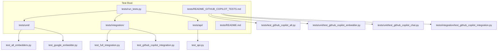
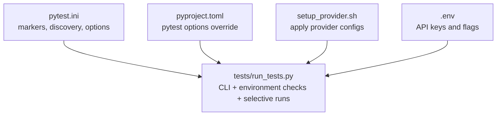
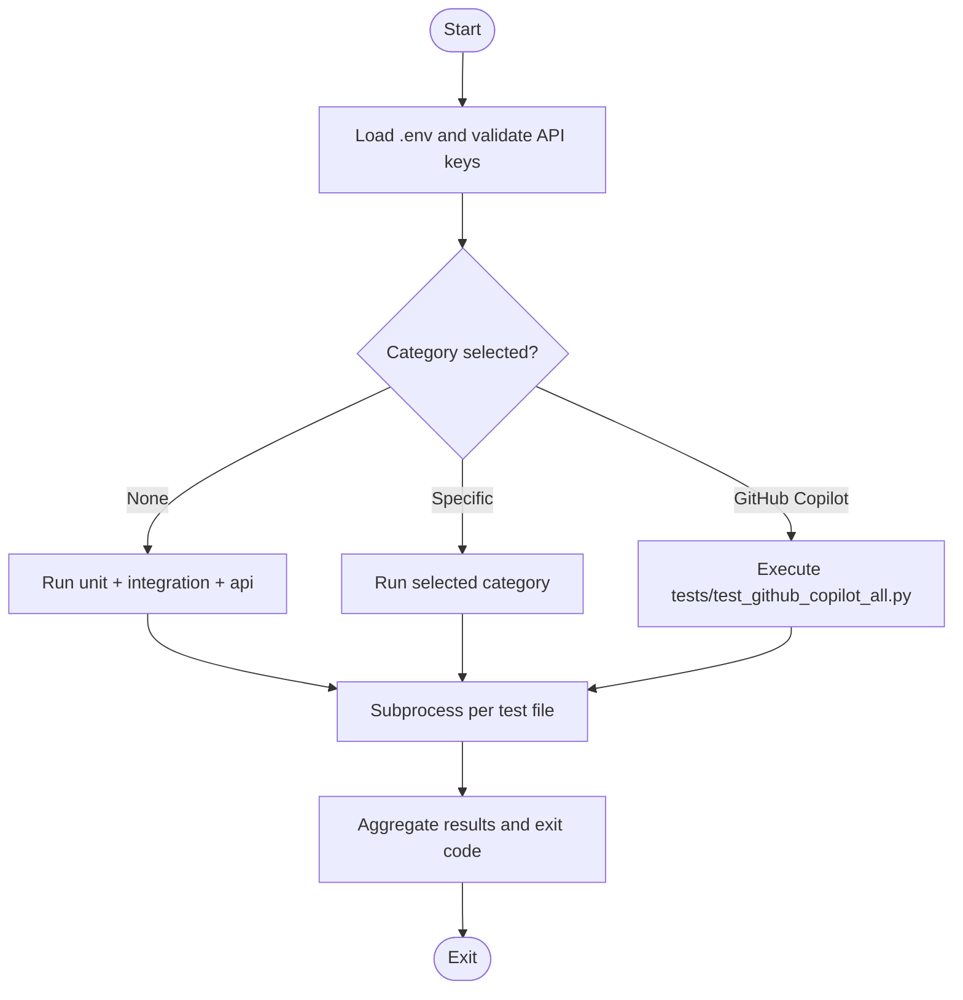
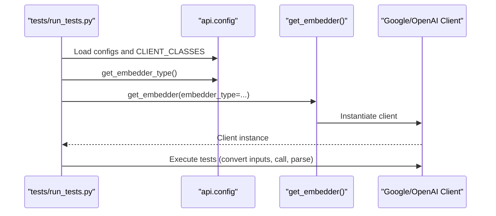
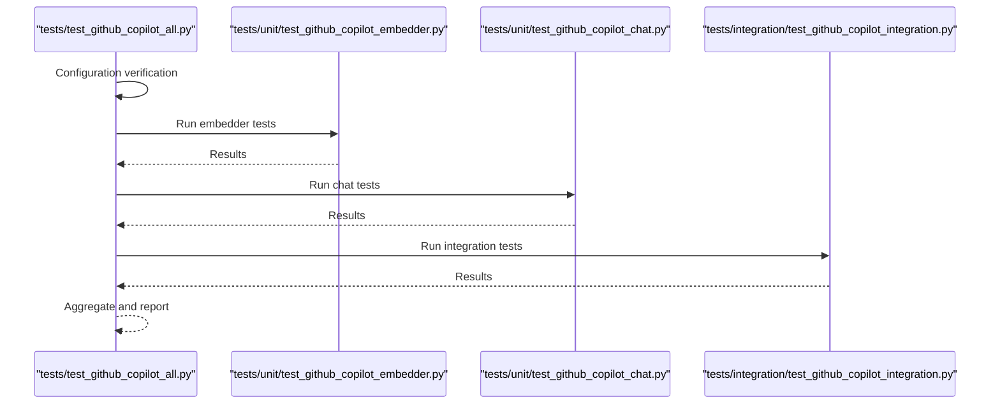
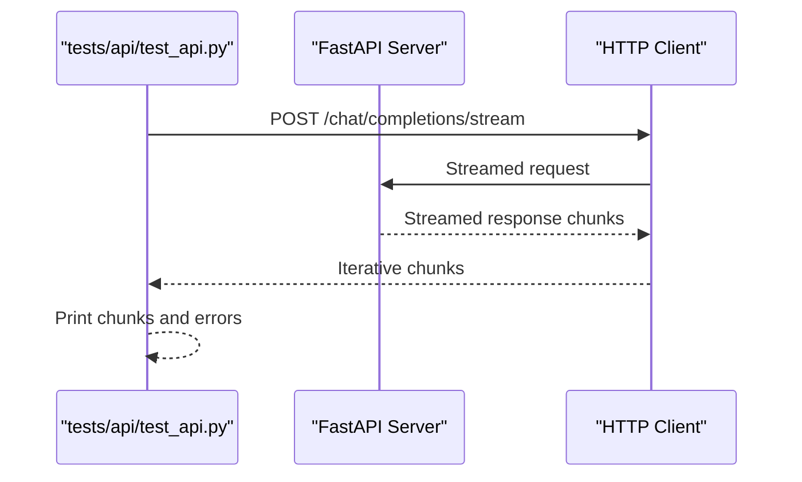
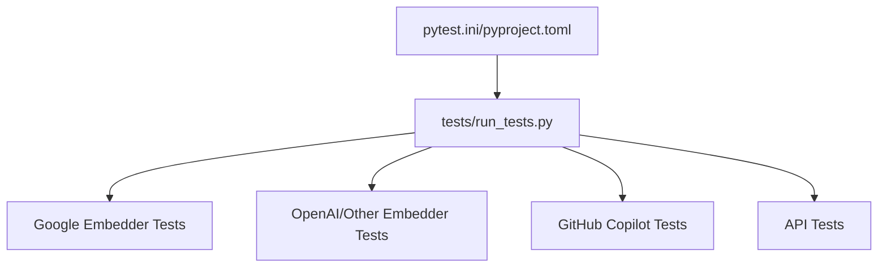

# Test Configuration and Setup

<cite>
**Referenced Files in This Document**
- [pytest.ini](file://pytest.ini)
- [pyproject.toml](file://pyproject.toml)
- [tests/run_tests.py](file://tests/run_tests.py)
- [tests/README.md](file://tests/README.md)
- [tests/README_GITHUB_COPILOT_TESTS.md](file://tests/README_GITHUB_COPILOT_TESTS.md)
- [tests/unit/test_all_embedders.py](file://tests/unit/test_all_embedders.py)
- [tests/unit/test_google_embedder.py](file://tests/unit/test_google_embedder.py)
- [tests/integration/test_full_integration.py](file://tests/integration/test_full_integration.py)
- [tests/api/test_api.py](file://tests/api/test_api.py)
- [tests/test_github_copilot_all.py](file://tests/test_github_copilot_all.py)
- [tests/unit/test_github_copilot_embedder.py](file://tests/unit/test_github_copilot_embedder.py)
- [tests/unit/test_github_copilot_chat.py](file://tests/unit/test_github_copilot_chat.py)
- [tests/integration/test_github_copilot_integration.py](file://tests/integration/test_github_copilot_integration.py)
- [setup_provider.sh](file://setup_provider.sh)
- [PROVIDER_SETUP_GUIDE.md](file://PROVIDER_SETUP_GUIDE.md)
</cite>

## Table of Contents
1. [Introduction](#introduction)
2. [Project Structure](#project-structure)
3. [Core Components](#core-components)
4. [Architecture Overview](#architecture-overview)
5. [Detailed Component Analysis](#detailed-component-analysis)
6. [Dependency Analysis](#dependency-analysis)
7. [Performance Considerations](#performance-considerations)
8. [Troubleshooting Guide](#troubleshooting-guide)
9. [Conclusion](#conclusion)
10. [Appendices](#appendices)

## Introduction
This document provides comprehensive guidance for configuring and running tests in DeepWiki-Open. It covers pytest configuration, test discovery patterns, environment variables, provider-specific setups (OpenAI, Google, GitHub Copilot), test runner behavior, parallel execution, test result reporting, isolation techniques, cleanup procedures, and troubleshooting strategies. The goal is to enable reliable local and CI/CD test execution across unit, integration, and API test categories.

## Project Structure
The test suite is organized by scope and purpose:
- tests/unit: Unit tests for isolated components (e.g., embedders, provider clients)
- tests/integration: Integration tests validating cross-component workflows
- tests/api: API endpoint tests using HTTP requests against a running server
- tests/run_tests.py: Unified test runner supporting selective categories and environment checks
- tests/README.md and tests/README_GITHUB_COPILOT_TESTS.md: Category-specific guidance and GitHub Copilot test documentation

**Diagram sources**
- [tests/run_tests.py](file://tests/run_tests.py#L1-L184)
- [tests/README.md](file://tests/README.md#L1-L126)
- [tests/README_GITHUB_COPILOT_TESTS.md](file://tests/README_GITHUB_COPILOT_TESTS.md#L1-L231)

**Section sources**
- [tests/README.md](file://tests/README.md#L1-L126)

## Core Components
- pytest configuration: Defines test discovery patterns, markers, and default options.
- Test runner: Provides CLI-driven test execution with environment checks and selective categories.
- Provider setup: Scripts and documentation for switching between providers and applying configuration files.
- Test categories: Unit, integration, and API tests with distinct runtime requirements.

Key configuration highlights:
- Test discovery: testpaths and python_files/python_classes/python_functions patterns
- Markers: unit, integration, slow, network
- Options: verbosity, strict markers, disable warnings, short traceback
- Test runner options: --unit, --integration, --api, --github-copilot, --check-env, --verbose

**Section sources**
- [pytest.ini](file://pytest.ini#L1-L16)
- [pyproject.toml](file://pyproject.toml#L49-L52)
- [tests/run_tests.py](file://tests/run_tests.py#L137-L182)
- [tests/README.md](file://tests/README.md#L19-L52)

## Architecture Overview
The testing architecture integrates pytest defaults with a custom test runner and provider-specific configuration scripts. The runner orchestrates environment checks, selects test categories, and aggregates results. Provider setup scripts manage configuration file swaps and environment variables.

**Diagram sources**
- [pytest.ini](file://pytest.ini#L1-L16)
- [pyproject.toml](file://pyproject.toml#L49-L52)
- [tests/run_tests.py](file://tests/run_tests.py#L84-L136)
- [setup_provider.sh](file://setup_provider.sh#L1-L189)

## Detailed Component Analysis

### Pytest Configuration and Discovery
- Test discovery patterns:
  - testpaths: test and tests directories
  - python_files: test_*.py and *_test.py
  - python_classes: Test*
  - python_functions: test_*
- Default options:
  - Verbose output, strict markers, disable warnings, short traceback
- Markers:
  - unit, integration, slow, network

These settings ensure consistent discovery and categorization across the repository’s test layout.

**Section sources**
- [pytest.ini](file://pytest.ini#L1-L16)
- [pyproject.toml](file://pyproject.toml#L49-L52)

### Test Runner: Environment Checks and Execution Control
The unified test runner provides:
- Environment checks:
  - Loads .env if present
  - Validates presence of required API keys (Google, OpenAI)
  - Confirms optional GitHub Copilot OAuth2 setup
  - Verifies core dependencies (adalflow, google-generativeai, requests, litellm)
- Selective execution:
  - --unit, --integration, --api, --github-copilot
  - --check-env to validate environment only
  - --verbose for detailed output
- Execution behavior:
  - Subprocess-based invocation per test file for isolation
  - Aggregated summary with counts and failure listings

**Diagram sources**
- [tests/run_tests.py](file://tests/run_tests.py#L84-L182)

**Section sources**
- [tests/run_tests.py](file://tests/run_tests.py#L1-L184)
- [tests/README.md](file://tests/README.md#L19-L52)

### Provider-Specific Test Environments

#### OpenAI and Google Embedder Tests
- Environment variables:
  - GOOGLE_API_KEY: required for Google AI embedder tests
  - OPENAI_API_KEY: required for some integration tests
  - DEEPWIKI_EMBEDDER_TYPE: set to google to target Google embedder
- Test coverage:
  - Unit tests for embedder client behavior and response parsing
  - Integration tests validating configuration loading and selection
  - Environment variable-driven embedder selection

**Diagram sources**
- [tests/unit/test_all_embedders.py](file://tests/unit/test_all_embedders.py#L87-L137)
- [tests/integration/test_full_integration.py](file://tests/integration/test_full_integration.py#L13-L101)

**Section sources**
- [tests/README.md](file://tests/README.md#L54-L86)
- [tests/unit/test_all_embedders.py](file://tests/unit/test_all_embedders.py#L17-L23)
- [tests/integration/test_full_integration.py](file://tests/integration/test_full_integration.py#L13-L101)

#### GitHub Copilot Tests
- Zero-configuration OAuth2 authentication:
  - No API key required; relies on automatic OAuth2 via LiteLLM
- Test categories:
  - Unit: embedder and chat client behavior, model formatting, response parsing
  - Integration: configuration consistency, workflow validation, API endpoint integration
  - Master runner: comprehensive suite with graceful handling of expected OAuth2 failures
- Environment:
  - Optional: DEEPWIKI_EMBEDDER_TYPE=github_copilot
  - Provider configuration files are swapped via setup script

**Diagram sources**
- [tests/test_github_copilot_all.py](file://tests/test_github_copilot_all.py#L158-L244)
- [tests/unit/test_github_copilot_embedder.py](file://tests/unit/test_github_copilot_embedder.py#L446-L490)
- [tests/unit/test_github_copilot_chat.py](file://tests/unit/test_github_copilot_chat.py#L405-L468)
- [tests/integration/test_github_copilot_integration.py](file://tests/integration/test_github_copilot_integration.py#L459-L502)

**Section sources**
- [tests/README_GITHUB_COPILOT_TESTS.md](file://tests/README_GITHUB_COPILOT_TESTS.md#L1-L231)
- [tests/test_github_copilot_all.py](file://tests/test_github_copilot_all.py#L79-L157)

### API Endpoint Tests
- Purpose: Validate HTTP endpoints and streaming responses
- Prerequisites: Running FastAPI server on localhost:8000
- Usage: Provide repository URL, query, and optional file path as CLI arguments
- Behavior: Streams response chunks and prints errors with status codes

**Diagram sources**
- [tests/api/test_api.py](file://tests/api/test_api.py#L5-L59)

**Section sources**
- [tests/api/test_api.py](file://tests/api/test_api.py#L1-L71)
- [tests/README.md](file://tests/README.md#L120-L126)

### Test Data Management, Temporary Files, and Cleanup
- Test data:
  - Inline fixtures and mocked responses are used extensively (e.g., embedding and chat mocks)
- Temporary files:
  - No persistent temporary files are created during typical test runs
- Cleanup:
  - Environment variables restored after tests that modify them (e.g., DEEPWIKI_EMBEDDER_TYPE)
  - Mocks and patches are scoped to individual tests or patched at module level
- Isolation:
  - Subprocess-based execution per test file in the unified runner
  - Reload of modules when environment variables change to reflect new configuration

**Section sources**
- [tests/integration/test_full_integration.py](file://tests/integration/test_full_integration.py#L109-L115)
- [tests/integration/test_github_copilot_integration.py](file://tests/integration/test_github_copilot_integration.py#L146-L151)
- [tests/unit/test_all_embedders.py](file://tests/unit/test_all_embedders.py#L334-L354)

### Local and CI/CD Configuration Guidelines
- Local setup:
  - Install dependencies and run the unified test runner
  - Use setup_provider.sh to apply provider configurations
  - For GitHub Copilot, rely on automatic OAuth2; no API key required
- CI/CD:
  - Use the unified runner to select categories (--unit, --integration, --api)
  - Provide environment variables via CI secrets (.env is loaded automatically by the runner)
  - Skip or mark network/slow tests appropriately using pytest markers

**Section sources**
- [tests/README.md](file://tests/README.md#L19-L52)
- [setup_provider.sh](file://setup_provider.sh#L1-L189)
- [pytest.ini](file://pytest.ini#L11-L16)

### Test Runner Configuration, Parallel Execution, and Reporting
- Parallel execution:
  - The unified runner executes tests sequentially via subprocess per file
  - No built-in pytest parallelization is configured
- Reporting:
  - Verbose output and short traceback by default
  - Summary statistics and failure lists
  - Category-specific execution paths

**Section sources**
- [tests/run_tests.py](file://tests/run_tests.py#L18-L39)
- [pytest.ini](file://pytest.ini#L7-L10)

### Test Isolation and Mock Services
- Isolation:
  - Subprocess per test file to prevent cross-test contamination
  - Module reload when environment variables change
- Mock services:
  - Extensive use of unittest.mock for provider APIs (e.g., embedding, completion)
  - Async mocks for async client methods
- Error handling:
  - Graceful handling of missing OAuth2 credentials in GitHub Copilot tests
  - Validation of model types and input parameters

**Section sources**
- [tests/unit/test_github_copilot_embedder.py](file://tests/unit/test_github_copilot_embedder.py#L199-L253)
- [tests/unit/test_github_copilot_chat.py](file://tests/unit/test_github_copilot_chat.py#L106-L155)
- [tests/integration/test_github_copilot_integration.py](file://tests/integration/test_github_copilot_integration.py#L153-L220)

## Dependency Analysis
The test suite depends on:
- pytest and pytest options defined in configuration files
- Provider-specific packages (google-generativeai, litellm, adalflow)
- Environment variables for API keys and provider selection
- Configuration files for provider settings

**Diagram sources**
- [pytest.ini](file://pytest.ini#L1-L16)
- [pyproject.toml](file://pyproject.toml#L49-L52)
- [tests/run_tests.py](file://tests/run_tests.py#L1-L184)

**Section sources**
- [pyproject.toml](file://pyproject.toml#L8-L31)
- [tests/README.md](file://tests/README.md#L61-L67)

## Performance Considerations
- Unit tests are fast and minimize external dependencies.
- Integration and API tests may be slower due to network calls; use selective categories in CI.
- Prefer mocking for network-heavy tests to reduce flakiness and improve speed.

## Troubleshooting Guide
Common issues and resolutions:
- Missing environment variables:
  - Ensure .env is present and contains required keys (GOOGLE_API_KEY, OPENAI_API_KEY)
  - For GitHub Copilot, confirm automatic OAuth2 is available
- Import errors:
  - Include project root path setup in test files or use the unified runner
- Server dependencies:
  - Start the FastAPI server before running API tests
- Provider configuration:
  - Use setup_provider.sh to apply provider configs and verify configuration files
- Dependency resolution:
  - Install required packages (pytest, google-generativeai, litellm, adalflow)

**Section sources**
- [tests/README.md](file://tests/README.md#L97-L126)
- [PROVIDER_SETUP_GUIDE.md](file://PROVIDER_SETUP_GUIDE.md#L124-L140)

## Conclusion
DeepWiki-Open’s testing configuration provides a robust, flexible framework for validating components across providers. The unified test runner simplifies environment checks and selective execution, while provider setup scripts streamline configuration management. By leveraging mocks, environment checks, and structured categories, teams can reliably execute tests locally and in CI/CD pipelines.

## Appendices

### Environment Variable Requirements
- GOOGLE_API_KEY: Google AI embedder tests
- OPENAI_API_KEY: OpenAI integration tests
- DEEPWIKI_EMBEDDER_TYPE: Provider selection (e.g., google, github_copilot)
- DASHSCOPE_API_KEY: DashScope provider (when applicable)
- DEEPWIKI_EMBEDDER_TYPE=github_copilot: Forces GitHub Copilot embedder

**Section sources**
- [tests/README.md](file://tests/README.md#L56-L60)
- [PROVIDER_SETUP_GUIDE.md](file://PROVIDER_SETUP_GUIDE.md#L103-L122)

### Provider Setup Commands
- GitHub Copilot:
  - ./setup_provider.sh github_copilot
  - Optional: export DEEPWIKI_EMBEDDER_TYPE=github_copilot
- DashScope:
  - export DASHSCOPE_API_KEY='your_key'
  - ./setup_provider.sh dashscope

**Section sources**
- [PROVIDER_SETUP_GUIDE.md](file://PROVIDER_SETUP_GUIDE.md#L9-L46)