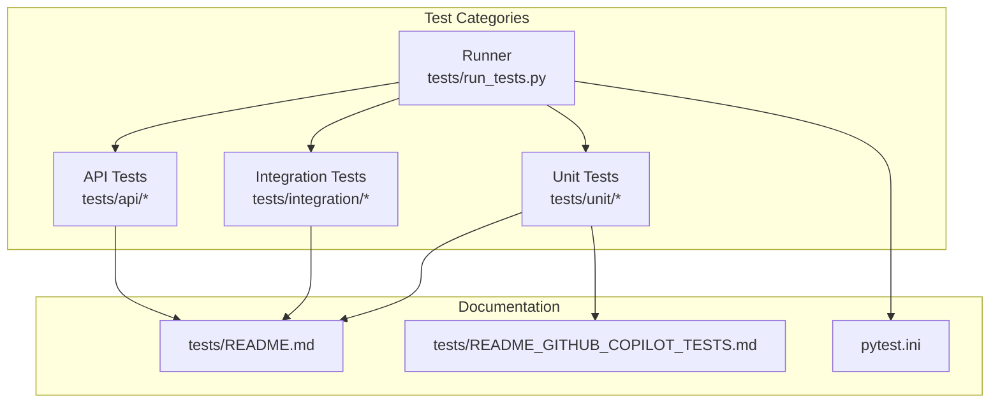
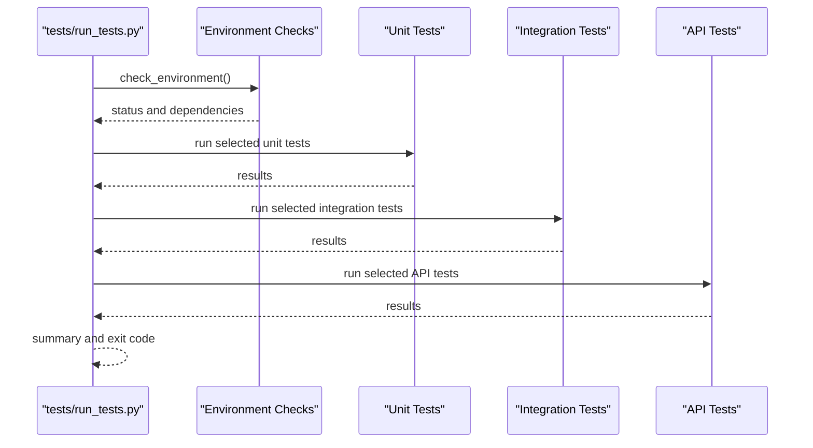
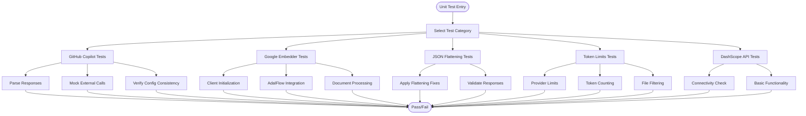
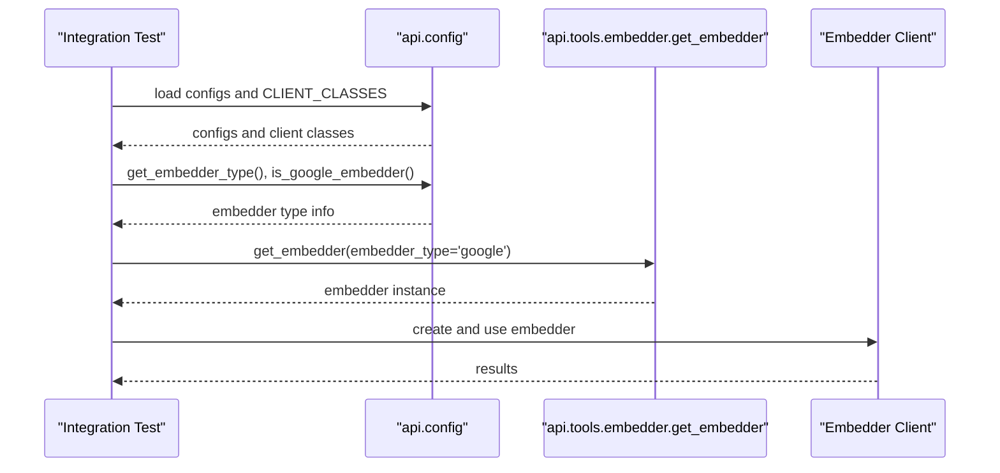
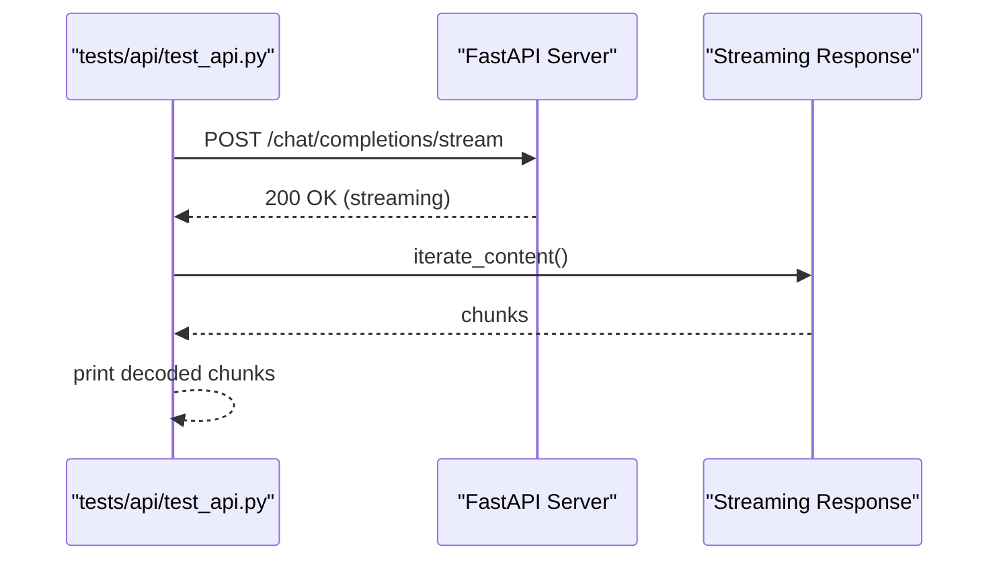
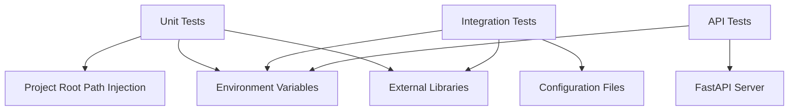

# Testing Strategy

<cite>
**Referenced Files in This Document**
- [tests/README.md](file://tests/README.md)
- [tests/README_GITHUB_COPILOT_TESTS.md](file://tests/README_GITHUB_COPILOT_TESTS.md)
- [pytest.ini](file://pytest.ini)
- [tests/run_tests.py](file://tests/run_tests.py)
- [tests/unit/test_all_embedders.py](file://tests/unit/test_all_embedders.py)
- [tests/unit/test_dashscope_api.py](file://tests/unit/test_dashscope_api.py)
- [tests/unit/test_github_copilot_embedder.py](file://tests/unit/test_github_copilot_embedder.py)
- [tests/unit/test_github_copilot_chat.py](file://tests/unit/test_github_copilot_chat.py)
- [tests/integration/test_full_integration.py](file://tests/integration/test_full_integration.py)
- [tests/api/test_api.py](file://tests/api/test_api.py)
- [tests/unit/test_json_flatten.py](file://tests/unit/test_json_flatten.py)
- [tests/unit/test_google_embedder.py](file://tests/unit/test_google_embedder.py)
- [tests/unit/test_provider_token_limits.py](file://tests/unit/test_provider_token_limits.py)
- [tests/test_github_copilot_all.py](file://tests/test_github_copilot_all.py)
- [test/test_extract_repo_name.py](file://test/test_extract_repo_name.py)
</cite>

## Table of Contents
1. [Introduction](#introduction)
2. [Project Structure](#project-structure)
3. [Core Components](#core-components)
4. [Architecture Overview](#architecture-overview)
5. [Detailed Component Analysis](#detailed-component-analysis)
6. [Dependency Analysis](#dependency-analysis)
7. [Performance Considerations](#performance-considerations)
8. [Troubleshooting Guide](#troubleshooting-guide)
9. [Conclusion](#conclusion)
10. [Appendices](#appendices)

## Introduction
This document describes the testing strategy and implementation for DeepWiki-Open. It covers unit testing for individual components, integration testing for system workflows, and API testing for endpoint validation. It also documents test coverage strategy, test data management, continuous integration practices, testing frameworks, mock implementations for external services, and test environment setup. Practical examples for writing new tests, running test suites, and interpreting results are included, along with guidance for performance/load testing, edge-case coverage, maintenance, debugging, and cross-environment reliability.

## Project Structure
The repository organizes tests by scope and category:
- tests/unit: Unit tests for isolated components (embedders, GitHub Copilot, JSON flattening, token limits, DashScope API).
- tests/integration: Integration tests validating end-to-end workflows and provider selection.
- tests/api: API tests validating HTTP endpoints and streaming responses.
- tests/run_tests.py: Unified test runner supporting selective categories and environment checks.
- tests/README.md and tests/README_GITHUB_COPILOT_TESTS.md: Documentation for test categories, environment setup, and expected behaviors.
- pytest.ini: Pytest configuration and markers for categorizing tests.

**Diagram sources**
- [tests/run_tests.py](file://tests/run_tests.py#L1-L184)
- [tests/README.md](file://tests/README.md#L1-L126)
- [tests/README_GITHUB_COPILOT_TESTS.md](file://tests/README_GITHUB_COPILOT_TESTS.md#L1-L231)
- [pytest.ini](file://pytest.ini#L1-L16)

**Section sources**
- [tests/README.md](file://tests/README.md#L1-L126)
- [tests/README_GITHUB_COPILOT_TESTS.md](file://tests/README_GITHUB_COPILOT_TESTS.md#L1-L231)
- [pytest.ini](file://pytest.ini#L1-L16)

## Core Components
DeepWiki-Open’s testing approach is built around three pillars:
- Unit tests: Validate individual components in isolation, focusing on client initialization, model formatting, API kwargs conversion, response parsing, configuration integration, and error handling.
- Integration tests: Validate provider selection, configuration consistency, and end-to-end workflows across embedders and generators.
- API tests: Validate HTTP endpoints and streaming responses against a running server.

Key testing frameworks and utilities:
- pytest.ini defines markers for unit, integration, slow, and network tests.
- tests/run_tests.py provides a unified runner with environment checks and selective execution.
- Many unit tests use unittest-style patterns with custom TestRunner classes and assertions, while others rely on pytest-compatible patterns and decorators.
- Mocking is extensively used for external services (e.g., GitHub Copilot, DashScope) to avoid live API calls and enforce deterministic behavior.

Practical examples:
- Running all tests: python tests/run_tests.py
- Running unit tests only: python tests/run_tests.py --unit
- Running GitHub Copilot tests: python tests/test_github_copilot_all.py or python tests/run_tests.py --github-copilot
- Running API tests: python tests/run_tests.py --api

**Section sources**
- [tests/README.md](file://tests/README.md#L19-L52)
- [pytest.ini](file://pytest.ini#L11-L16)
- [tests/run_tests.py](file://tests/run_tests.py#L137-L184)
- [tests/unit/test_github_copilot_embedder.py](file://tests/unit/test_github_copilot_embedder.py#L1-L490)
- [tests/unit/test_github_copilot_chat.py](file://tests/unit/test_github_copilot_chat.py#L1-L468)
- [tests/unit/test_all_embedders.py](file://tests/unit/test_all_embedders.py#L1-L464)
- [tests/unit/test_dashscope_api.py](file://tests/unit/test_dashscope_api.py#L1-L206)
- [tests/integration/test_full_integration.py](file://tests/integration/test_full_integration.py#L1-L152)
- [tests/api/test_api.py](file://tests/api/test_api.py#L1-L71)

## Architecture Overview
The testing architecture supports:
- Environment-driven test execution: tests/check environment variables and optional dependencies, and adapt behavior accordingly.
- Provider-agnostic testing: embedder selection via environment variables and configuration files enables switching providers without changing tests.
- Mock-first design: external service calls are mocked to ensure reproducibility and safety.
- Clear separation of concerns: unit tests focus on component behavior; integration tests validate provider selection and configuration; API tests validate server endpoints.

**Diagram sources**
- [tests/run_tests.py](file://tests/run_tests.py#L84-L181)

**Section sources**
- [tests/run_tests.py](file://tests/run_tests.py#L84-L181)

## Detailed Component Analysis

### Unit Testing Strategy
Unit tests validate individual components in isolation:
- GitHub Copilot embedder and chat: model name formatting, API kwargs conversion, response parsing, error handling, zero-configuration OAuth2 setup, and async/sync completion.
- Google embedder: client initialization, API kwargs conversion, response parsing, and document processing via AdalFlow.
- JSON flattening utilities: validation, streaming chunk repair, and malformed response handling.
- Provider token limits: provider-specific token limits, token counting, and file filtering logic.
- DashScope API: connectivity and basic functionality checks.

**Diagram sources**
- [tests/unit/test_github_copilot_embedder.py](file://tests/unit/test_github_copilot_embedder.py#L15-L490)
- [tests/unit/test_github_copilot_chat.py](file://tests/unit/test_github_copilot_chat.py#L15-L468)
- [tests/unit/test_google_embedder.py](file://tests/unit/test_google_embedder.py#L23-L183)
- [tests/unit/test_json_flatten.py](file://tests/unit/test_json_flatten.py#L21-L195)
- [tests/unit/test_provider_token_limits.py](file://tests/unit/test_provider_token_limits.py#L18-L268)
- [tests/unit/test_dashscope_api.py](file://tests/unit/test_dashscope_api.py#L11-L206)

**Section sources**
- [tests/unit/test_github_copilot_embedder.py](file://tests/unit/test_github_copilot_embedder.py#L1-L490)
- [tests/unit/test_github_copilot_chat.py](file://tests/unit/test_github_copilot_chat.py#L1-L468)
- [tests/unit/test_google_embedder.py](file://tests/unit/test_google_embedder.py#L1-L183)
- [tests/unit/test_json_flatten.py](file://tests/unit/test_json_flatten.py#L1-L195)
- [tests/unit/test_provider_token_limits.py](file://tests/unit/test_provider_token_limits.py#L1-L268)
- [tests/unit/test_dashscope_api.py](file://tests/unit/test_dashscope_api.py#L1-L206)

### Integration Testing Strategy
Integration tests validate provider selection and configuration consistency:
- Configuration loading and client availability.
- Embedder selection via environment variables.
- End-to-end workflow validation for Google AI embeddings and GitHub Copilot integration.

**Diagram sources**
- [tests/integration/test_full_integration.py](file://tests/integration/test_full_integration.py#L13-L115)
- [tests/unit/test_all_embedders.py](file://tests/unit/test_all_embedders.py#L84-L184)

**Section sources**
- [tests/integration/test_full_integration.py](file://tests/integration/test_full_integration.py#L1-L152)
- [tests/unit/test_all_embedders.py](file://tests/unit/test_all_embedders.py#L84-L184)

### API Testing Strategy
API tests validate HTTP endpoints and streaming responses:
- Streaming endpoint validation with a running server.
- Payload construction and response streaming handling.
- Error handling and status code validation.

**Diagram sources**
- [tests/api/test_api.py](file://tests/api/test_api.py#L5-L71)

**Section sources**
- [tests/api/test_api.py](file://tests/api/test_api.py#L1-L71)

### Test Coverage Strategy
Coverage focuses on:
- Client initialization and configuration for all providers.
- Model name formatting and validation.
- API request parameter conversion and response parsing.
- Error handling and edge cases.
- Configuration file consistency across embedder and generator configs.
- Integration with existing API endpoints.
- Zero-configuration OAuth2 setup for GitHub Copilot.
- Provider-specific token limits and file filtering logic.

**Section sources**
- [tests/README_GITHUB_COPILOT_TESTS.md](file://tests/README_GITHUB_COPILOT_TESTS.md#L139-L156)
- [tests/unit/test_github_copilot_embedder.py](file://tests/unit/test_github_copilot_embedder.py#L376-L444)
- [tests/unit/test_github_copilot_chat.py](file://tests/unit/test_github_copilot_chat.py#L15-L61)
- [tests/unit/test_provider_token_limits.py](file://tests/unit/test_provider_token_limits.py#L18-L268)

### Test Data Management
- Environment variables: GOOGLE_API_KEY, OPENAI_API_KEY, DEEPWIKI_EMBEDDER_TYPE, DASHSCOPE_API_KEY, DASHSCOPE_WORKSPACE_ID, DASHSCOPE_BASE_URL.
- Configuration files: generator.json and embedder.json for provider definitions and client classes.
- Temporary files: used in token limit tests to simulate file filtering behavior.

**Section sources**
- [tests/README.md](file://tests/README.md#L56-L67)
- [tests/unit/test_dashscope_api.py](file://tests/unit/test_dashscope_api.py#L17-L26)
- [tests/unit/test_provider_token_limits.py](file://tests/unit/test_provider_token_limits.py#L93-L154)

### Continuous Integration Practices
- Markers in pytest.ini enable categorization of tests (unit, integration, slow, network).
- tests/run_tests.py orchestrates environment checks and selective execution.
- GitHub Copilot comprehensive test runner aggregates unit and integration tests and reports results.

**Section sources**
- [pytest.ini](file://pytest.ini#L11-L16)
- [tests/run_tests.py](file://tests/run_tests.py#L137-L184)
- [tests/test_github_copilot_all.py](file://tests/test_github_copilot_all.py#L158-L244)

### Testing Frameworks and Mock Implementations
- Frameworks: pytest.ini markers, unittest-style runners, and direct subprocess invocation for some suites.
- Mocking: External service calls are mocked (e.g., GitHub Copilot, DashScope) to avoid live API dependencies and ensure deterministic outcomes.
- Zero-configuration OAuth2: GitHub Copilot tests are designed to handle missing authentication gracefully.

**Section sources**
- [pytest.ini](file://pytest.ini#L1-L16)
- [tests/unit/test_github_copilot_embedder.py](file://tests/unit/test_github_copilot_embedder.py#L199-L253)
- [tests/unit/test_github_copilot_chat.py](file://tests/unit/test_github_copilot_chat.py#L106-L206)
- [tests/README_GITHUB_COPILOT_TESTS.md](file://tests/README_GITHUB_COPILOT_TESTS.md#L125-L131)

### Test Environment Setup
- Environment variables and optional dependencies are checked before running tests.
- For API tests, the FastAPI server must be running on the expected port.
- GitHub Copilot tests can run without API keys due to automatic OAuth2 authentication.

**Section sources**
- [tests/README.md](file://tests/README.md#L111-L126)
- [tests/run_tests.py](file://tests/run_tests.py#L84-L150)
- [tests/README_GITHUB_COPILOT_TESTS.md](file://tests/README_GITHUB_COPILOT_TESTS.md#L133-L137)

### Practical Examples
- Writing new unit tests: Follow naming conventions (test_<component>.py), place in tests/unit/, add project root to sys.path, and include docstrings.
- Running test suites: Use python tests/run_tests.py with flags (--unit, --integration, --api, --github-copilot) or run individual files.
- Interpreting results: Use the unified runner summary and per-test output; GitHub Copilot tests may show expected failures in environments without OAuth2.

**Section sources**
- [tests/README.md](file://tests/README.md#L88-L96)
- [tests/run_tests.py](file://tests/run_tests.py#L137-L184)
- [tests/README_GITHUB_COPILOT_TESTS.md](file://tests/README_GITHUB_COPILOT_TESTS.md#L182-L195)

### Performance Testing and Load Testing Considerations
- Unit tests are fast (< 1 second per test) and should remain isolated from heavy operations.
- Integration tests may involve external services and can be slower (1-10 seconds per test).
- API tests depend on server performance and network latency (5-30 seconds per test).
- Recommendations:
  - Prefer mocking for heavy external calls.
  - Use pytest markers to exclude slow/network tests during quick cycles.
  - Introduce dedicated performance test suites separate from unit/integration tests.

[No sources needed since this section provides general guidance]

### Edge Cases and Reliability Across Environments
- GitHub Copilot tests expect OAuth2 failures in test environments and handle them gracefully.
- Environment variable handling is validated to ensure embedder selection works across deployments.
- Token limit tests validate filtering logic and provider differences (e.g., DashScope vs GitHub Copilot).

**Section sources**
- [tests/README_GITHUB_COPILOT_TESTS.md](file://tests/README_GITHUB_COPILOT_TESTS.md#L125-L131)
- [tests/unit/test_provider_token_limits.py](file://tests/unit/test_provider_token_limits.py#L160-L219)

## Dependency Analysis
The test suite depends on:
- Project root path injection to import api modules.
- Optional environment variables for provider credentials.
- External libraries for embeddings and HTTP requests.
- Configuration files for provider definitions.

**Diagram sources**
- [tests/unit/test_all_embedders.py](file://tests/unit/test_all_embedders.py#L13-L23)
- [tests/integration/test_full_integration.py](file://tests/integration/test_full_integration.py#L13-L42)
- [tests/api/test_api.py](file://tests/api/test_api.py#L14-L58)

**Section sources**
- [tests/unit/test_all_embedders.py](file://tests/unit/test_all_embedders.py#L13-L23)
- [tests/integration/test_full_integration.py](file://tests/integration/test_full_integration.py#L13-L42)
- [tests/api/test_api.py](file://tests/api/test_api.py#L14-L58)

## Performance Considerations
- Keep unit tests lightweight and deterministic.
- Use mocking to avoid network-bound delays.
- Separate slow and network-dependent tests using pytest markers.
- For API tests, consider batching requests and measuring throughput separately from unit tests.

[No sources needed since this section provides general guidance]

## Troubleshooting Guide
Common issues and resolutions:
- Import errors: Ensure project root is added to sys.path in test files.
- API key issues: Provide .env with required keys or set environment variables.
- Server dependencies: Start the FastAPI server before running API tests.
- GitHub Copilot OAuth2 failures: Expected in test environments; tests handle failures gracefully.
- Missing dependencies: Install adalflow, google-generativeai, requests, and litellm as needed.

**Section sources**
- [tests/README.md](file://tests/README.md#L99-L126)
- [tests/run_tests.py](file://tests/run_tests.py#L84-L150)
- [tests/README_GITHUB_COPILOT_TESTS.md](file://tests/README_GITHUB_COPILOT_TESTS.md#L157-L181)

## Conclusion
DeepWiki-Open’s testing strategy emphasizes isolation, determinism, and provider-agnostic validation. The unified runner, environment checks, and extensive mocking ensure reliable test execution across diverse environments. By following the documented practices, contributors can confidently add new tests, maintain reliability, and scale testing for performance and load considerations.

[No sources needed since this section summarizes without analyzing specific files]

## Appendices

### Appendix A: Example Workflows

#### Running GitHub Copilot Tests
- Run all: python tests/test_github_copilot_all.py
- Run specific category: python tests/test_github_copilot_all.py embedder | chat | integration | config

**Section sources**
- [tests/README_GITHUB_COPILOT_TESTS.md](file://tests/README_GITHUB_COPILOT_TESTS.md#L67-L91)
- [tests/test_github_copilot_all.py](file://tests/test_github_copilot_all.py#L245-L262)

#### Running API Tests
- Start server locally, then run: python tests/api/test_api.py <repo_url> <query> [file_path]

**Section sources**
- [tests/api/test_api.py](file://tests/api/test_api.py#L60-L71)

#### Extracting Repository Names (Example of focused test)
- Run focused test: python test/test_extract_repo_name.py

**Section sources**
- [test/test_extract_repo_name.py](file://test/test_extract_repo_name.py#L1-L119)