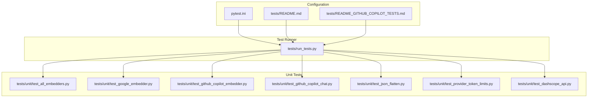
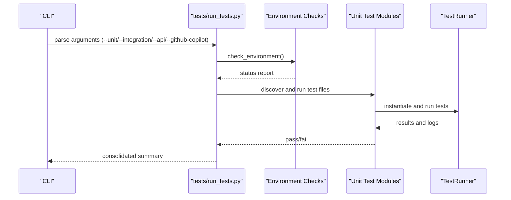
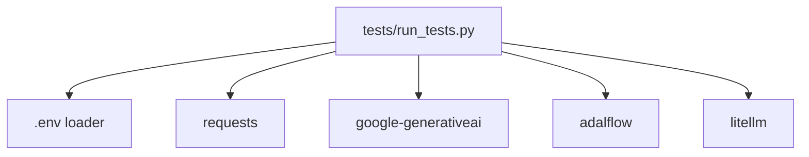

# Unit Testing

<cite>
**Referenced Files in This Document**
- [tests/run_tests.py](file://tests/run_tests.py)
- [pytest.ini](file://pytest.ini)
- [tests/README.md](file://tests/README.md)
- [tests/README_GITHUB_COPILOT_TESTS.md](file://tests/README_GITHUB_COPILOT_TESTS.md)
- [tests/unit/test_all_embedders.py](file://tests/unit/test_all_embedders.py)
- [tests/unit/test_google_embedder.py](file://tests/unit/test_google_embedder.py)
- [tests/unit/test_github_copilot_embedder.py](file://tests/unit/test_github_copilot_embedder.py)
- [tests/unit/test_github_copilot_chat.py](file://tests/unit/test_github_copilot_chat.py)
- [tests/unit/test_json_flatten.py](file://tests/unit/test_json_flatten.py)
- [tests/unit/test_provider_token_limits.py](file://tests/unit/test_provider_token_limits.py)
- [tests/unit/test_dashscope_api.py](file://tests/unit/test_dashscope_api.py)
</cite>

## Table of Contents
1. [Introduction](#introduction)
2. [Project Structure](#project-structure)
3. [Core Components](#core-components)
4. [Architecture Overview](#architecture-overview)
5. [Detailed Component Analysis](#detailed-component-analysis)
6. [Dependency Analysis](#dependency-analysis)
7. [Performance Considerations](#performance-considerations)
8. [Troubleshooting Guide](#troubleshooting-guide)
9. [Conclusion](#conclusion)
10. [Appendices](#appendices)

## Introduction
This document explains the unit testing implementation for DeepWiki-Open with a focus on the custom TestRunner framework used for embedder systems, test execution patterns, assertion strategies, and failure reporting. It also covers test structure for embedder clients (OpenAI, Google, Ollama), data pipeline functions, and configuration management; describes mocking strategies for external APIs; outlines environment variable handling in tests; and details test isolation techniques. Practical guidance is provided for writing new unit tests, running specific test suites, interpreting results, and ensuring reliable test execution across environments.

## Project Structure
The test suite is organized into categories under the tests directory:
- tests/unit: Unit tests for individual components and integrations
- tests/integration: Integration tests for end-to-end workflows
- tests/api: API endpoint tests
- tests/run_tests.py: Unified test runner script supporting selective execution and environment checks

**Diagram sources**
- [tests/run_tests.py](file://tests/run_tests.py#L1-L184)
- [pytest.ini](file://pytest.ini#L1-L16)
- [tests/README.md](file://tests/README.md#L1-L126)
- [tests/README_GITHUB_COPILOT_TESTS.md](file://tests/README_GITHUB_COPILOT_TESTS.md#L1-L231)
- [tests/unit/test_all_embedders.py](file://tests/unit/test_all_embedders.py#L1-L464)
- [tests/unit/test_google_embedder.py](file://tests/unit/test_google_embedder.py#L1-L183)
- [tests/unit/test_github_copilot_embedder.py](file://tests/unit/test_github_copilot_embedder.py#L1-L490)
- [tests/unit/test_github_copilot_chat.py](file://tests/unit/test_github_copilot_chat.py#L1-L468)
- [tests/unit/test_json_flatten.py](file://tests/unit/test_json_flatten.py#L1-L195)
- [tests/unit/test_provider_token_limits.py](file://tests/unit/test_provider_token_limits.py#L1-L268)
- [tests/unit/test_dashscope_api.py](file://tests/unit/test_dashscope_api.py#L1-L206)

**Section sources**
- [tests/README.md](file://tests/README.md#L1-L126)
- [tests/README_GITHUB_COPILOT_TESTS.md](file://tests/README_GITHUB_COPILOT_TESTS.md#L1-L231)

## Core Components
- Custom TestRunner framework: A lightweight test harness enabling test execution, parametrized runs, and structured failure reporting without relying on external frameworks for core embedder tests.
- Pytest configuration: Standard pytest markers and discovery rules for unit, integration, and network tests.
- Test runner script: Orchestrates test discovery, execution, environment checks, and selective test categories.

Key capabilities:
- Test execution: run_test, run_test_class, run_parametrized_test
- Assertion methods: Python’s built-in assert statements and unittest assertions
- Failure reporting: Summary statistics, failure list, and structured logs
- Environment checks: Verifies .env presence, API keys, and dependency availability

**Section sources**
- [tests/unit/test_all_embedders.py](file://tests/unit/test_all_embedders.py#L25-L82)
- [pytest.ini](file://pytest.ini#L1-L16)
- [tests/run_tests.py](file://tests/run_tests.py#L18-L82)

## Architecture Overview
The test architecture supports:
- Isolated unit tests for embedder clients and data pipeline functions
- Mock-based testing for external APIs
- Environment-driven test skipping and graceful degradation
- Centralized test runner with category selection and environment verification

**Diagram sources**
- [tests/run_tests.py](file://tests/run_tests.py#L84-L181)
- [tests/unit/test_all_embedders.py](file://tests/unit/test_all_embedders.py#L403-L464)

## Detailed Component Analysis

### Custom TestRunner Framework
The TestRunner provides:
- run_test: Executes a single test function with exception handling and logging
- run_test_class: Discovers and runs all test methods in a class
- run_parametrized_test: Iterates over parameter sets and runs a test with each
- summary: Aggregates counts and prints a structured summary

Execution patterns:
- Logging is used for visibility during test runs
- Exceptions are captured and recorded as failures
- Parametrized tests are supported via lambda wrappers

Failure reporting:
- Tracks total, passed, and failed counts
- Maintains a list of (test_name, error) tuples
- Returns a boolean indicating overall success

Practical usage:
- Used extensively in tests/unit/test_all_embedders.py to orchestrate multiple test classes and parametrized scenarios

**Section sources**
- [tests/unit/test_all_embedders.py](file://tests/unit/test_all_embedders.py#L25-L82)
- [tests/unit/test_all_embedders.py](file://tests/unit/test_all_embedders.py#L403-L464)

### Embedder Clients and Data Pipeline Tests
Coverage areas:
- Embedder configuration loading and type detection
- Factory-style creation of embedders with explicit and legacy parameters
- Direct client tests for Google and GitHub Copilot
- Data pipeline token counting and pipeline preparation
- RAG integration and environment variable handling
- Provider-specific token limits and file filtering logic

Mocking strategies:
- unittest.mock.patch and Mock objects for external API calls
- AsyncMock for async methods in GitHub Copilot chat tests
- Environment variable manipulation for embedder selection

Isolation techniques:
- Temporary directories and files for token limit tests
- Environment restoration after tests that modify environment variables
- Selective skipping when required API keys are unavailable

**Section sources**
- [tests/unit/test_all_embedders.py](file://tests/unit/test_all_embedders.py#L84-L355)
- [tests/unit/test_google_embedder.py](file://tests/unit/test_google_embedder.py#L23-L156)
- [tests/unit/test_github_copilot_embedder.py](file://tests/unit/test_github_copilot_embedder.py#L15-L444)
- [tests/unit/test_github_copilot_chat.py](file://tests/unit/test_github_copilot_chat.py#L15-L403)
- [tests/unit/test_provider_token_limits.py](file://tests/unit/test_provider_token_limits.py#L18-L219)

### JSON Flattening Utilities
Tests validate:
- Valid JSON passthrough
- Trailing comma fixes
- Markdown wrapper removal
- Streaming artifacts handling
- Manual extraction fallback
- Response validation helpers
- Repair of individual streaming chunks

These tests use unittest.TestCase and a dedicated runner for structured reporting.

**Section sources**
- [tests/unit/test_json_flatten.py](file://tests/unit/test_json_flatten.py#L21-L170)

### DashScope API Connectivity
Verifies:
- API key and workspace configuration
- Chat completion and embeddings endpoints
- DeepWiki integration with DashScope client

This test focuses on environment readiness and basic connectivity rather than internal logic.

**Section sources**
- [tests/unit/test_dashscope_api.py](file://tests/unit/test_dashscope_api.py#L11-L188)

### Test Execution Patterns and Assertions
Patterns:
- Direct function-based tests with assert statements
- unittest.TestCase-based tests for JSON flattening
- Parametrized tests via TestRunner.run_parametrized_test
- Mock-based tests using patch and AsyncMock

Assertions:
- Built-in assert for functional correctness
- unittest.TestCase assertions for structured test suites
- Exception catching for graceful failure reporting

**Section sources**
- [tests/unit/test_all_embedders.py](file://tests/unit/test_all_embedders.py#L84-L355)
- [tests/unit/test_json_flatten.py](file://tests/unit/test_json_flatten.py#L21-L170)
- [tests/unit/test_github_copilot_chat.py](file://tests/unit/test_github_copilot_chat.py#L106-L206)

### Failure Reporting Mechanisms
Mechanisms:
- Structured logging with INFO/WARNING/ERROR levels
- TestRunner summary with counts and failure list
- Environment check warnings for missing keys or dependencies
- Detailed stderr/stdout capture and printing for failed tests

**Section sources**
- [tests/unit/test_all_embedders.py](file://tests/unit/test_all_embedders.py#L33-L49)
- [tests/run_tests.py](file://tests/run_tests.py#L18-L39)
- [tests/run_tests.py](file://tests/run_tests.py#L84-L136)

### Environment Variable Handling in Tests
Strategies:
- Loading .env via python-dotenv for local development
- Conditional skipping when API keys are absent
- Modifying and restoring environment variables for embedder selection tests
- Graceful handling of OAuth2 authentication absence in GitHub Copilot tests

**Section sources**
- [tests/run_tests.py](file://tests/run_tests.py#L88-L111)
- [tests/unit/test_all_embedders.py](file://tests/unit/test_all_embedders.py#L313-L354)
- [tests/README_GITHUB_COPILOT_TESTS.md](file://tests/README_GITHUB_COPILOT_TESTS.md#L117-L137)

### Test Isolation Techniques
Techniques:
- Temporary directories for token limit file filtering tests
- Environment variable backup/restore cycles
- Mocking external services to avoid network dependencies
- Selective test skipping when prerequisites are missing

**Section sources**
- [tests/unit/test_provider_token_limits.py](file://tests/unit/test_provider_token_limits.py#L93-L154)
- [tests/unit/test_all_embedders.py](file://tests/unit/test_all_embedders.py#L313-L354)

### Practical Examples

- Writing a new unit test:
  - Choose the appropriate category and file name following the test_<component>.py convention
  - Add project root to sys.path for imports
  - Use assert statements for assertions
  - For async or external API tests, use unittest.mock.patch or AsyncMock
  - Example patterns are visible in:
    - [tests/unit/test_all_embedders.py](file://tests/unit/test_all_embedders.py#L25-L82)
    - [tests/unit/test_github_copilot_chat.py](file://tests/unit/test_github_copilot_chat.py#L106-L206)

- Running specific test suites:
  - All tests: python tests/run_tests.py
  - Unit tests only: python tests/run_tests.py --unit
  - Integration tests only: python tests/run_tests.py --integration
  - API tests only: python tests/run_tests.py --api
  - GitHub Copilot suite: python tests/run_tests.py --github-copilot
  - Individual test files: python tests/unit/<test_file>.py

- Interpreting test results:
  - Summary includes total, passed, and failed counts
  - Failed tests are listed with error messages
  - Environment warnings guide dependency and key setup
  - See [tests/run_tests.py](file://tests/run_tests.py#L66-L82) and [tests/README.md](file://tests/README.md#L97-L126)

**Section sources**
- [tests/README.md](file://tests/README.md#L19-L52)
- [tests/run_tests.py](file://tests/run_tests.py#L137-L181)
- [tests/README.md](file://tests/README.md#L97-L126)

### Test Coverage for Critical Functionality
- Token counting: Verified across embedder types and parameter variations
- Data pipeline preparation: Tested with different is_ollama_embedder values
- RAG integration: Initialization and embedder type detection
- Provider-specific token limits: Validation of limits and file filtering logic
- JSON flattening: Robust handling of malformed and streaming responses

Evidence:
- Token counting and pipeline preparation tests: [tests/unit/test_all_embedders.py](file://tests/unit/test_all_embedders.py#L240-L279)
- Provider token limits and filtering: [tests/unit/test_provider_token_limits.py](file://tests/unit/test_provider_token_limits.py#L18-L219)
- JSON flattening utilities: [tests/unit/test_json_flatten.py](file://tests/unit/test_json_flatten.py#L21-L170)

**Section sources**
- [tests/unit/test_all_embedders.py](file://tests/unit/test_all_embedders.py#L240-L279)
- [tests/unit/test_provider_token_limits.py](file://tests/unit/test_provider_token_limits.py#L18-L219)
- [tests/unit/test_json_flatten.py](file://tests/unit/test_json_flatten.py#L21-L170)

## Dependency Analysis
The test runner depends on:
- Python standard library (subprocess, argparse, os, sys)
- External libraries for environment checks and API testing (dotenv, requests, google-generativeai, adalflow, litellm)
- Project modules under test (api.*)

**Diagram sources**
- [tests/run_tests.py](file://tests/run_tests.py#L84-L136)

**Section sources**
- [tests/run_tests.py](file://tests/run_tests.py#L84-L136)

## Performance Considerations
- Unit tests are designed to be fast and isolated, minimizing external dependencies
- Mocking avoids network latency and reduces flakiness
- Environment checks prevent unnecessary API calls when keys are missing
- Parametrized tests reduce duplication while keeping execution efficient

## Troubleshooting Guide
Common issues and resolutions:
- Import errors: Ensure project root is added to sys.path in test files
- Missing API keys: Set environment variables or use .env; tests may skip when keys are absent
- Dependency issues: Install required packages (dotenv, adalflow, google-generativeai, requests, litellm)
- OAuth2 authentication failures in GitHub Copilot tests: Expected in test environments; tests handle failures gracefully
- Environment warnings: Address missing keys or dependencies as indicated by the environment checker

**Section sources**
- [tests/README.md](file://tests/README.md#L97-L126)
- [tests/run_tests.py](file://tests/run_tests.py#L84-L136)
- [tests/README_GITHUB_COPILOT_TESTS.md](file://tests/README_GITHUB_COPILOT_TESTS.md#L157-L181)

## Conclusion
DeepWiki-Open’s unit testing implementation combines a custom TestRunner framework with targeted mocking and environment-aware strategies. The suite comprehensively covers embedder clients, data pipeline functions, configuration management, and provider-specific behaviors. The unified test runner simplifies execution and reporting, while isolation and graceful failure handling improve reliability across diverse environments.

## Appendices

### Appendix A: Pytest Configuration
Pytest is configured with discovery rules and markers for unit, integration, slow, and network tests.

**Section sources**
- [pytest.ini](file://pytest.ini#L1-L16)

### Appendix B: GitHub Copilot Test Suite Overview
The GitHub Copilot test suite includes unit and integration tests covering client initialization, model formatting, response parsing, streaming, error handling, and zero-configuration OAuth2 setup.

**Section sources**
- [tests/README_GITHUB_COPILOT_TESTS.md](file://tests/README_GITHUB_COPILOT_TESTS.md#L1-L231)