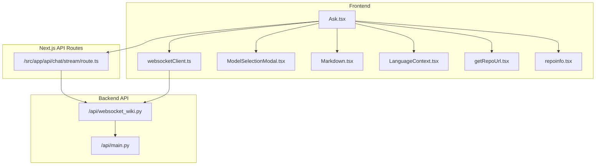
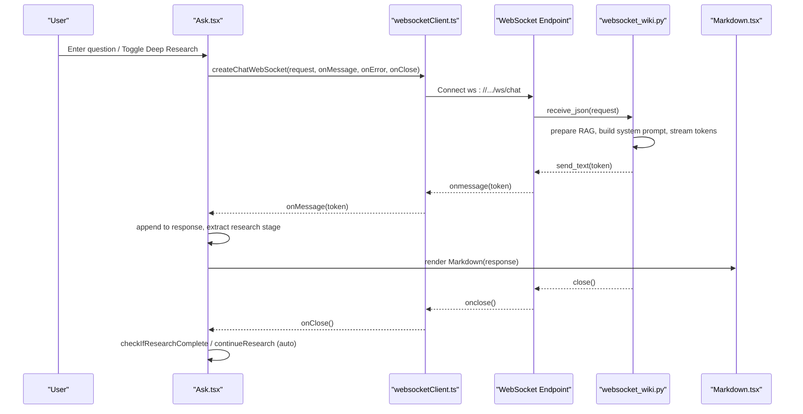
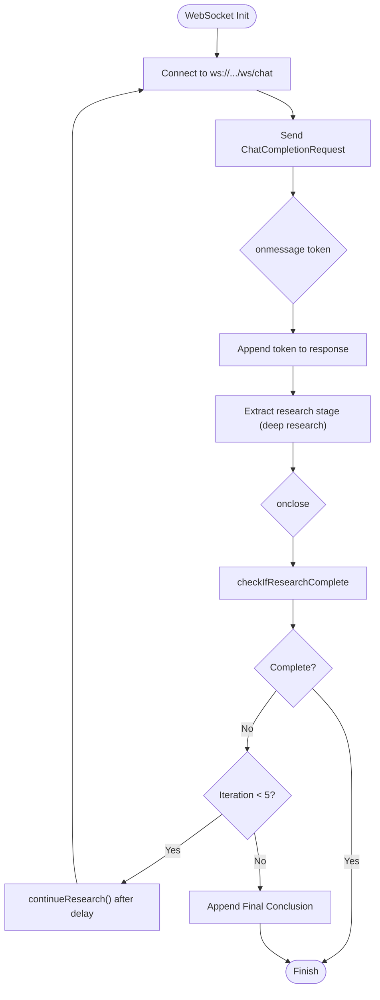
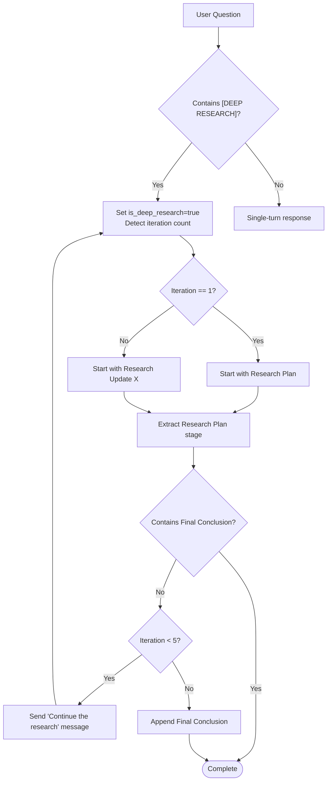
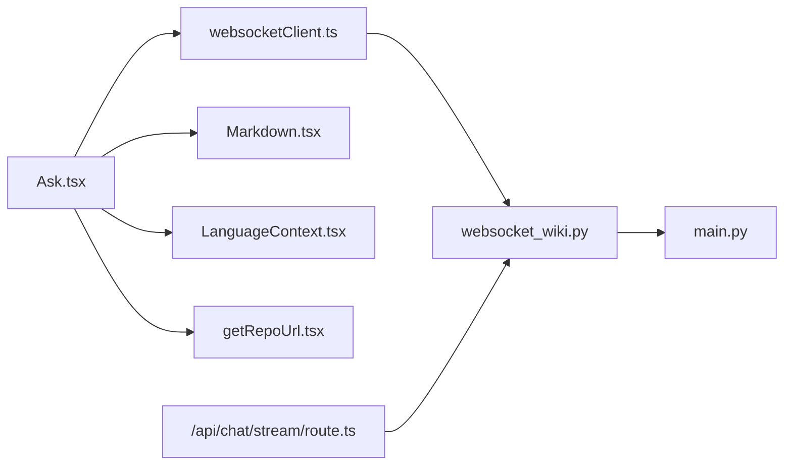

# Ask Component

<cite>
**Referenced Files in This Document**
- [Ask.tsx](file://src/components/Ask.tsx)
- [websocketClient.ts](file://src/utils/websocketClient.ts)
- [ModelSelectionModal.tsx](file://src/components/ModelSelectionModal.tsx)
- [Markdown.tsx](file://src/components/Markdown.tsx)
- [repoinfo.tsx](file://src/types/repoinfo.tsx)
- [getRepoUrl.tsx](file://src/utils/getRepoUrl.tsx)
- [LanguageContext.tsx](file://src/contexts/LanguageContext.tsx)
- [route.ts](file://src/app/api/chat/stream/route.ts)
- [websocket_wiki.py](file://api/websocket_wiki.py)
- [main.py](file://api/main.py)
</cite>

## Table of Contents
1. [Introduction](#introduction)
2. [Project Structure](#project-structure)
3. [Core Components](#core-components)
4. [Architecture Overview](#architecture-overview)
5. [Detailed Component Analysis](#detailed-component-analysis)
6. [Dependency Analysis](#dependency-analysis)
7. [Performance Considerations](#performance-considerations)
8. [Troubleshooting Guide](#troubleshooting-guide)
9. [Conclusion](#conclusion)
10. [Appendices](#appendices)

## Introduction
The Ask component is the core RAG interaction UI for DeepWiki-Open. It enables users to ask questions about a code repository with optional deep research capabilities, real-time streaming responses via WebSocket, and Markdown-rendered outputs. It integrates with a WebSocket-based backend and falls back to HTTP streaming when needed. The component manages conversation history, research stages, and provides navigation controls for multi-turn deep research.

## Project Structure
The Ask component resides in the frontend under src/components and interacts with:
- WebSocket client utilities for streaming
- Model selection modal for provider/model configuration
- Markdown renderer for formatted output
- Language context for internationalization
- Backend WebSocket handler and HTTP fallback route

**Diagram sources**
- [Ask.tsx](file://src/components/Ask.tsx#L1-L929)
- [websocketClient.ts](file://src/utils/websocketClient.ts#L1-L86)
- [ModelSelectionModal.tsx](file://src/components/ModelSelectionModal.tsx#L1-L260)
- [Markdown.tsx](file://src/components/Markdown.tsx#L1-L208)
- [LanguageContext.tsx](file://src/contexts/LanguageContext.tsx#L1-L203)
- [getRepoUrl.tsx](file://src/utils/getRepoUrl.tsx#L1-L17)
- [repoinfo.tsx](file://src/types/repoinfo.tsx#L1-L11)
- [route.ts](file://src/app/api/chat/stream/route.ts#L1-L113)
- [websocket_wiki.py](file://api/websocket_wiki.py#L1-L978)
- [main.py](file://api/main.py#L1-L104)

**Section sources**
- [Ask.tsx](file://src/components/Ask.tsx#L1-L929)
- [websocketClient.ts](file://src/utils/websocketClient.ts#L1-L86)
- [ModelSelectionModal.tsx](file://src/components/ModelSelectionModal.tsx#L1-L260)
- [Markdown.tsx](file://src/components/Markdown.tsx#L1-L208)
- [LanguageContext.tsx](file://src/contexts/LanguageContext.tsx#L1-L203)
- [getRepoUrl.tsx](file://src/utils/getRepoUrl.tsx#L1-L17)
- [repoinfo.tsx](file://src/types/repoinfo.tsx#L1-L11)
- [route.ts](file://src/app/api/chat/stream/route.ts#L1-L113)
- [websocket_wiki.py](file://api/websocket_wiki.py#L1-L978)
- [main.py](file://api/main.py#L1-L104)

## Core Components
- Ask.tsx: Main component implementing the UI, state, deep research logic, WebSocket streaming, HTTP fallback, conversation/history management, and research navigation.
- websocketClient.ts: Provides createChatWebSocket and closeWebSocket utilities to connect to the backend WebSocket endpoint.
- ModelSelectionModal.tsx: Modal for selecting provider, model, and related options; integrates with Ask via props/state.
- Markdown.tsx: Renders streamed Markdown content with syntax highlighting and Mermaid support.
- LanguageContext.tsx: Supplies localized messages used in Ask UI (placeholders, buttons, tooltips).
- getRepoUrl.tsx: Utility to resolve repository URL from RepoInfo.
- repoinfo.tsx: Type definition for repository metadata.
- route.ts: HTTP fallback route proxying to the backend streaming endpoint.
- websocket_wiki.py: Backend WebSocket handler implementing RAG, deep research orchestration, and streaming responses.
- main.py: Backend entrypoint configuring environment and starting the FastAPI app.

**Section sources**
- [Ask.tsx](file://src/components/Ask.tsx#L36-L54)
- [websocketClient.ts](file://src/utils/websocketClient.ts#L43-L86)
- [ModelSelectionModal.tsx](file://src/components/ModelSelectionModal.tsx#L9-L46)
- [Markdown.tsx](file://src/components/Markdown.tsx#L9-L11)
- [LanguageContext.tsx](file://src/contexts/LanguageContext.tsx#L8-L13)
- [getRepoUrl.tsx](file://src/utils/getRepoUrl.tsx#L3-L16)
- [repoinfo.tsx](file://src/types/repoinfo.tsx#L1-L11)
- [route.ts](file://src/app/api/chat/stream/route.ts#L9-L28)
- [websocket_wiki.py](file://api/websocket_wiki.py#L53-L63)
- [main.py](file://api/main.py#L87-L103)

## Architecture Overview
The Ask component uses a WebSocket-first streaming architecture:
- Frontend: Ask.tsx creates a WebSocket connection via websocketClient.ts and streams tokens as they arrive.
- Backend: websocket_wiki.py handles the WebSocket, prepares RAG context, applies provider-specific streaming, and emits tokens.
- Fallback: If WebSocket fails, Ask.tsx falls back to HTTP streaming via route.ts to the backend’s streaming endpoint.
- Rendering: Responses are rendered by Markdown.tsx with syntax highlighting and Mermaid diagrams.

**Diagram sources**
- [Ask.tsx](file://src/components/Ask.tsx#L578-L620)
- [websocketClient.ts](file://src/utils/websocketClient.ts#L43-L75)
- [websocket_wiki.py](file://api/websocket_wiki.py#L53-L780)
- [Markdown.tsx](file://src/components/Markdown.tsx#L13-L205)

## Detailed Component Analysis

### Props Interface and State Management
- Props:
  - repoInfo: RepoInfo — repository metadata including owner, repo, type, token, localPath, repoUrl, and optional branch.
  - provider: string — selected provider ID.
  - model: string — selected model ID.
  - isCustomModel: boolean — whether a custom model is selected.
  - customModel: string — custom model name.
  - language: string — language code for content generation.
  - onRef?: (ref: { clearConversation: () => void }) => void — exposes a method to clear the conversation to parent components.
- Internal state:
  - Question input, streaming response, loading state, deep research toggle.
  - Selected provider/model, custom model flag, and custom model name.
  - Conversation history (Message[]), research stages (ResearchStage[]), current stage index, iteration count, and completion flag.
  - Refs for input, response container, and WebSocket.

Key behaviors:
- Auto-focus input on mount.
- Expose clearConversation via onRef.
- Scroll response container to bottom on new content.
- Fetch default provider/model if not provided.
- Close WebSocket on unmount.

**Section sources**
- [Ask.tsx](file://src/components/Ask.tsx#L36-L108)
- [repoinfo.tsx](file://src/types/repoinfo.tsx#L1-L11)

### WebSocket-Based Streaming Architecture
- Connection handling:
  - createChatWebSocket constructs a WebSocket URL from SERVER_BASE_URL and opens a ws/wss connection.
  - Sends the ChatCompletionRequest payload as JSON on open.
- Message streaming:
  - onmessage appends received tokens to the growing response.
  - On close, checks completion conditions and triggers auto-continuation for deep research.
- Error handling and fallback:
  - onerror logs and appends an error notice to the response.
  - FallbackToHttp performs a POST to /api/chat/stream with the same request body, reads the backend stream, and updates response incrementally.
- Closing behavior:
  - closeWebSocket ensures the connection is closed when needed.

**Diagram sources**
- [websocketClient.ts](file://src/utils/websocketClient.ts#L43-L75)
- [Ask.tsx](file://src/components/Ask.tsx#L337-L403)
- [Ask.tsx](file://src/components/Ask.tsx#L406-L480)
- [Ask.tsx](file://src/components/Ask.tsx#L482-L498)

**Section sources**
- [websocketClient.ts](file://src/utils/websocketClient.ts#L43-L86)
- [Ask.tsx](file://src/components/Ask.tsx#L277-L403)
- [Ask.tsx](file://src/components/Ask.tsx#L406-L480)

### Deep Research Functionality and Multi-Turn Iteration
- Detection:
  - Initial research is triggered by prepending “[DEEP RESEARCH]” to the user’s question.
  - Continuation detection recognizes “continue the research” in subsequent user messages and reuses the original topic.
- Stages:
  - First iteration: starts with “## Research Plan” and ends with “## Next Steps”.
  - Iterations 1–4: “## Research Update X”.
  - Final iteration: “## Final Conclusion”.
- Navigation:
  - ResearchStage[] tracks stages; currentStageIndex allows moving between stages with Previous/Next buttons.
- Automatic continuation:
  - After each response, the component checks completion and auto-continues research with a small delay, up to 5 iterations.

**Diagram sources**
- [Ask.tsx](file://src/components/Ask.tsx#L212-L253)
- [Ask.tsx](file://src/components/Ask.tsx#L281-L403)
- [Ask.tsx](file://src/components/Ask.tsx#L482-L530)
- [websocket_wiki.py](file://api/websocket_wiki.py#L147-L178)

**Section sources**
- [Ask.tsx](file://src/components/Ask.tsx#L176-L209)
- [Ask.tsx](file://src/components/Ask.tsx#L212-L253)
- [Ask.tsx](file://src/components/Ask.tsx#L281-L403)
- [Ask.tsx](file://src/components/Ask.tsx#L482-L530)
- [websocket_wiki.py](file://api/websocket_wiki.py#L147-L178)

### Conversation History Management
- Initial message: constructed from the user’s question (with “[DEEP RESEARCH]” prefix if enabled).
- Subsequent turns: assistant’s previous response plus a user continuation message “[DEEP RESEARCH] Continue the research”.
- Memory integration: the backend maintains conversation history in memory for multi-turn context.

**Section sources**
- [Ask.tsx](file://src/components/Ask.tsx#L541-L576)
- [Ask.tsx](file://src/components/Ask.tsx#L294-L304)
- [websocket_wiki.py](file://api/websocket_wiki.py#L135-L145)

### Research Navigation Controls and Response Formatting
- Navigation:
  - Previous/Next buttons move between research stages; stage counter shows current position.
- Formatting:
  - Markdown.tsx renders headings, lists, tables, links, blockquotes, code blocks, and Mermaid diagrams.
  - Inline code and code blocks support syntax highlighting and copy-to-clipboard.
- Download:
  - Download button saves the current response as a Markdown file.

**Section sources**
- [Ask.tsx](file://src/components/Ask.tsx#L747-L799)
- [Markdown.tsx](file://src/components/Markdown.tsx#L13-L205)

### Practical Usage Examples and Integration Patterns
- Basic usage:
  - Wrap Ask with LanguageContext provider to localize UI strings.
  - Pass repoInfo with owner/repo/type/token/localPath/repoUrl/branch.
  - Optionally pre-set provider, model, isCustomModel, customModel, language.
- Integration with ModelSelectionModal:
  - Open the modal to select provider/model; apply changes and close; Ask updates selectedProvider/selectedModel/isCustomSelectedModel/customSelectedModel.
- Parent access:
  - Use onRef to obtain a clearConversation method and reset the UI externally.

**Section sources**
- [Ask.tsx](file://src/components/Ask.tsx#L904-L923)
- [ModelSelectionModal.tsx](file://src/components/ModelSelectionModal.tsx#L116-L134)
- [LanguageContext.tsx](file://src/contexts/LanguageContext.tsx#L196-L202)

### Relationship with ModelSelectionModal and WebSocket Client Utilities
- ModelSelectionModal:
  - Manages provider, model, custom model, and wiki type toggles.
  - Applies changes on submit and optionally passes tokens for refresh.
- WebSocket client:
  - createChatWebSocket encapsulates connection creation and event handling.
  - closeWebSocket ensures cleanup.

**Section sources**
- [ModelSelectionModal.tsx](file://src/components/ModelSelectionModal.tsx#L9-L46)
- [websocketClient.ts](file://src/utils/websocketClient.ts#L43-L86)

## Dependency Analysis
- Frontend dependencies:
  - Ask depends on websocketClient for transport, Markdown for rendering, LanguageContext for i18n, and getRepoUrl for resolving repository URLs.
- Backend dependencies:
  - WebSocket handler depends on RAG pipeline, provider clients, and environment configuration.
- API routing:
  - HTTP fallback route proxies to the backend streaming endpoint.

**Diagram sources**
- [Ask.tsx](file://src/components/Ask.tsx#L1-L11)
- [websocketClient.ts](file://src/utils/websocketClient.ts#L1-L15)
- [Markdown.tsx](file://src/components/Markdown.tsx#L1-L7)
- [LanguageContext.tsx](file://src/contexts/LanguageContext.tsx#L1-L7)
- [getRepoUrl.tsx](file://src/utils/getRepoUrl.tsx#L1-L1)
- [route.ts](file://src/app/api/chat/stream/route.ts#L1-L28)
- [websocket_wiki.py](file://api/websocket_wiki.py#L1-L26)
- [main.py](file://api/main.py#L1-L33)

**Section sources**
- [Ask.tsx](file://src/components/Ask.tsx#L1-L11)
- [websocketClient.ts](file://src/utils/websocketClient.ts#L1-L15)
- [route.ts](file://src/app/api/chat/stream/route.ts#L1-L28)
- [websocket_wiki.py](file://api/websocket_wiki.py#L1-L26)
- [main.py](file://api/main.py#L1-L33)

## Performance Considerations
- Streaming responsiveness:
  - WebSocket reduces latency compared to polling; ensure SERVER_BASE_URL points to a low-latency backend.
- Backpressure:
  - Append tokens incrementally; avoid excessive re-renders by batching DOM updates.
- Deep research limits:
  - Auto-continuation stops at 5 iterations; consider adding user-configurable limits.
- Large inputs:
  - Backend detects oversized inputs and may skip RAG context; the Ask component falls back gracefully.

[No sources needed since this section provides general guidance]

## Troubleshooting Guide
Common issues and resolutions:
- WebSocket connection failures:
  - The component appends an error notice and falls back to HTTP streaming via /api/chat/stream.
- Backend errors:
  - The backend may return provider-specific errors (e.g., missing API keys). The frontend displays a user-friendly message.
- Token limit exceeded:
  - The backend retries without context; if still failing, suggest shortening the query.
- Deep research not completing:
  - Ensure the response contains “## Final Conclusion” or equivalent markers; otherwise, the component forces completion after 5 iterations.

**Section sources**
- [Ask.tsx](file://src/components/Ask.tsx#L369-L375)
- [Ask.tsx](file://src/components/Ask.tsx#L474-L476)
- [websocket_wiki.py](file://api/websocket_wiki.py#L781-L962)
- [route.ts](file://src/app/api/chat/stream/route.ts#L31-L42)

## Conclusion
The Ask component delivers a robust, real-time RAG experience with deep research capabilities. Its WebSocket-first streaming architecture ensures responsive interactions, while the fallback mechanism guarantees resilience. The component’s modular design integrates cleanly with provider selection, localization, and Markdown rendering, enabling flexible and accessible usage across diverse repositories and languages.

## Appendices

### Props Reference
- repoInfo: RepoInfo — repository metadata.
- provider: string — provider ID.
- model: string — model ID.
- isCustomModel: boolean — custom model flag.
- customModel: string — custom model name.
- language: string — language code.
- onRef: (ref: { clearConversation: () => void }) => void — optional callback to expose clearConversation.

**Section sources**
- [Ask.tsx](file://src/components/Ask.tsx#L36-L54)
- [repoinfo.tsx](file://src/types/repoinfo.tsx#L1-L11)

### Backend Request Schema
- ChatCompletionRequest fields:
  - repo_url: string
  - messages: Array of ChatMessage (role, content)
  - filePath?: string
  - token?: string
  - type?: string
  - provider?: string
  - model?: string
  - language?: string
  - excluded_dirs?: string
  - excluded_files?: string

**Section sources**
- [websocketClient.ts](file://src/utils/websocketClient.ts#L22-L33)
- [websocket_wiki.py](file://api/websocket_wiki.py#L33-L52)