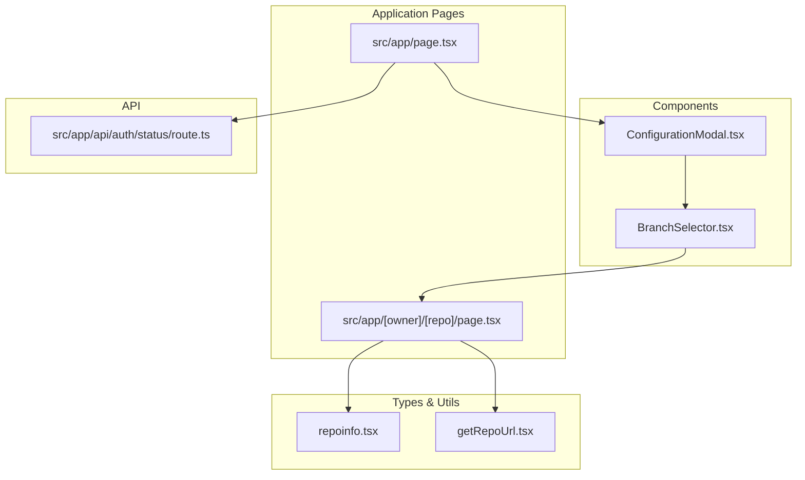
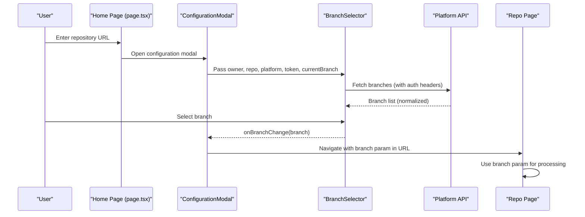
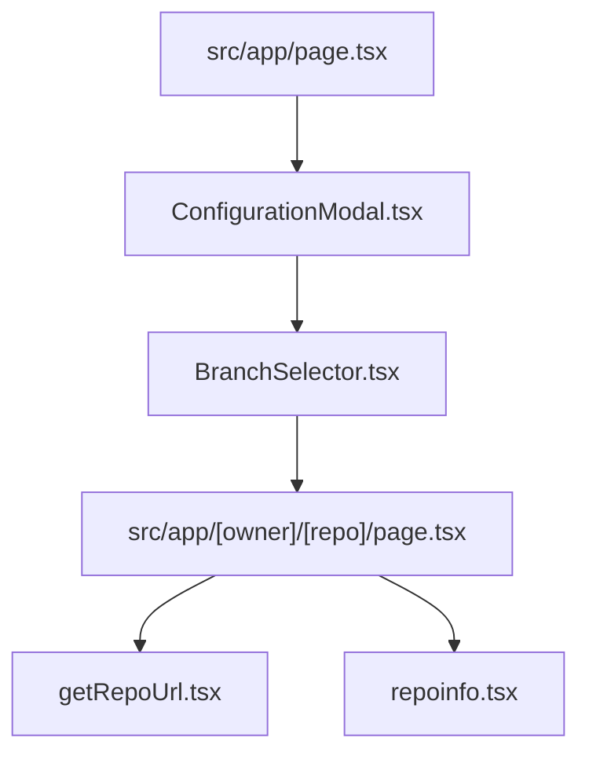

# Branch Selector Component

<cite>
**Referenced Files in This Document**
- [BranchSelector.tsx](file://src/components/BranchSelector.tsx)
- [ConfigurationModal.tsx](file://src/components/ConfigurationModal.tsx)
- [page.tsx](file://src/app/page.tsx)
- [page.tsx](file://src/app/[owner]/[repo]/page.tsx)
- [repoinfo.tsx](file://src/types/repoinfo.tsx)
- [getRepoUrl.tsx](file://src/utils/getRepoUrl.tsx)
- [route.ts](file://src/app/api/auth/status/route.ts)
</cite>

## Table of Contents
1. [Introduction](#introduction)
2. [Project Structure](#project-structure)
3. [Core Components](#core-components)
4. [Architecture Overview](#architecture-overview)
5. [Detailed Component Analysis](#detailed-component-analysis)
6. [Dependency Analysis](#dependency-analysis)
7. [Performance Considerations](#performance-considerations)
8. [Troubleshooting Guide](#troubleshooting-guide)
9. [Conclusion](#conclusion)

## Introduction
This document provides comprehensive documentation for the BranchSelector component used for repository branch selection. It explains the component's props, internal state management, integration with repository processing workflows, UI patterns for displaying available branches, branch validation, and user selection handling. It also covers error handling for invalid branches, integration with repository URL processing and authentication flows, and accessibility considerations.

## Project Structure
The BranchSelector component resides in the components directory and is integrated into the main application flow via the ConfigurationModal and the repository page. It interacts with repository URL parsing, authentication status, and branch parameter propagation in the URL.

**Diagram sources**
- [BranchSelector.tsx](file://src/components/BranchSelector.tsx#L1-L236)
- [ConfigurationModal.tsx](file://src/components/ConfigurationModal.tsx#L1-L364)
- [page.tsx](file://src/app/page.tsx#L1-L637)
- [page.tsx](file://src/app/[owner]/[repo]/page.tsx#L178-L295)
- [repoinfo.tsx](file://src/types/repoinfo.tsx#L1-L11)
- [getRepoUrl.tsx](file://src/utils/getRepoUrl.tsx#L1-L17)
- [route.ts](file://src/app/api/auth/status/route.ts#L1-L32)

**Section sources**
- [BranchSelector.tsx](file://src/components/BranchSelector.tsx#L1-L236)
- [ConfigurationModal.tsx](file://src/components/ConfigurationModal.tsx#L1-L364)
- [page.tsx](file://src/app/page.tsx#L1-L637)
- [page.tsx](file://src/app/[owner]/[repo]/page.tsx#L178-L295)
- [repoinfo.tsx](file://src/types/repoinfo.tsx#L1-L11)
- [getRepoUrl.tsx](file://src/utils/getRepoUrl.tsx#L1-L17)
- [route.ts](file://src/app/api/auth/status/route.ts#L1-L32)

## Core Components
- BranchSelector: A React component that fetches and displays available branches for a given repository, manages selection state, and handles authentication and error scenarios across GitHub, GitLab, and Bitbucket.
- ConfigurationModal: Integrates BranchSelector into the configuration flow, extracting owner/repo from the repository input and passing platform-specific tokens and branch state.
- Repository Page: Uses BranchSelector for branch selection and propagates the selected branch via URL parameters to trigger repository processing workflows.

Key responsibilities:
- Fetch branches from platform-specific APIs with appropriate headers and URL encoding.
- Normalize branch data across platforms for consistent UI display.
- Manage loading, error, and selection states.
- Integrate with authentication flows and repository URL processing.

**Section sources**
- [BranchSelector.tsx](file://src/components/BranchSelector.tsx#L12-L30)
- [ConfigurationModal.tsx](file://src/components/ConfigurationModal.tsx#L145-L201)
- [page.tsx](file://src/app/[owner]/[repo]/page.tsx#L276-L295)

## Architecture Overview
The BranchSelector participates in a multi-stage workflow:
1. User enters repository URL in the home page.
2. ConfigurationModal initializes BranchSelector with owner, repo, platform, and token.
3. BranchSelector fetches branches from the respective platform API.
4. User selects a branch; the selection propagates to the repository page via URL parameters.
5. The repository page uses the branch parameter to drive wiki generation and file URL generation.

**Diagram sources**
- [page.tsx](file://src/app/page.tsx#L255-L401)
- [ConfigurationModal.tsx](file://src/components/ConfigurationModal.tsx#L145-L201)
- [BranchSelector.tsx](file://src/components/BranchSelector.tsx#L47-L151)
- [page.tsx](file://src/app/[owner]/[repo]/page.tsx#L188-L203)

## Detailed Component Analysis

### BranchSelector Component
The BranchSelector component encapsulates branch selection logic and UI. It accepts props for owner, repo, platform type, current branch, and an optional token, and exposes an onBranchChange callback.

Props:
- owner: string – Repository owner or namespace.
- repo: string – Repository name.
- repoType: 'github' | 'gitlab' | 'bitbucket' – Platform type.
- currentBranch: string – Currently selected branch.
- onBranchChange: (branch: string) => void – Callback invoked when a branch is selected.
- token?: string | null – Optional access token for private repositories.
- className?: string – Optional CSS class for styling.

State:
- branches: Branch[] – List of available branches fetched from the platform API.
- isOpen: boolean – Whether the dropdown menu is visible.
- isLoading: boolean – Indicates ongoing branch fetch operation.
- error: string | null – Error message if branch fetch fails.

Behavior:
- Fetches branches on mount or when owner/repo/platform/token change.
- Normalizes branch data across platforms (GitHub, GitLab, Bitbucket).
- Handles authentication headers per platform.
- Provides retry mechanism and fallback default branches on error.
- Manages dropdown visibility and selection.

UI Patterns:
- Dropdown button with chevron indicator and current branch label.
- Scrollable list of branches with current selection highlighted.
- Commit SHA display for each branch (when available).
- Error banner with retry action and fallback suggestion.

Integration:
- Used inside ConfigurationModal to select branches before wiki generation.
- Propagates selection to the repository page via URL parameter 'branch'.

Accessibility:
- Dropdown toggled via button with keyboard focus support.
- Current selection indicated with visual emphasis and badge.
- Error messages presented clearly with retry option.

Error Handling:
- Handles 404 (repository not found or no access), 403 (requires auth or permission denied), 429 (rate limit), and generic failures.
- On error, sets error state, optionally falls back to common default branches.

**Section sources**
- [BranchSelector.tsx](file://src/components/BranchSelector.tsx#L12-L30)
- [BranchSelector.tsx](file://src/components/BranchSelector.tsx#L36-L45)
- [BranchSelector.tsx](file://src/components/BranchSelector.tsx#L47-L151)
- [BranchSelector.tsx](file://src/components/BranchSelector.tsx#L153-L156)
- [BranchSelector.tsx](file://src/components/BranchSelector.tsx#L158-L236)

### Integration with ConfigurationModal
The ConfigurationModal integrates BranchSelector into the configuration flow. It extracts owner and repo from the repository input and passes them along with the selected platform and token to BranchSelector. It also manages the selectedBranch state and passes it back via onBranchChange.

Key integration points:
- Owner/repo extraction from repository input (URL or owner/repo format).
- Passing selectedPlatform, accessToken, and selectedBranch to BranchSelector.
- Updating selectedBranch when the user makes a selection.

**Section sources**
- [ConfigurationModal.tsx](file://src/components/ConfigurationModal.tsx#L145-L201)
- [ConfigurationModal.tsx](file://src/components/ConfigurationModal.tsx#L152-L195)

### Repository URL Processing and Branch Parameter
The repository page reads the branch parameter from the URL and uses it to drive wiki generation and file URL construction. When the user selects a branch in the BranchSelector, the repository page updates the URL and refreshes content accordingly.

Key behaviors:
- Reads branch parameter from URL search params.
- Updates URL when branch changes and clears wiki data to force refresh.
- Generates file URLs based on the selected branch and repository type.

**Section sources**
- [page.tsx](file://src/app/[owner]/[repo]/page.tsx#L188-L203)
- [page.tsx](file://src/app/[owner]/[repo]/page.tsx#L276-L295)
- [page.tsx](file://src/app/[owner]/[repo]/page.tsx#L298-L329)

### Authentication Flows
The application checks authentication requirements and validates authorization codes before proceeding with wiki generation. While BranchSelector itself does not directly validate tokens, it respects the presence of tokens passed in props to access private repositories.

Key points:
- Authentication status is fetched from the backend API.
- Authorization code validation is performed before proceeding with generation.
- BranchSelector uses platform-specific headers when a token is provided.

**Section sources**
- [page.tsx](file://src/app/page.tsx#L157-L178)
- [page.tsx](file://src/app/page.tsx#L271-L294)
- [route.ts](file://src/app/api/auth/status/route.ts#L1-L32)
- [BranchSelector.tsx](file://src/components/BranchSelector.tsx#L58-L85)

### Data Models and Utilities
- RepoInfo: Defines the shape of repository information including owner, repo, type, token, localPath, repoUrl, and optional branch.
- getRepoUrl: Utility to construct a repository URL from RepoInfo, supporting local paths and remote URLs.

**Section sources**
- [repoinfo.tsx](file://src/types/repoinfo.tsx#L1-L11)
- [getRepoUrl.tsx](file://src/utils/getRepoUrl.tsx#L1-L17)

## Dependency Analysis
The BranchSelector depends on:
- Platform-specific APIs (GitHub, GitLab, Bitbucket) for branch retrieval.
- Authentication headers configured per platform.
- ConfigurationModal for initialization and state management.
- Repository page for URL parameter propagation and processing.

**Diagram sources**
- [BranchSelector.tsx](file://src/components/BranchSelector.tsx#L1-L236)
- [ConfigurationModal.tsx](file://src/components/ConfigurationModal.tsx#L1-L364)
- [page.tsx](file://src/app/page.tsx#L1-L637)
- [page.tsx](file://src/app/[owner]/[repo]/page.tsx#L178-L295)
- [repoinfo.tsx](file://src/types/repoinfo.tsx#L1-L11)
- [getRepoUrl.tsx](file://src/utils/getRepoUrl.tsx#L1-L17)

**Section sources**
- [BranchSelector.tsx](file://src/components/BranchSelector.tsx#L1-L236)
- [ConfigurationModal.tsx](file://src/components/ConfigurationModal.tsx#L1-L364)
- [page.tsx](file://src/app/page.tsx#L1-L637)
- [page.tsx](file://src/app/[owner]/[repo]/page.tsx#L178-L295)
- [repoinfo.tsx](file://src/types/repoinfo.tsx#L1-L11)
- [getRepoUrl.tsx](file://src/utils/getRepoUrl.tsx#L1-L17)

## Performance Considerations
- Branch fetching is triggered only when owner, repo, platform, or token change, minimizing redundant network calls.
- Error handling includes a fallback to common default branches to reduce perceived downtime.
- The dropdown list is scrollable to accommodate long branch lists.
- Consider debouncing or caching branch lists if the component is reused frequently across sessions.

## Troubleshooting Guide
Common issues and resolutions:
- Missing owner/repo: The component logs and sets an error when either owner or repo is empty, preventing unnecessary API calls.
- Repository not found or access denied: The component distinguishes between 404 and 403 responses and provides actionable messages. For 403 without a token, it suggests adding an access token.
- Rate limit exceeded: Displays a rate limit message and suggests retrying later or adding a token.
- Network errors: General failure messages are shown; the component attempts to provide fallback branches.
- Platform-specific headers: Ensure the correct token type is used per platform (GitHub token vs. GitLab PRIVATE-TOKEN vs. Bitbucket Bearer).

**Section sources**
- [BranchSelector.tsx](file://src/components/BranchSelector.tsx#L38-L44)
- [BranchSelector.tsx](file://src/components/BranchSelector.tsx#L89-L103)
- [BranchSelector.tsx](file://src/components/BranchSelector.tsx#L137-L150)

## Conclusion
The BranchSelector component provides a robust, platform-agnostic branch selection experience with strong error handling, authentication support, and seamless integration into the application’s configuration and repository processing workflows. Its design ensures reliable branch discovery and selection across GitHub, GitLab, and Bitbucket, while maintaining a clean UI and accessible interactions.