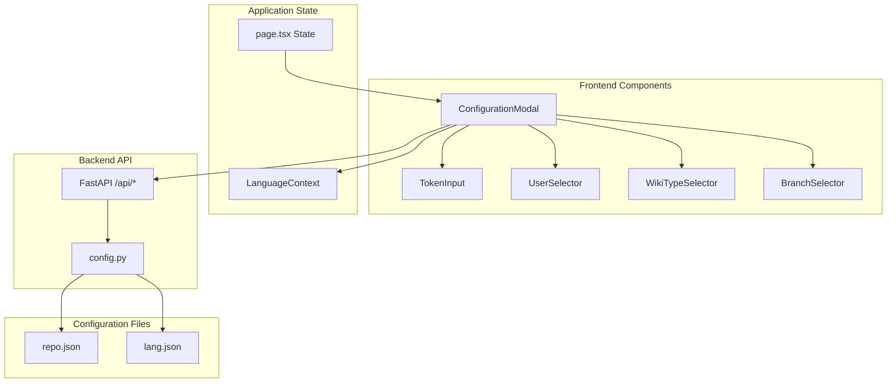
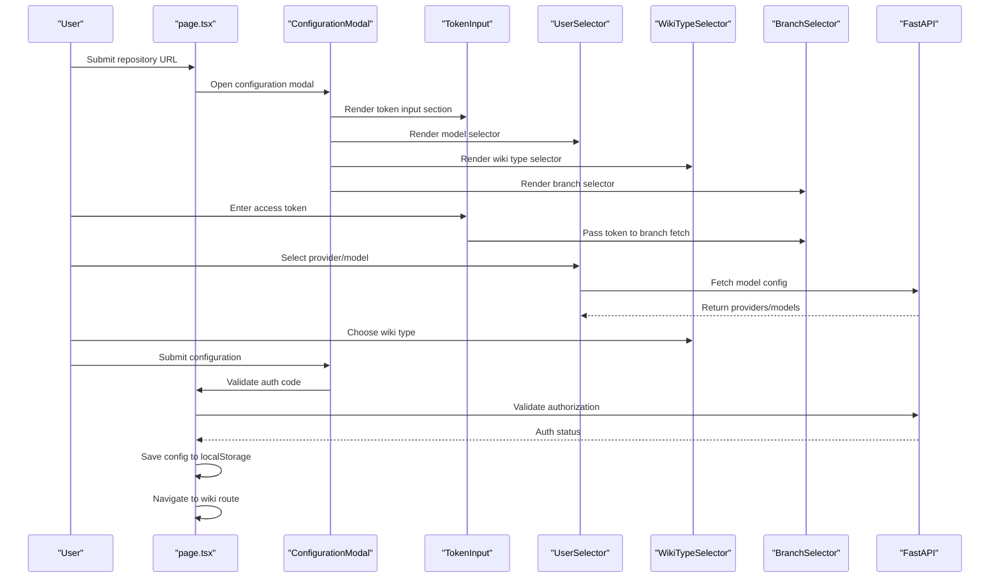
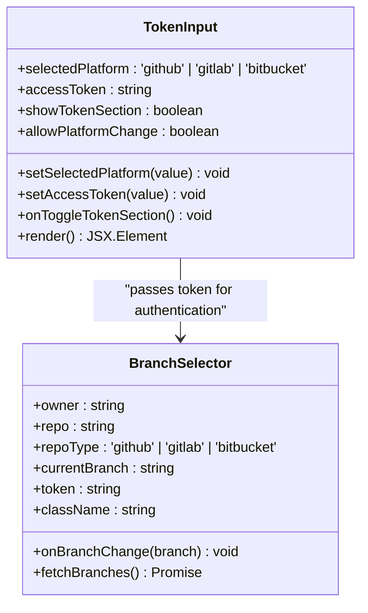
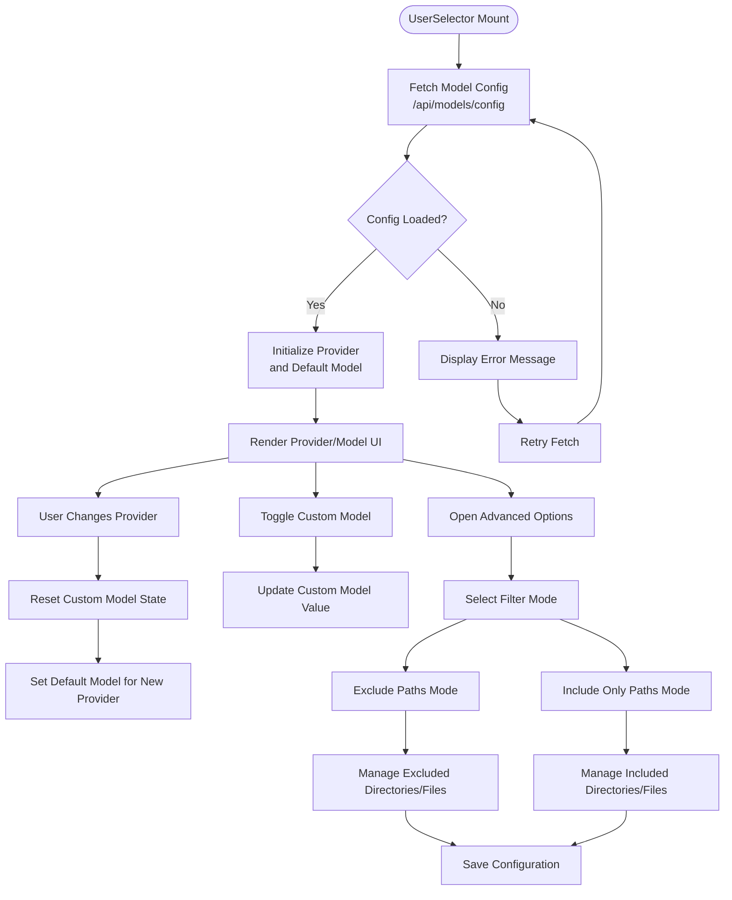
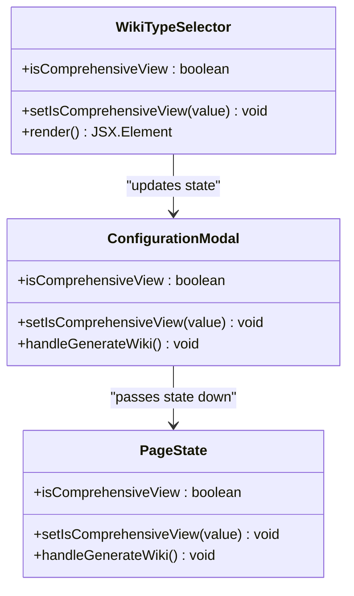
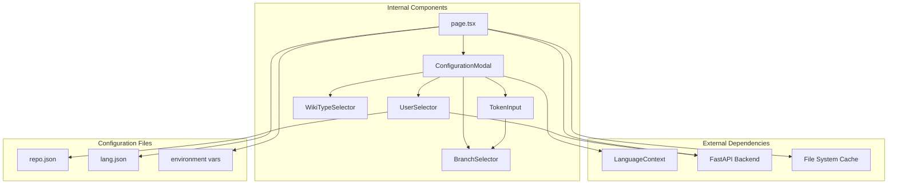

# Configuration Input Components

<cite>
**Referenced Files in This Document**
- [TokenInput.tsx](file://src/components/TokenInput.tsx)
- [UserSelector.tsx](file://src/components/UserSelector.tsx)
- [WikiTypeSelector.tsx](file://src/components/WikiTypeSelector.tsx)
- [ConfigurationModal.tsx](file://src/components/ConfigurationModal.tsx)
- [BranchSelector.tsx](file://src/components/BranchSelector.tsx)
- [page.tsx](file://src/app/page.tsx)
- [LanguageContext.tsx](file://src/contexts/LanguageContext.tsx)
- [api.py](file://api/api.py)
- [config.py](file://api/config.py)
- [repo.json](file://api/config/repo.json)
- [lang.json](file://api/config/lang.json)
- [en.json](file://src/messages/en.json)
</cite>

## Table of Contents
1. [Introduction](#introduction)
2. [Project Structure](#project-structure)
3. [Core Components](#core-components)
4. [Architecture Overview](#architecture-overview)
5. [Detailed Component Analysis](#detailed-component-analysis)
6. [Dependency Analysis](#dependency-analysis)
7. [Performance Considerations](#performance-considerations)
8. [Troubleshooting Guide](#troubleshooting-guide)
9. [Conclusion](#conclusion)

## Introduction
This document provides comprehensive documentation for the configuration input components that enable users to configure repository authentication, model selection, and wiki generation preferences. The three primary components covered are:
- TokenInput: Handles personal access tokens for repository authentication across GitHub, GitLab, and Bitbucket platforms
- UserSelector: Manages model provider selection, model configuration, and advanced file filtering options
- WikiTypeSelector: Controls the wiki generation mode between comprehensive and concise views

These components integrate with the main application state through the ConfigurationModal and are validated against authentication systems, repository access patterns, and wiki generation preferences.

## Project Structure
The configuration components are organized within the Next.js application under the src/components directory and integrate with the main application state in src/app/page.tsx. They rely on:
- Internationalization through LanguageContext and message files
- Backend API endpoints for model configuration and authentication status
- Configuration files for default repository filters and supported languages

**Diagram sources**
- [ConfigurationModal.tsx](file://src/components/ConfigurationModal.tsx#L1-L364)
- [TokenInput.tsx](file://src/components/TokenInput.tsx#L1-L108)
- [UserSelector.tsx](file://src/components/UserSelector.tsx#L1-L540)
- [WikiTypeSelector.tsx](file://src/components/WikiTypeSelector.tsx#L1-L79)
- [BranchSelector.tsx](file://src/components/BranchSelector.tsx#L1-L236)
- [page.tsx](file://src/app/page.tsx#L1-L637)
- [LanguageContext.tsx](file://src/contexts/LanguageContext.tsx#L1-L203)
- [api.py](file://api/api.py#L1-L635)
- [config.py](file://api/config.py#L1-L464)
- [repo.json](file://api/config/repo.json#L1-L129)
- [lang.json](file://api/config/lang.json#L1-L16)

**Section sources**
- [ConfigurationModal.tsx](file://src/components/ConfigurationModal.tsx#L1-L364)
- [page.tsx](file://src/app/page.tsx#L1-L637)

## Core Components
This section provides an overview of each component's role and integration patterns within the configuration workflow.

### TokenInput Component
The TokenInput component manages personal access tokens for repository authentication across multiple platforms. It provides:
- Platform selection (GitHub, GitLab, Bitbucket)
- Secure token input with password masking
- Toggleable token section for privacy
- Platform-specific authentication headers for branch fetching

Integration patterns:
- Controlled by ConfigurationModal props for selected platform and access token
- Passes token to BranchSelector for repository access
- Supports platform change toggling based on allowPlatformChange prop

### UserSelector Component
The UserSelector component handles model configuration and advanced file filtering:
- Dynamic model provider selection with API-driven configuration
- Model dropdown with custom model support
- Advanced file filter configuration with include/exclude modes
- Default filter management using repository configuration

Integration patterns:
- Fetches model configuration from /api/models/config endpoint
- Manages provider/model state for wiki generation
- Provides file filter controls for repository processing

### WikiTypeSelector Component
The WikiTypeSelector component controls wiki generation preferences:
- Comprehensive vs concise wiki modes
- Visual selection interface with icons
- Persistent state management for wiki structure complexity

Integration patterns:
- Controlled by ConfigurationModal state for isComprehensiveView
- Influences wiki generation complexity and page count

**Section sources**
- [TokenInput.tsx](file://src/components/TokenInput.tsx#L1-L108)
- [UserSelector.tsx](file://src/components/UserSelector.tsx#L1-L540)
- [WikiTypeSelector.tsx](file://src/components/WikiTypeSelector.tsx#L1-L79)

## Architecture Overview
The configuration components follow a centralized state management pattern with the main application state coordinating user interactions and validation.

**Diagram sources**
- [page.tsx](file://src/app/page.tsx#L255-L401)
- [ConfigurationModal.tsx](file://src/components/ConfigurationModal.tsx#L105-L364)
- [TokenInput.tsx](file://src/components/TokenInput.tsx#L16-L108)
- [UserSelector.tsx](file://src/components/UserSelector.tsx#L82-L123)
- [BranchSelector.tsx](file://src/components/BranchSelector.tsx#L47-L151)
- [api.py](file://api/api.py#L167-L226)

## Detailed Component Analysis

### TokenInput Component Analysis
The TokenInput component provides secure token management for repository authentication across multiple platforms.

**Diagram sources**
- [TokenInput.tsx](file://src/components/TokenInput.tsx#L6-L24)
- [BranchSelector.tsx](file://src/components/BranchSelector.tsx#L12-L30)

Key functionality:
- Platform-specific authentication headers:
  - GitHub: Authorization: token {token}
  - GitLab: PRIVATE-TOKEN: {token}
  - Bitbucket: Authorization: Bearer {token}
- Password masking for security
- Conditional rendering based on showTokenSection prop
- Platform change capability controlled by allowPlatformChange

Validation rules:
- Token format validation occurs during branch fetching
- Error handling for unauthorized access and rate limits
- Fallback to common default branches when API errors occur

Accessibility features:
- Proper labeling with aria attributes
- Keyboard navigation support
- Focus management for form controls

**Section sources**
- [TokenInput.tsx](file://src/components/TokenInput.tsx#L1-L108)
- [BranchSelector.tsx](file://src/components/BranchSelector.tsx#L58-L103)

### UserSelector Component Analysis
The UserSelector component manages model provider selection and advanced file filtering capabilities.

**Diagram sources**
- [UserSelector.tsx](file://src/components/UserSelector.tsx#L82-L123)
- [UserSelector.tsx](file://src/components/UserSelector.tsx#L125-L140)

Key functionality:
- Dynamic model configuration from backend API
- Provider-specific model selection
- Custom model support for providers that allow it
- Advanced file filtering with include/exclude modes
- Default filter management using repository configuration

Integration with repository configuration:
- Uses DEFAULT_EXCLUDED_DIRS and DEFAULT_EXCLUDED_FILES from config.py
- Applies default filters automatically
- Allows user customization of filters

Validation rules:
- Provider/model existence validation
- Custom model name validation
- File filter format validation
- Error handling for API failures

**Section sources**
- [UserSelector.tsx](file://src/components/UserSelector.tsx#L1-L540)
- [config.py](file://api/config.py#L309-L348)
- [repo.json](file://api/config/repo.json#L1-L129)

### WikiTypeSelector Component Analysis
The WikiTypeSelector component provides user control over wiki generation complexity.

**Diagram sources**
- [WikiTypeSelector.tsx](file://src/components/WikiTypeSelector.tsx#L7-L16)
- [ConfigurationModal.tsx](file://src/components/ConfigurationModal.tsx#L26-L27)
- [page.tsx](file://src/app/page.tsx#L132-L132)

User experience considerations:
- Visual distinction between comprehensive and concise modes
- Icon-based selection for better recognition
- Immediate feedback on selection changes
- Consistent styling with application theme

Integration patterns:
- Controlled by parent components through props
- Persists user preference in localStorage
- Influences wiki generation complexity

**Section sources**
- [WikiTypeSelector.tsx](file://src/components/WikiTypeSelector.tsx#L1-L79)
- [ConfigurationModal.tsx](file://src/components/ConfigurationModal.tsx#L220-L274)

## Dependency Analysis
The configuration components have well-defined dependencies and integration points within the application architecture.

**Diagram sources**
- [ConfigurationModal.tsx](file://src/components/ConfigurationModal.tsx#L1-L66)
- [UserSelector.tsx](file://src/components/UserSelector.tsx#L1-L76)
- [TokenInput.tsx](file://src/components/TokenInput.tsx#L1-L25)
- [BranchSelector.tsx](file://src/components/BranchSelector.tsx#L1-L30)
- [page.tsx](file://src/app/page.tsx#L1-L15)
- [api.py](file://api/api.py#L167-L226)
- [config.py](file://api/config.py#L276-L379)

Key dependencies:
- LanguageContext for internationalization support
- FastAPI backend for model configuration and authentication
- Local storage for configuration persistence
- Environment variables for API keys and service configuration
- File system cache for wiki data persistence

**Section sources**
- [LanguageContext.tsx](file://src/contexts/LanguageContext.tsx#L1-L203)
- [api.py](file://api/api.py#L167-L226)
- [config.py](file://api/config.py#L1-L464)

## Performance Considerations
The configuration components are designed with performance and user experience in mind:

### TokenInput Performance
- Password masking prevents unnecessary re-renders
- Conditional rendering reduces DOM complexity
- Platform-specific authentication headers minimize API calls

### UserSelector Performance
- Lazy loading of model configuration from backend
- Debounced provider/model updates
- Efficient file filter management with textarea controls

### WikiTypeSelector Performance
- Stateless component with minimal re-render triggers
- Immediate visual feedback without network requests

### Caching Strategies
- Local storage caching for configuration preferences
- Backend API caching for model configuration
- File system caching for wiki data

## Troubleshooting Guide

### Authentication Issues
Common problems and solutions:
- **Invalid Access Token**: Verify token permissions and platform-specific requirements
- **Rate Limit Exceeded**: Add authentication token or wait for rate limit reset
- **Repository Not Found**: Check repository URL format and public/private access settings

### Model Configuration Problems
- **Provider Not Available**: Check backend API status and environment variable configuration
- **Model Selection Issues**: Verify provider supports custom models when needed
- **API Key Missing**: Ensure required environment variables are set for selected providers

### File Filter Issues
- **Filter Not Working**: Verify filter syntax and path formats
- **Performance Issues**: Reduce filter complexity and avoid overly broad patterns
- **Default Filters Conflicts**: Understand that default filters are applied automatically

### Error Handling Patterns
The components implement comprehensive error handling:
- Network request failures with retry mechanisms
- Validation errors with user-friendly messages
- Graceful degradation when features are unavailable

**Section sources**
- [BranchSelector.tsx](file://src/components/BranchSelector.tsx#L89-L103)
- [UserSelector.tsx](file://src/components/UserSelector.tsx#L114-L120)
- [TokenInput.tsx](file://src/components/TokenInput.tsx#L95-L102)

## Conclusion
The configuration input components provide a robust foundation for managing repository authentication, model selection, and wiki generation preferences. Their integration with the main application state ensures consistent user experience while maintaining flexibility for different use cases. The components follow established patterns for state management, validation, and error handling, making them maintainable and extensible for future enhancements.

The modular design allows for easy customization and extension, while the centralized state management ensures consistency across the application. The internationalization support and accessibility features demonstrate attention to user experience across different languages and abilities.