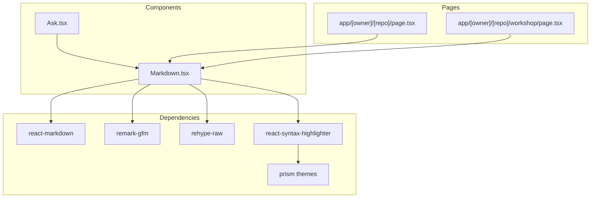
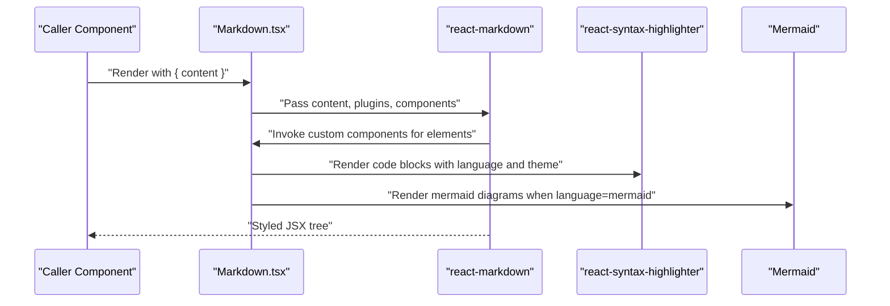
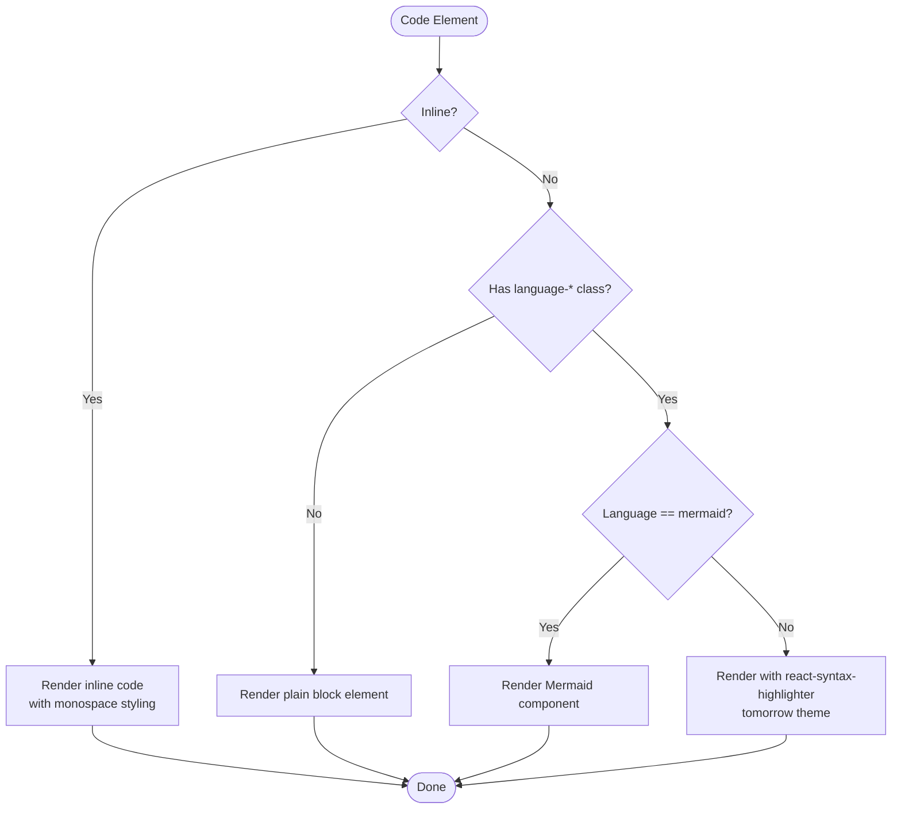
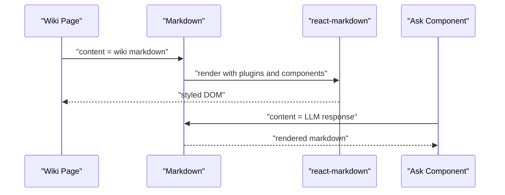
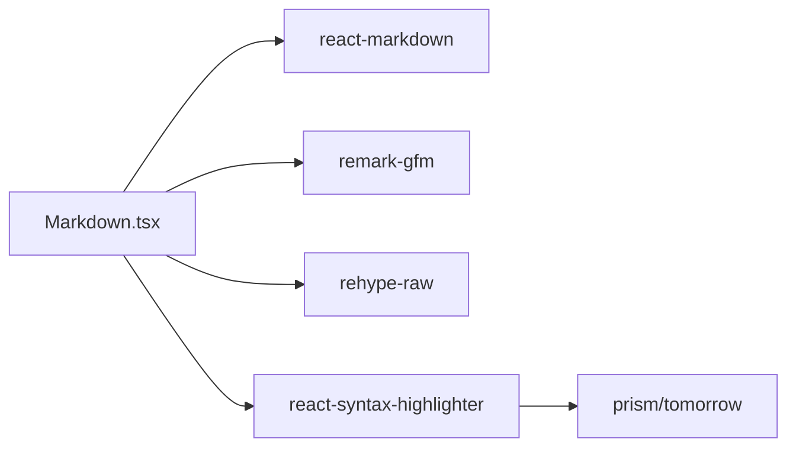

# Markdown Renderer Component

<cite>
**Referenced Files in This Document**
- [Markdown.tsx](file://src/components/Markdown.tsx)
- [Ask.tsx](file://src/components/Ask.tsx)
- [page.tsx](file://src/app/[owner]/[repo]/page.tsx)
- [workshop/page.tsx](file://src/app/[owner]/[repo]/workshop/page.tsx)
- [package.json](file://package.json)
</cite>

## Table of Contents
1. [Introduction](#introduction)
2. [Project Structure](#project-structure)
3. [Core Components](#core-components)
4. [Architecture Overview](#architecture-overview)
5. [Detailed Component Analysis](#detailed-component-analysis)
6. [Dependency Analysis](#dependency-analysis)
7. [Performance Considerations](#performance-considerations)
8. [Troubleshooting Guide](#troubleshooting-guide)
9. [Conclusion](#conclusion)

## Introduction
This document provides comprehensive technical and practical documentation for the Markdown renderer component used throughout the application to render markdown content. It covers the component’s props interface, markdown parsing capabilities, syntax highlighting features, integration with Prism.js via react-syntax-highlighter, and handling of various markdown elements such as headers, lists, tables, and code blocks. It also explains usage patterns across chat responses, wiki content, and documentation displays, along with customization options, theme integration, and performance optimization techniques for large content rendering.

## Project Structure
The Markdown component resides under the components directory and is integrated into several application pages and UI components:
- Component definition: src/components/Markdown.tsx
- Chat usage: src/components/Ask.tsx
- Wiki content usage: src/app/[owner]/[repo]/page.tsx
- Workshop documentation usage: src/app/[owner]/[repo]/workshop/page.tsx
- Dependencies: package.json

**Diagram sources**
- [Markdown.tsx](file://src/components/Markdown.tsx#L1-L208)
- [Ask.tsx](file://src/components/Ask.tsx#L730-L742)
- [page.tsx](file://src/app/[owner]/[repo]/page.tsx#L1-L200)
- [workshop/page.tsx](file://src/app/[owner]/[repo]/workshop/page.tsx#L620-L628)
- [package.json](file://package.json#L20-L24)

**Section sources**
- [Markdown.tsx](file://src/components/Markdown.tsx#L1-L208)
- [Ask.tsx](file://src/components/Ask.tsx#L730-L742)
- [page.tsx](file://src/app/[owner]/[repo]/page.tsx#L1-L200)
- [workshop/page.tsx](file://src/app/[owner]/[repo]/workshop/page.tsx#L620-L628)
- [package.json](file://package.json#L20-L24)

## Core Components
- Markdown component props:
  - content: string — The markdown content to render.
- Rendering pipeline:
  - Uses react-markdown with remark-gfm for GitHub Flavored Markdown support and rehype-raw to allow raw HTML inside markdown.
  - Provides a components map to override default element rendering with Tailwind-based styling and interactive features (e.g., copy-to-clipboard for code blocks).
- Syntax highlighting:
  - Integrates react-syntax-highlighter with the prism/tomorrow theme for code block syntax highlighting.
  - Supports line numbers, wrapping long lines, and dynamic language detection via language-* class names.
- Special handling:
  - Inline code rendering with monospace styling.
  - Mermaid diagrams embedded in code blocks with language identifier mermaid are rendered via a dedicated Mermaid component.

**Section sources**
- [Markdown.tsx](file://src/components/Markdown.tsx#L9-L11)
- [Markdown.tsx](file://src/components/Markdown.tsx#L195-L205)
- [Markdown.tsx](file://src/components/Markdown.tsx#L167-L178)
- [Markdown.tsx](file://src/components/Markdown.tsx#L125-L136)

## Architecture Overview
The Markdown component composes a rendering pipeline that transforms markdown into styled React elements. It delegates syntax highlighting to react-syntax-highlighter and integrates with a Mermaid component for diagram rendering.

**Diagram sources**
- [Markdown.tsx](file://src/components/Markdown.tsx#L13-L208)
- [package.json](file://package.json#L20-L24)

## Detailed Component Analysis

### Props Interface
- content: string — The markdown string to render. This is passed directly to react-markdown as children.

**Section sources**
- [Markdown.tsx](file://src/components/Markdown.tsx#L9-L11)

### Markdown Parsing Capabilities
- Plugins:
  - remark-gfm: Enables GitHub Flavored Markdown features (task lists, strikethrough, tables).
  - rehype-raw: Allows raw HTML inside markdown nodes.
- Component overrides:
  - Headings h1–h4 with semantic and responsive styling.
  - Paragraphs with spacing and dark mode support.
  - Lists (ordered and unordered) with disc/decimal markers and spacing.
  - Links with external link handling and dark mode styling.
  - Blockquotes with left border and italicized text.
  - Tables with horizontal scrolling, hover effects, and dark mode borders.
  - Code elements:
    - Inline code with monospace and accent coloring.
    - Code blocks with language detection, copy-to-clipboard, line numbers, and wrapping.

**Section sources**
- [Markdown.tsx](file://src/components/Markdown.tsx#L15-L193)
- [Markdown.tsx](file://src/components/Markdown.tsx#L195-L205)

### Syntax Highlighting Features
- Library: react-syntax-highlighter with prism/tomorrow theme.
- Behavior:
  - Detects language via className matching language-<lang>.
  - Renders code blocks with a header containing the language label and a copy button.
  - Applies line numbers, wraps long lines, and sets a consistent text size.
- Mermaid integration:
  - When language=mermaid, renders a Mermaid component instead of highlighted code.

**Diagram sources**
- [Markdown.tsx](file://src/components/Markdown.tsx#L114-L192)

**Section sources**
- [Markdown.tsx](file://src/components/Markdown.tsx#L167-L178)
- [Markdown.tsx](file://src/components/Markdown.tsx#L125-L136)

### Handling of Markdown Elements
- Headers: Responsive typography with special styling for ReAct-style headings (Thought, Action, Observation, Answer) using contextual background and text colors.
- Lists: Disc/decimal markers with spacing and dark mode compatibility.
- Tables: Horizontal scroll container, hover rows, and bordered cells with dark mode contrast.
- Code Blocks: Language-aware highlighting, copy-to-clipboard, line numbers, and wrapping.
- Inline Code: Monospace font with accent coloring.

**Section sources**
- [Markdown.tsx](file://src/components/Markdown.tsx#L19-L46)
- [Markdown.tsx](file://src/components/Markdown.tsx#L51-L113)
- [Markdown.tsx](file://src/components/Markdown.tsx#L114-L192)

### Integration Examples Across the Application
- Chat responses:
  - The Ask component renders streaming or final LLM responses using the Markdown component inside a scrollable container.
- Wiki content:
  - The repository wiki page renders markdown content with Tailwind-based prose classes and custom CSS overrides for a Japanese aesthetic theme.
- Workshop documentation:
  - Workshop pages render instructional markdown content using the Markdown component.

**Diagram sources**
- [page.tsx](file://src/app/[owner]/[repo]/page.tsx#L1-L200)
- [Ask.tsx](file://src/components/Ask.tsx#L730-L742)
- [workshop/page.tsx](file://src/app/[owner]/[repo]/workshop/page.tsx#L620-L628)

**Section sources**
- [Ask.tsx](file://src/components/Ask.tsx#L730-L742)
- [page.tsx](file://src/app/[owner]/[repo]/page.tsx#L48-L89)
- [workshop/page.tsx](file://src/app/[owner]/[repo]/workshop/page.tsx#L620-L628)

### Customization Options and Theme Integration
- Styling:
  - Tailwind utility classes applied to headings, paragraphs, lists, links, blockquotes, tables, and code elements.
  - Dark mode support via dark:text-* and dark:bg-* utilities.
- Prose overrides:
  - The wiki page applies custom CSS to prose code, pre, headings, links, blockquotes, and tables to align with a Japanese aesthetic theme.
- Syntax highlighting theme:
  - Uses the tomorrow theme from react-syntax-highlighter; can be swapped by importing another theme and passing it to the style prop.

**Section sources**
- [Markdown.tsx](file://src/components/Markdown.tsx#L15-L193)
- [page.tsx](file://src/app/[owner]/[repo]/page.tsx#L48-L89)

## Dependency Analysis
External dependencies used by the Markdown component:
- react-markdown: Core markdown rendering engine.
- remark-gfm: Adds GitHub Flavored Markdown support.
- rehype-raw: Allows raw HTML inside markdown.
- react-syntax-highlighter: Provides syntax highlighting for code blocks.
- prism themes: Used for code block styling.

**Diagram sources**
- [Markdown.tsx](file://src/components/Markdown.tsx#L1-L7)
- [package.json](file://package.json#L20-L24)

**Section sources**
- [Markdown.tsx](file://src/components/Markdown.tsx#L1-L7)
- [package.json](file://package.json#L20-L24)

## Performance Considerations
- Large content rendering:
  - Prefer breaking very large markdown content into smaller chunks to reduce initial render cost.
  - Consider virtualization for long lists or tables if used within markdown.
- Code block rendering:
  - Disable line numbers or wrapping for extremely large code blocks if performance becomes an issue.
  - Limit the number of concurrent highlighted code blocks by deferring rendering until needed (e.g., lazy rendering when blocks come into view).
- Plugin overhead:
  - remark-gfm and rehype-raw add parsing overhead; disable plugins if not needed.
- Memoization:
  - Wrap the Markdown component with memoization at higher levels if the content is static to avoid unnecessary re-renders.
- Theme switching:
  - Switching themes triggers re-rendering of highlighted code; batch theme changes when possible.

[No sources needed since this section provides general guidance]

## Troubleshooting Guide
- Code blocks not highlighting:
  - Ensure language class names follow the language-<lang> pattern.
  - Verify react-syntax-highlighter is installed and the chosen theme is imported.
- Mermaid diagrams not rendering:
  - Confirm the language identifier is mermaid and the Mermaid component is available.
- Links opening in same tab:
  - External links are configured to open in a new tab; verify target and rel attributes are preserved.
- Table overflow:
  - Tables are wrapped in a horizontally scrollable container; ensure parent containers allow horizontal scrolling.
- Dark mode inconsistencies:
  - Apply dark:* utilities consistently across headings, tables, and code blocks.

**Section sources**
- [Markdown.tsx](file://src/components/Markdown.tsx#L125-L136)
- [Markdown.tsx](file://src/components/Markdown.tsx#L167-L178)
- [Markdown.tsx](file://src/components/Markdown.tsx#L60-L72)

## Conclusion
The Markdown component provides a robust, extensible foundation for rendering markdown across the application. It leverages modern ecosystem libraries to deliver rich, interactive content with syntax highlighting, Mermaid diagram support, and theme-aware styling. By following the customization and performance recommendations, teams can maintain consistent rendering quality while scaling to larger content volumes.