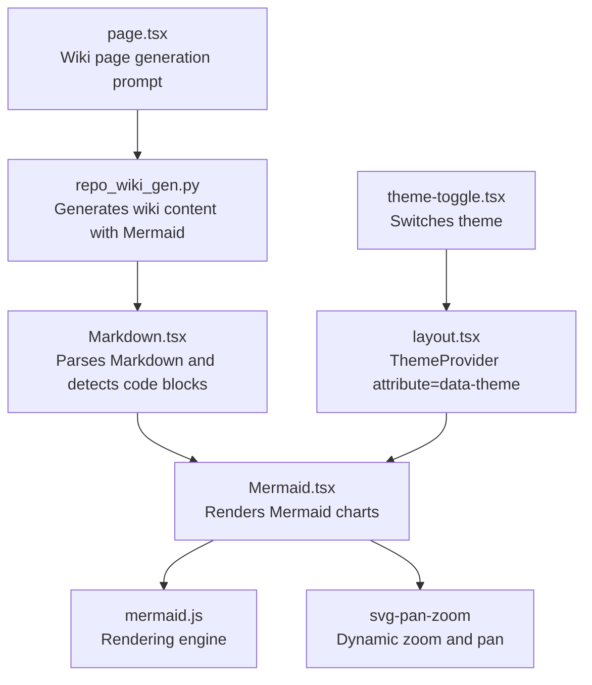
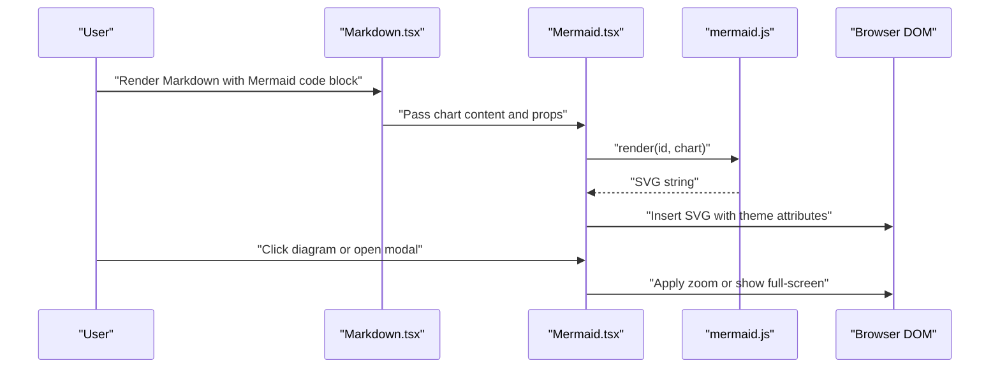
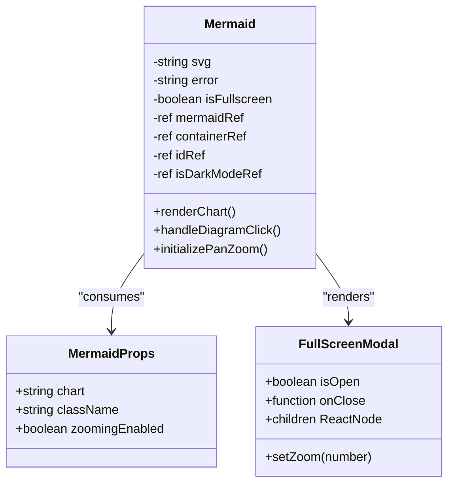
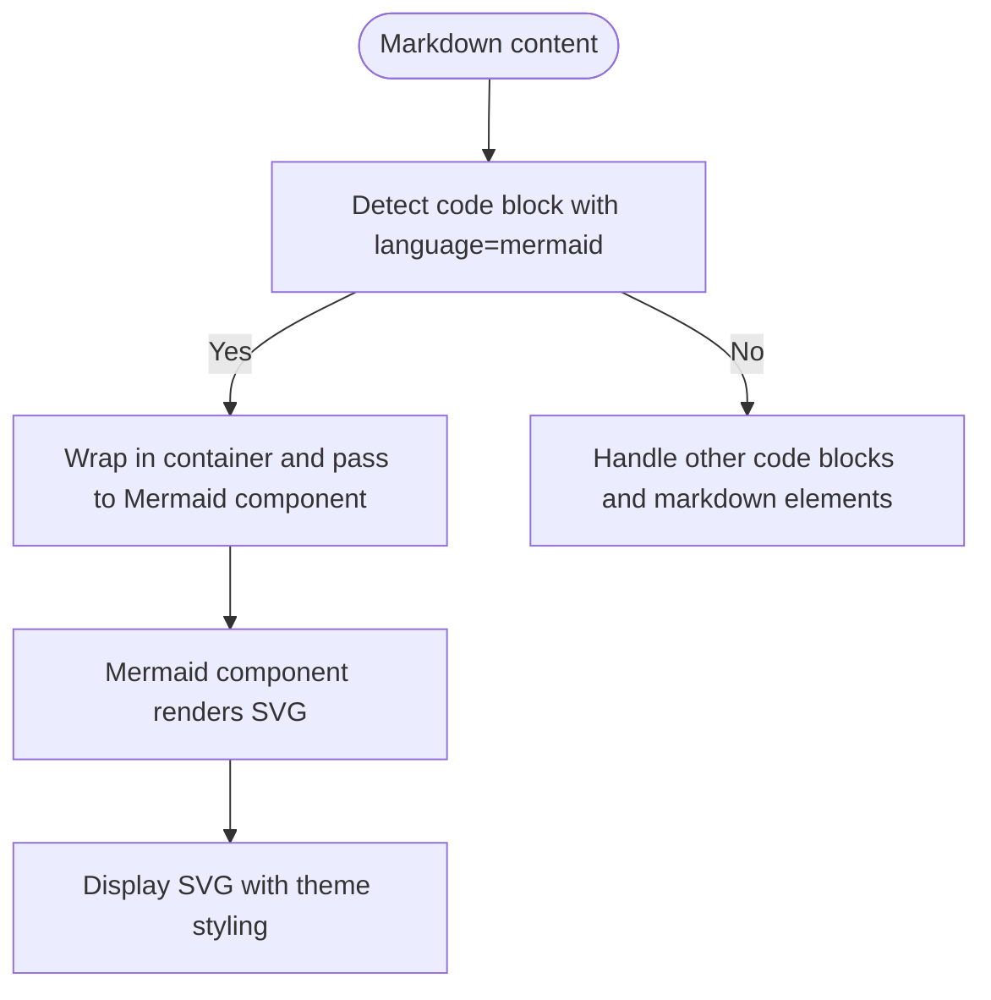
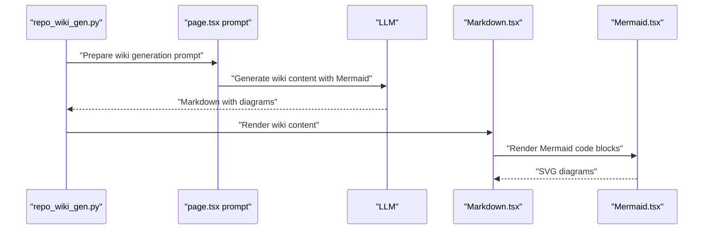
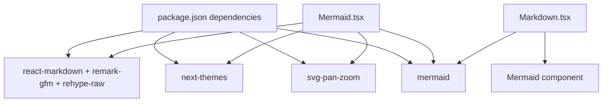
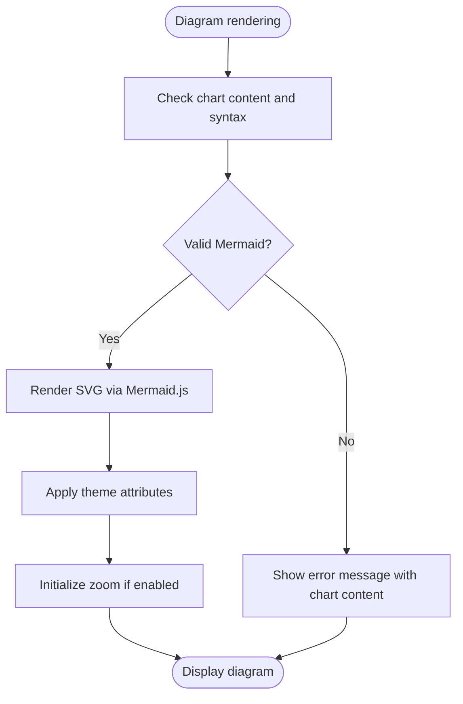

# Mermaid Diagram Component

<cite>
**Referenced Files in This Document**
- [Mermaid.tsx](file://src/components/Mermaid.tsx)
- [Markdown.tsx](file://src/components/Markdown.tsx)
- [package.json](file://package.json)
- [layout.tsx](file://src/app/layout.tsx)
- [theme-toggle.tsx](file://src/components/theme-toggle.tsx)
- [repo_wiki_gen.py](file://api/repo_wiki_gen.py)
- [page.tsx](file://src/app/[owner]/[repo]/page.tsx)
</cite>

## Table of Contents
1. [Introduction](#introduction)
2. [Project Structure](#project-structure)
3. [Core Components](#core-components)
4. [Architecture Overview](#architecture-overview)
5. [Detailed Component Analysis](#detailed-component-analysis)
6. [Dependency Analysis](#dependency-analysis)
7. [Performance Considerations](#performance-considerations)
8. [Troubleshooting Guide](#troubleshooting-guide)
9. [Conclusion](#conclusion)
10. [Appendices](#appendices)

## Introduction
This document describes the Mermaid diagram component that renders interactive flowcharts, sequence diagrams, class diagrams, state diagrams, and other Mermaid-supported chart types within the application. It explains how the component integrates with the Mermaid.js library, how it processes Markdown code blocks containing Mermaid syntax, and how it supports dynamic rendering, zooming, full-screen viewing, themes, and accessibility. It also covers error handling for malformed diagrams, performance considerations for complex diagrams, and integration patterns with wiki content generation.

## Project Structure
The Mermaid rendering pipeline spans several layers:
- Markdown parsing and code block detection
- Mermaid component rendering and interactivity
- Theme integration via next-themes and CSS custom properties
- Dynamic zooming and full-screen modal
- Wiki content generation that produces Mermaid diagrams

**Diagram sources**
- [Markdown.tsx](file://src/components/Markdown.tsx#L125-L136)
- [Mermaid.tsx](file://src/components/Mermaid.tsx#L306-L487)
- [layout.tsx](file://src/app/layout.tsx#L23-L27)
- [theme-toggle.tsx](file://src/components/theme-toggle.tsx#L1-L50)
- [repo_wiki_gen.py](file://api/repo_wiki_gen.py#L226-L261)
- [page.tsx](file://src/app/[owner]/[repo]/page.tsx#L461-L479)

**Section sources**
- [Markdown.tsx](file://src/components/Markdown.tsx#L1-L208)
- [Mermaid.tsx](file://src/components/Mermaid.tsx#L1-L491)
- [layout.tsx](file://src/app/layout.tsx#L1-L32)
- [theme-toggle.tsx](file://src/components/theme-toggle.tsx#L1-L50)
- [repo_wiki_gen.py](file://api/repo_wiki_gen.py#L220-L285)
- [page.tsx](file://src/app/[owner]/[repo]/page.tsx#L450-L520)

## Core Components
- Mermaid component: Renders Mermaid diagrams from Markdown code blocks, supports zooming, full-screen modal, and theme-aware styling.
- Markdown renderer: Detects Mermaid code blocks and delegates rendering to the Mermaid component.
- Theme system: Uses next-themes to switch between light/dark modes and applies theme-specific CSS for diagrams.
- Wiki generator: Produces wiki pages enriched with Mermaid diagrams for architecture and flow visualization.

Key responsibilities:
- Parse and validate Mermaid syntax
- Render SVG output from Mermaid.js
- Apply Japanese aesthetic theme styles and dark mode overrides
- Provide zoom controls and full-screen modal
- Integrate with wiki content generation

**Section sources**
- [Mermaid.tsx](file://src/components/Mermaid.tsx#L172-L177)
- [Markdown.tsx](file://src/components/Markdown.tsx#L125-L136)
- [layout.tsx](file://src/app/layout.tsx#L23-L27)
- [repo_wiki_gen.py](file://api/repo_wiki_gen.py#L226-L261)

## Architecture Overview
The Mermaid rendering architecture consists of:
- Input: Markdown code blocks with language identifier "mermaid"
- Processing: Markdown component identifies Mermaid blocks and passes content to Mermaid component
- Rendering: Mermaid component initializes Mermaid.js, renders SVG, applies theme CSS, and optionally enables zoom
- Interaction: Click-to-zoom or full-screen modal; zoom controls in modal
- Output: SVG embedded in the UI with theme-appropriate styling

**Diagram sources**
- [Markdown.tsx](file://src/components/Markdown.tsx#L125-L136)
- [Mermaid.tsx](file://src/components/Mermaid.tsx#L361-L407)
- [Mermaid.tsx](file://src/components/Mermaid.tsx#L409-L487)

## Detailed Component Analysis

### Mermaid Component
The Mermaid component encapsulates:
- Initialization of Mermaid.js with default configuration and Japanese aesthetic theme CSS
- Dynamic rendering of SVG from Mermaid syntax
- Theme-awareness by adding data-theme="dark" when appropriate
- Optional zooming via svg-pan-zoom with configurable min/max zoom and sensitivity
- Full-screen modal with zoom controls and keyboard support
- Graceful error handling with user-friendly messages and fallback display

Implementation highlights:
- Props interface defines chart content, optional CSS class, and zooming flag
- Uses dynamic import for svg-pan-zoom to minimize bundle size until needed
- Applies extensive themeCSS for nodes, edges, clusters, and sequence diagram actors
- Adds hover effects and transitions for clickable elements
- Provides accessibility labels for zoom controls and modal close button

**Diagram sources**
- [Mermaid.tsx](file://src/components/Mermaid.tsx#L172-L177)
- [Mermaid.tsx](file://src/components/Mermaid.tsx#L179-L304)
- [Mermaid.tsx](file://src/components/Mermaid.tsx#L306-L487)

**Section sources**
- [Mermaid.tsx](file://src/components/Mermaid.tsx#L1-L171)
- [Mermaid.tsx](file://src/components/Mermaid.tsx#L172-L177)
- [Mermaid.tsx](file://src/components/Mermaid.tsx#L306-L487)

### Markdown Integration
The Markdown component:
- Parses Markdown with GFM and raw HTML plugins
- Detects code blocks with language "mermaid"
- Wraps Mermaid content in a dedicated container and passes it to the Mermaid component
- Enables zooming for Mermaid diagrams by default

**Diagram sources**
- [Markdown.tsx](file://src/components/Markdown.tsx#L125-L136)
- [Markdown.tsx](file://src/components/Markdown.tsx#L1-L208)

**Section sources**
- [Markdown.tsx](file://src/components/Markdown.tsx#L1-L208)

### Theme Support and Responsive Design
Theme integration:
- ThemeProvider sets attribute "data-theme" on the root element
- Mermaid component reads system preference and adds data-theme="dark" to SVG when appropriate
- Comprehensive themeCSS defines Japanese aesthetic styles for nodes, edges, clusters, and sequence actors
- Dark mode overrides apply consistently across all diagram types
- Tailwind-based CSS custom properties adapt colors and borders to theme

Responsive behavior:
- Container adapts width to parent while preserving aspect ratio
- Zoom controls scale the SVG inside the modal
- Hover indicators appear for non-zoom-enabled diagrams to signal interactivity

**Section sources**
- [layout.tsx](file://src/app/layout.tsx#L23-L27)
- [theme-toggle.tsx](file://src/components/theme-toggle.tsx#L1-L50)
- [Mermaid.tsx](file://src/components/Mermaid.tsx#L6-L170)
- [Mermaid.tsx](file://src/components/Mermaid.tsx#L374-L376)

### Supported Diagram Types and Configuration
Supported diagram types observed in the codebase and wiki generation:
- Flowcharts (vertical orientation)
- Sequence diagrams
- Class diagrams
- ER diagrams
- Graphs (top-down)

Configuration guidelines enforced by the wiki generator:
- Prefer vertical orientation for flowcharts
- Use precise arrow types for sequence diagrams
- Define all participants at the beginning of sequence diagrams
- Use activation boxes and structural elements for complex flows
- Keep node labels concise and within word limits

**Section sources**
- [repo_wiki_gen.py](file://api/repo_wiki_gen.py#L226-L261)
- [page.tsx](file://src/app/[owner]/[repo]/page.tsx#L461-L479)

### Dynamic Rendering and Interactions
Dynamic rendering:
- On mount or prop change, the component renders the chart via Mermaid.js
- After successful render, calls contentLoaded to finalize initialization
- Applies theme attribute to SVG for dark mode compatibility

Interactions:
- Click to zoom: triggers full-screen modal with zoom controls
- Full-screen modal: includes zoom in/out/reset buttons and escape key handling
- Hover hint: shows a tooltip indicating click-to-zoom for non-zoom-enabled diagrams

Accessibility:
- Buttons include aria-label attributes for assistive technologies
- Modal uses keyboard events for closing
- Theme-aware color contrast maintained in both light and dark modes

**Section sources**
- [Mermaid.tsx](file://src/components/Mermaid.tsx#L361-L407)
- [Mermaid.tsx](file://src/components/Mermaid.tsx#L409-L487)

### Wiki Content Integration
The wiki generation pipeline:
- Generates wiki pages with Mermaid diagrams for architecture and data flow
- Enforces diagram orientation and labeling standards
- Cites source files and line ranges for accuracy
- Integrates diagrams into Markdown content consumed by the Markdown component

**Diagram sources**
- [repo_wiki_gen.py](file://api/repo_wiki_gen.py#L226-L261)
- [page.tsx](file://src/app/[owner]/[repo]/page.tsx#L461-L479)
- [Markdown.tsx](file://src/components/Markdown.tsx#L125-L136)
- [Mermaid.tsx](file://src/components/Mermaid.tsx#L306-L487)

**Section sources**
- [repo_wiki_gen.py](file://api/repo_wiki_gen.py#L220-L285)
- [page.tsx](file://src/app/[owner]/[repo]/page.tsx#L450-L520)

## Dependency Analysis
External dependencies and their roles:
- mermaid: Core rendering engine for diagrams
- svg-pan-zoom: Enables interactive zoom and pan for SVGs
- next-themes: Manages theme switching and data-theme attribute
- react-markdown + remark-gfm + rehype-raw: Parses Markdown and preserves raw HTML

**Diagram sources**
- [package.json](file://package.json#L11-L25)
- [Mermaid.tsx](file://src/components/Mermaid.tsx#L1-L4)
- [Markdown.tsx](file://src/components/Markdown.tsx#L1-L8)

**Section sources**
- [package.json](file://package.json#L11-L25)

## Performance Considerations
- Large diagrams: The Mermaid initialization increases maxTextSize to accommodate larger diagrams.
- Dynamic imports: svg-pan-zoom is imported only when zooming is enabled, reducing initial bundle size.
- Debounced rendering: The component waits slightly before initializing pan-zoom to ensure SVG is ready.
- Memory cleanup: The component tracks mounted state to prevent updates after unmount.
- Recommendations:
  - Prefer simpler diagrams for very large datasets
  - Use zooming selectively to avoid heavy DOM manipulation
  - Consider lazy-loading diagrams off-screen
  - Monitor render time and consider splitting complex diagrams into smaller views

**Section sources**
- [Mermaid.tsx](file://src/components/Mermaid.tsx#L12-L13)
- [Mermaid.tsx](file://src/components/Mermaid.tsx#L331-L352)
- [Mermaid.tsx](file://src/components/Mermaid.tsx#L356-L407)

## Troubleshooting Guide
Common issues and resolutions:
- Malformed Mermaid syntax: The component catches rendering errors and displays a user-friendly message with the original chart content for inspection.
- Empty or missing chart content: The component shows a loading indicator until content is available.
- Zoom not working: Ensure zoomingEnabled is true and the browser supports dynamic imports.
- Theme mismatch: Verify that the data-theme attribute is applied to the root and that themeCSS is loaded.
- Accessibility concerns: Confirm that buttons have aria-label attributes and that modal can be closed via keyboard.

**Diagram sources**
- [Mermaid.tsx](file://src/components/Mermaid.tsx#L361-L407)
- [Mermaid.tsx](file://src/components/Mermaid.tsx#L415-L432)

**Section sources**
- [Mermaid.tsx](file://src/components/Mermaid.tsx#L361-L407)
- [Mermaid.tsx](file://src/components/Mermaid.tsx#L415-L432)

## Conclusion
The Mermaid component provides a robust, theme-aware, and accessible solution for rendering interactive diagrams within the application. It integrates seamlessly with Markdown parsing, supports multiple diagram types, and offers dynamic zooming and full-screen viewing. Combined with the wiki generation pipeline, it enables rich visual documentation of architecture and workflows, ensuring clarity and maintainability across the codebase.

## Appendices

### Configuration Options Reference
- chart: Required. The Mermaid syntax string to render.
- className: Optional. Additional CSS classes for the container.
- zoomingEnabled: Optional. Enables interactive zoom and pan.

**Section sources**
- [Mermaid.tsx](file://src/components/Mermaid.tsx#L172-L177)

### Example Diagram Generation from Repository Analysis
- The wiki generator enforces diagram standards and citations, ensuring diagrams are accurate and directly derived from source files.
- Sequence diagrams require explicit participant definitions and precise arrow types.
- Flowcharts must use top-down orientation and concise node labels.

**Section sources**
- [repo_wiki_gen.py](file://api/repo_wiki_gen.py#L226-L261)
- [page.tsx](file://src/app/[owner]/[repo]/page.tsx#L461-L479)