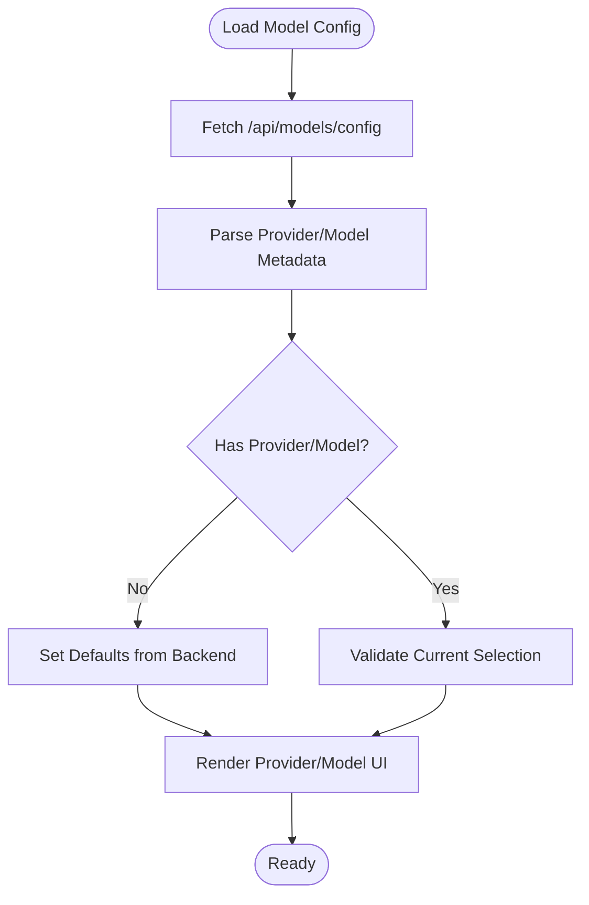

# Model Selection Modal Component

<cite>
**Referenced Files in This Document**
- [ModelSelectionModal.tsx](file://src/components/ModelSelectionModal.tsx)
- [Ask.tsx](file://src/components/Ask.tsx)
- [UserSelector.tsx](file://src/components/UserSelector.tsx)
- [WikiTypeSelector.tsx](file://src/components/WikiTypeSelector.tsx)
- [TokenInput.tsx](file://src/components/TokenInput.tsx)
- [route.ts](file://src/app/api/models/config/route.ts)
- [generator.json](file://api/config/generator.json)
- [config.py](file://api/config.py)
</cite>

## Table of Contents
1. [Introduction](#introduction)
2. [Project Structure](#project-structure)
3. [Core Components](#core-components)
4. [Architecture Overview](#architecture-overview)
5. [Detailed Component Analysis](#detailed-component-analysis)
6. [Dependency Analysis](#dependency-analysis)
7. [Performance Considerations](#performance-considerations)
8. [Troubleshooting Guide](#troubleshooting-guide)
9. [Conclusion](#conclusion)

## Introduction
This document provides comprehensive technical and user-focused documentation for the ModelSelectionModal component. It explains how users configure AI model providers and selections, how the modal integrates with backend model configuration APIs, and how provider-specific model availability and real-time validation are handled. It also covers usage patterns within the Ask component, configuration persistence, user experience considerations, provider-specific optimizations, token limit considerations, and fallback model selection strategies.

## Project Structure
The ModelSelectionModal is part of the frontend React components and integrates with Next.js API routes and backend configuration files. The key files involved are:
- Frontend modal and selectors: ModelSelectionModal.tsx, UserSelector.tsx, WikiTypeSelector.tsx, TokenInput.tsx
- Frontend integration: Ask.tsx
- API route: route.ts (Next.js API endpoint)
- Backend configuration: generator.json and config.py

**Diagram sources**
- [ModelSelectionModal.tsx](file://src/components/ModelSelectionModal.tsx#L1-L260)
- [Ask.tsx](file://src/components/Ask.tsx#L1-L929)
- [UserSelector.tsx](file://src/components/UserSelector.tsx#L1-L540)
- [WikiTypeSelector.tsx](file://src/components/WikiTypeSelector.tsx#L1-L79)
- [TokenInput.tsx](file://src/components/TokenInput.tsx#L1-L108)
- [route.ts](file://src/app/api/models/config/route.ts#L1-L64)
- [generator.json](file://api/config/generator.json#L1-L101)
- [config.py](file://api/config.py#L1-L464)

**Section sources**
- [ModelSelectionModal.tsx](file://src/components/ModelSelectionModal.tsx#L1-L260)
- [Ask.tsx](file://src/components/Ask.tsx#L1-L929)
- [route.ts](file://src/app/api/models/config/route.ts#L1-L64)
- [generator.json](file://api/config/generator.json#L1-L101)
- [config.py](file://api/config.py#L1-L464)

## Core Components
- ModelSelectionModal: Central modal for selecting providers, models, wiki type, and optional token inputs. It maintains local state and applies changes on submit.
- UserSelector: Loads provider and model metadata from the backend, renders provider and model dropdowns, and supports custom model toggles.
- WikiTypeSelector: Allows switching between comprehensive and concise wiki generation modes.
- TokenInput: Manages platform selection and secure token input for private repositories.
- Ask: Integrates the modal into the chat experience, loads default model configuration, and passes selected provider/model to chat requests.

Key responsibilities:
- Provider and model selection with real-time availability validation
- Custom model support when providers allow it
- Wiki type configuration for generation mode
- Optional token input for private repository access
- Integration with backend model configuration API

**Section sources**
- [ModelSelectionModal.tsx](file://src/components/ModelSelectionModal.tsx#L1-L260)
- [UserSelector.tsx](file://src/components/UserSelector.tsx#L1-L540)
- [WikiTypeSelector.tsx](file://src/components/WikiTypeSelector.tsx#L1-L79)
- [TokenInput.tsx](file://src/components/TokenInput.tsx#L1-L108)
- [Ask.tsx](file://src/components/Ask.tsx#L1-L929)

## Architecture Overview
The modal orchestrates user choices and persists them via callbacks. The Ask component manages the lifecycle of model configuration loading and passes the selected provider/model to chat requests.

**Diagram sources**
- [Ask.tsx](file://src/components/Ask.tsx#L115-L149)
- [ModelSelectionModal.tsx](file://src/components/ModelSelectionModal.tsx#L115-L134)
- [route.ts](file://src/app/api/models/config/route.ts#L6-L43)
- [config.py](file://api/config.py#L381-L464)

## Detailed Component Analysis

### ModelSelectionModal Component
Responsibilities:
- Manage local state for provider, model, custom model flag, wiki type, and file filters
- Optionally render token input for refresh scenarios
- Optionally render authorization code input when authentication is required
- Apply changes on submit and notify parent via onApply callback

User interface:
- Header with close button
- Wiki type selector (optional)
- Provider/model selector via UserSelector
- Token input section (optional)
- Authorization code input (optional)
- Footer with cancel and submit actions

Integration points:
- Uses UserSelector for provider/model selection
- Uses WikiTypeSelector for wiki type
- Uses TokenInput for optional token management
- Calls onApply with optional token when submitted

State synchronization:
- Resets local state when modal opens based on incoming props
- Applies local state to parent on submit

**Section sources**
- [ModelSelectionModal.tsx](file://src/components/ModelSelectionModal.tsx#L48-L260)
- [Ask.tsx](file://src/components/Ask.tsx#L640-L655)

### UserSelector Component
Responsibilities:
- Fetch model configuration from /api/models/config
- Render provider dropdown and model dropdown or custom model input
- Support custom model toggle when provider allows it
- Provide advanced file filter options (optional)

Behavior:
- On provider change, resets custom model flag and sets default model for the selected provider
- Initializes provider/model from backend defaults if none provided
- Supports optional file filter section with include/exclude modes

Backend integration:
- Loads provider/model metadata from backend generator configuration
- Ensures provider-specific defaults and capabilities (e.g., supportsCustomModel)

**Section sources**
- [UserSelector.tsx](file://src/components/UserSelector.tsx#L82-L140)
- [UserSelector.tsx](file://src/components/UserSelector.tsx#L285-L391)
- [route.ts](file://src/app/api/models/config/route.ts#L6-L43)
- [generator.json](file://api/config/generator.json#L1-L101)

### WikiTypeSelector Component
Responsibilities:
- Toggle between comprehensive and concise wiki generation modes
- Reflect current selection via visual indicators

Usage:
- Controlled by isComprehensiveView prop
- Updates parent via setIsComprehensiveView callback

**Section sources**
- [WikiTypeSelector.tsx](file://src/components/WikiTypeSelector.tsx#L12-L75)

### TokenInput Component
Responsibilities:
- Allow platform selection among GitHub, GitLab, Bitbucket
- Securely capture personal access tokens
- Optionally hide/show token section
- Prevent platform change when disabled

Usage:
- Used within ModelSelectionModal for refresh scenarios
- Used within ConfigurationModal for wiki generation

**Section sources**
- [TokenInput.tsx](file://src/components/TokenInput.tsx#L16-L108)

### Ask Component Integration
Responsibilities:
- Load default model configuration on mount if provider/model not provided
- Display current provider/model selection
- Trigger ModelSelectionModal to update configuration
- Pass selected provider/model to chat requests

Behavior:
- Fetches model config from /api/models/config
- Sets default provider/model if missing
- Sends selected provider/model to chat WebSocket requests

**Section sources**
- [Ask.tsx](file://src/components/Ask.tsx#L115-L149)
- [Ask.tsx](file://src/components/Ask.tsx#L640-L655)

## Architecture Overview

**Diagram sources**
- [ModelSelectionModal.tsx](file://src/components/ModelSelectionModal.tsx#L1-L260)
- [Ask.tsx](file://src/components/Ask.tsx#L1-L929)
- [UserSelector.tsx](file://src/components/UserSelector.tsx#L1-L540)
- [WikiTypeSelector.tsx](file://src/components/WikiTypeSelector.tsx#L1-L79)
- [TokenInput.tsx](file://src/components/TokenInput.tsx#L1-L108)
- [route.ts](file://src/app/api/models/config/route.ts#L1-L64)
- [generator.json](file://api/config/generator.json#L1-L101)
- [config.py](file://api/config.py#L1-L464)

## Detailed Component Analysis

### Model Selection Flow

**Diagram sources**
- [Ask.tsx](file://src/components/Ask.tsx#L640-L655)
- [ModelSelectionModal.tsx](file://src/components/ModelSelectionModal.tsx#L115-L134)
- [UserSelector.tsx](file://src/components/UserSelector.tsx#L82-L140)
- [route.ts](file://src/app/api/models/config/route.ts#L6-L43)

### Provider-Specific Model Availability and Validation
- Backend configuration defines providers, default models, and model parameters.
- The API route forwards provider/model metadata to the frontend.
- UserSelector validates provider/model availability and initializes defaults.
- Custom model support is provider-dependent (e.g., GitHub Copilot, DashScope, iFlow).

**Diagram sources**
- [Ask.tsx](file://src/components/Ask.tsx#L115-L149)
- [UserSelector.tsx](file://src/components/UserSelector.tsx#L82-L140)
- [route.ts](file://src/app/api/models/config/route.ts#L6-L43)
- [generator.json](file://api/config/generator.json#L1-L101)

### Token Limit Considerations and Fallback Strategies
- Provider-specific token limits are enforced at the data pipeline level (outside the modal).
- The modal itself focuses on provider/model selection and optional token input for private repositories.
- Fallback strategies are handled by the Ask component when continuing research or falling back to HTTP streaming.

**Diagram sources**
- [Ask.tsx](file://src/components/Ask.tsx#L277-L403)
- [Ask.tsx](file://src/components/Ask.tsx#L405-L480)

## Dependency Analysis

**Diagram sources**
- [ModelSelectionModal.tsx](file://src/components/ModelSelectionModal.tsx#L1-L260)
- [Ask.tsx](file://src/components/Ask.tsx#L1-L929)
- [UserSelector.tsx](file://src/components/UserSelector.tsx#L1-L540)
- [WikiTypeSelector.tsx](file://src/components/WikiTypeSelector.tsx#L1-L79)
- [TokenInput.tsx](file://src/components/TokenInput.tsx#L1-L108)
- [route.ts](file://src/app/api/models/config/route.ts#L1-L64)
- [config.py](file://api/config.py#L1-L464)
- [generator.json](file://api/config/generator.json#L1-L101)

**Section sources**
- [ModelSelectionModal.tsx](file://src/components/ModelSelectionModal.tsx#L1-L260)
- [Ask.tsx](file://src/components/Ask.tsx#L1-L929)
- [route.ts](file://src/app/api/models/config/route.ts#L1-L64)
- [config.py](file://api/config.py#L1-L464)
- [generator.json](file://api/config/generator.json#L1-L101)

## Performance Considerations
- Minimize re-renders by keeping modal state local and applying changes on submit.
- Debounce or batch UI updates when toggling custom model or file filters.
- Cache provider/model metadata after initial fetch to reduce network overhead.
- Avoid unnecessary re-initialization of provider/model defaults when values are unchanged.

## Troubleshooting Guide
Common issues and resolutions:
- Provider/model not loading: Verify /api/models/config endpoint is reachable and backend configuration is valid.
- Custom model toggle not visible: Confirm the selected provider supports custom models as defined in backend configuration.
- Token input not appearing: Ensure showTokenInput is enabled and the modal is configured to display token section.
- Authorization code prompt: If authRequired is true, provide the code via the modal input; otherwise, disable authentication requirements.
- Wiki type selection not persisting: Ensure setIsComprehensiveView is correctly wired to maintain state.

**Section sources**
- [ModelSelectionModal.tsx](file://src/components/ModelSelectionModal.tsx#L115-L134)
- [UserSelector.tsx](file://src/components/UserSelector.tsx#L82-L140)
- [route.ts](file://src/app/api/models/config/route.ts#L6-L43)

## Conclusion
The ModelSelectionModal provides a robust, extensible interface for configuring AI model providers and selections. It integrates seamlessly with backend model configuration APIs, respects provider-specific capabilities, and offers optional token and authorization controls. Its design supports both simple and advanced use cases, enabling users to tailor model selection to their needs while maintaining a consistent user experience across the application.