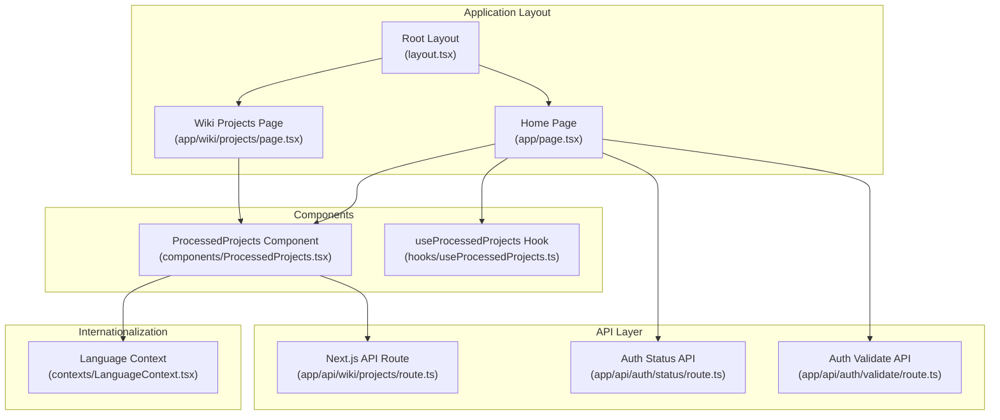
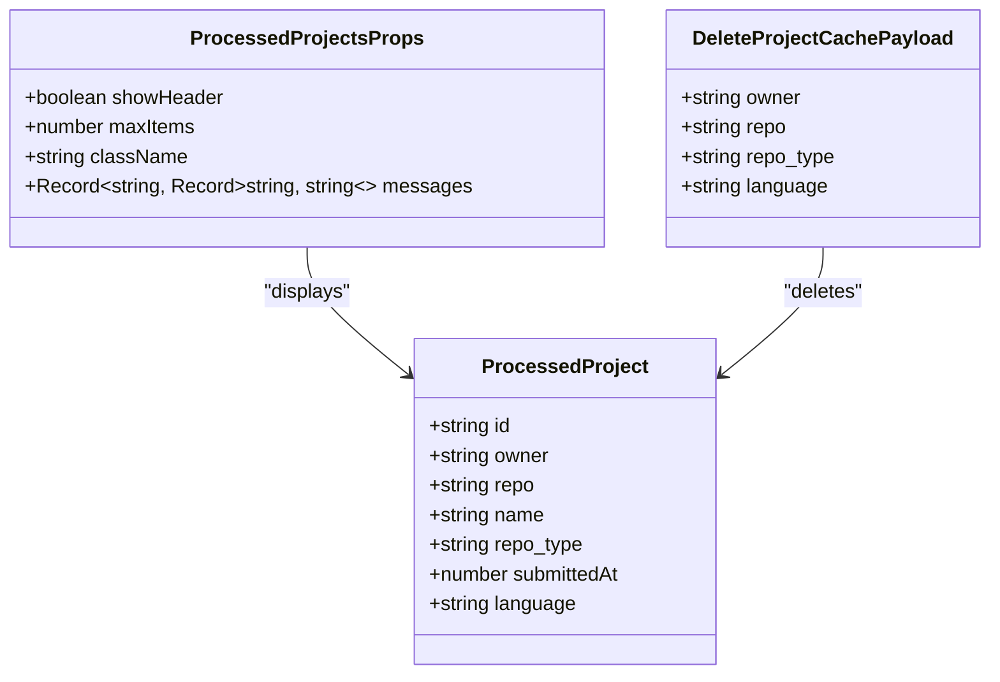
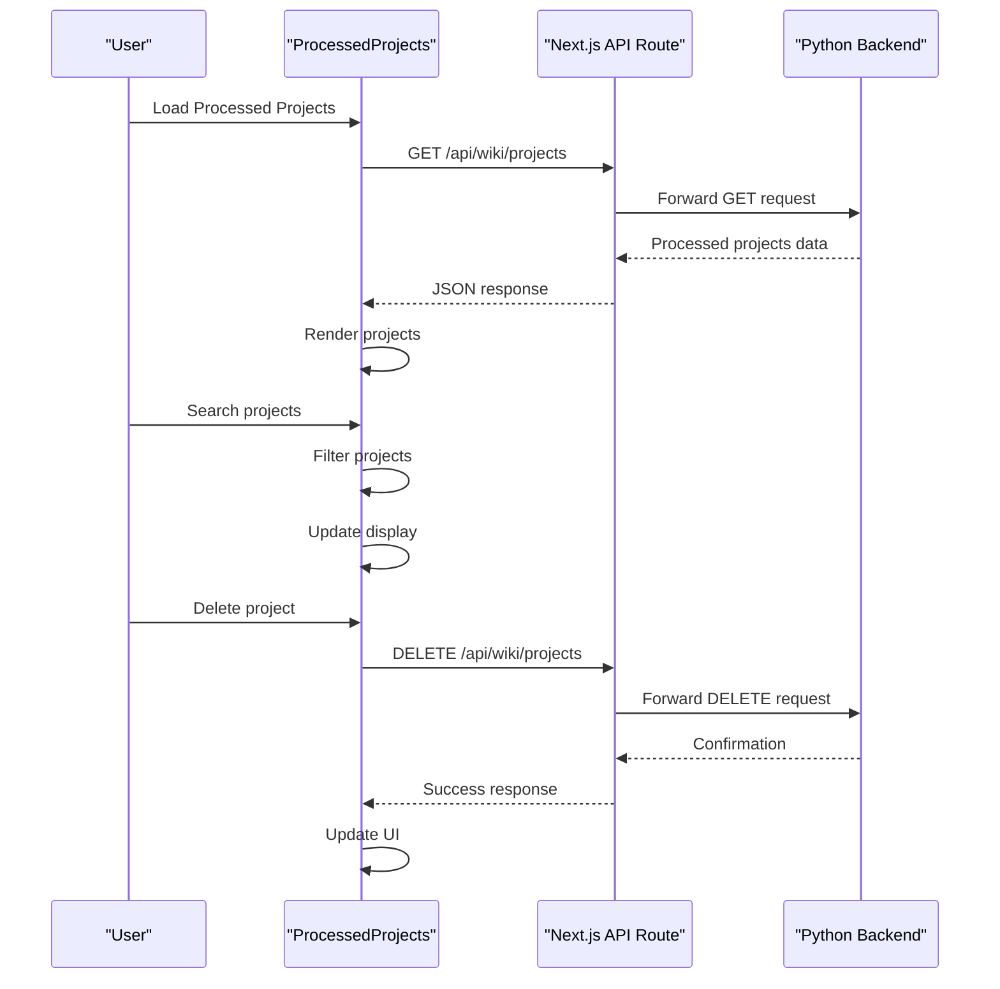
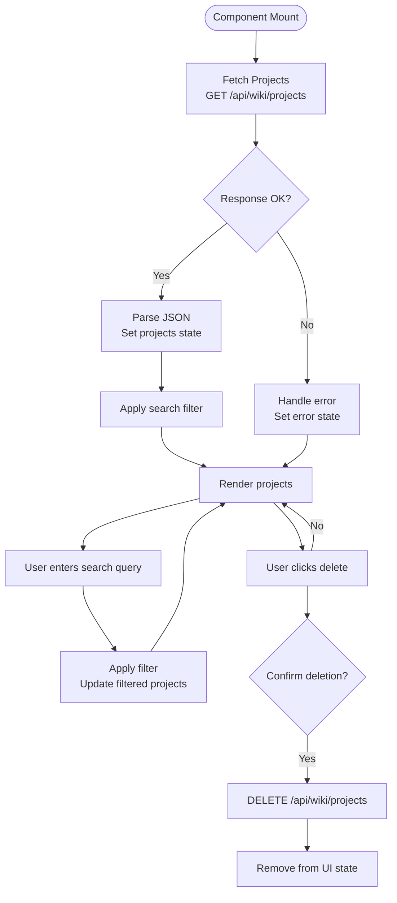
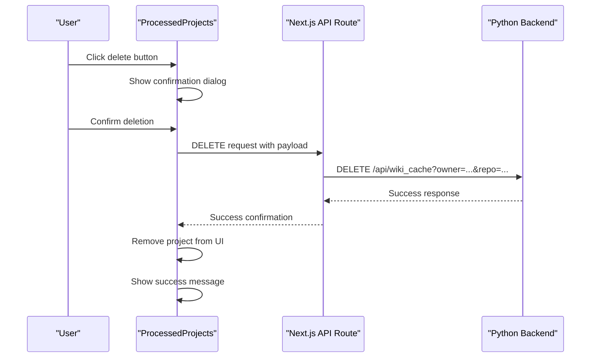
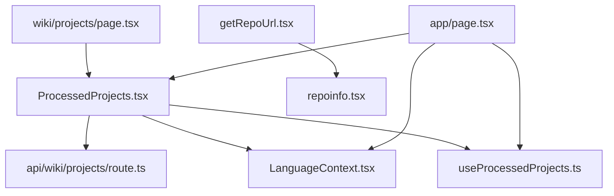

# Processed Projects Component

<cite>
**Referenced Files in This Document**
- [ProcessedProjects.tsx](file://src/components/ProcessedProjects.tsx)
- [useProcessedProjects.ts](file://src/hooks/useProcessedProjects.ts)
- [page.tsx](file://src/app/wiki/projects/page.tsx)
- [route.ts](file://src/app/api/wiki/projects/route.ts)
- [layout.tsx](file://src/app/layout.tsx)
- [page.tsx](file://src/app/page.tsx)
- [route.ts](file://src/app/api/auth/status/route.ts)
- [route.ts](file://src/app/api/auth/validate/route.ts)
- [LanguageContext.tsx](file://src/contexts/LanguageContext.tsx)
- [repoinfo.tsx](file://src/types/repoinfo.tsx)
- [getRepoUrl.tsx](file://src/utils/getRepoUrl.tsx)
</cite>

## Table of Contents
1. [Introduction](#introduction)
2. [Project Structure](#project-structure)
3. [Core Components](#core-components)
4. [Architecture Overview](#architecture-overview)
5. [Detailed Component Analysis](#detailed-component-analysis)
6. [Dependency Analysis](#dependency-analysis)
7. [Performance Considerations](#performance-considerations)
8. [Troubleshooting Guide](#troubleshooting-guide)
9. [Conclusion](#conclusion)

## Introduction
The ProcessedProjects component is a React-based UI element responsible for displaying cached repository processing results. It integrates with a backend API to fetch processed projects, supports filtering and view modes, and enables cache cleanup operations. The component is designed to be embedded in various application layouts and provides internationalization support through a shared language context.

## Project Structure
The ProcessedProjects component is organized within the Next.js application structure, with clear separation between frontend components, hooks, API routes, and application pages.

**Diagram sources**
- [layout.tsx](file://src/app/layout.tsx#L13-L31)
- [page.tsx](file://src/app/page.tsx#L45-L637)
- [page.tsx](file://src/app/wiki/projects/page.tsx#L7-L18)
- [ProcessedProjects.tsx](file://src/components/ProcessedProjects.tsx#L25-L30)
- [useProcessedProjects.ts](file://src/hooks/useProcessedProjects.ts#L13-L46)
- [route.ts](file://src/app/api/wiki/projects/route.ts#L38-L73)
- [route.ts](file://src/app/api/auth/status/route.ts#L5-L31)
- [route.ts](file://src/app/api/auth/validate/route.ts#L5-L34)
- [LanguageContext.tsx](file://src/contexts/LanguageContext.tsx#L17-L194)

**Section sources**
- [layout.tsx](file://src/app/layout.tsx#L13-L31)
- [page.tsx](file://src/app/page.tsx#L45-L637)
- [page.tsx](file://src/app/wiki/projects/page.tsx#L7-L18)

## Core Components
The ProcessedProjects component consists of several key elements that work together to provide a comprehensive interface for managing cached repository processing results.

### Component Interface
The component accepts the following props:
- `showHeader`: Controls whether to display the header section
- `maxItems`: Limits the number of projects displayed
- `className`: Additional CSS classes for styling
- `messages`: Internationalized text translations

### Data Model
The component works with a structured data model representing processed projects:

**Diagram sources**
- [ProcessedProjects.tsx](file://src/components/ProcessedProjects.tsx#L8-L16)
- [ProcessedProjects.tsx](file://src/components/ProcessedProjects.tsx#L18-L23)
- [route.ts](file://src/app/api/wiki/projects/route.ts#L14-L19)

### State Management
The component maintains several state variables:
- `projects`: Array of processed project objects
- `isLoading`: Loading state indicator
- `error`: Error message storage
- `searchQuery`: Current search term
- `viewMode`: Display mode (card or list)

**Section sources**
- [ProcessedProjects.tsx](file://src/components/ProcessedProjects.tsx#L31-L36)

## Architecture Overview
The ProcessedProjects component follows a client-server architecture pattern with clear separation of concerns between the frontend UI and backend services.

**Diagram sources**
- [ProcessedProjects.tsx](file://src/components/ProcessedProjects.tsx#L56-L81)
- [route.ts](file://src/app/api/wiki/projects/route.ts#L38-L73)
- [route.ts](file://src/app/api/wiki/projects/route.ts#L75-L104)

## Detailed Component Analysis

### Component Implementation
The ProcessedProjects component implements a comprehensive interface for managing cached repository processing results with the following key features:

#### Data Fetching and Caching
The component uses React's useEffect hook to fetch processed projects on initial render. The API route forwards requests to a Python backend service that maintains the actual cache of processed projects.

#### Search and Filtering
The component provides real-time search functionality that filters projects based on multiple criteria:
- Project name
- Owner name
- Repository name
- Repository type

#### View Modes
Users can toggle between two display modes:
- Card view: Grid-based layout with project cards
- List view: Compact list format

#### Cache Management Operations
The component supports cache cleanup operations through a delete functionality that removes individual projects from the backend cache.

### API Integration
The component communicates with the backend through a well-defined API interface:

**Diagram sources**
- [ProcessedProjects.tsx](file://src/components/ProcessedProjects.tsx#L56-L81)
- [ProcessedProjects.tsx](file://src/components/ProcessedProjects.tsx#L84-L98)
- [ProcessedProjects.tsx](file://src/components/ProcessedProjects.tsx#L104-L128)

### Component Usage Examples

#### Main Application Integration
The component is integrated into the main application layout in two primary ways:

1. **Homepage Integration**: The home page conditionally renders the ProcessedProjects component when cached projects are available, displaying up to six recent projects in a compact card layout.

2. **Dedicated Projects Page**: A dedicated page provides a full-featured interface for browsing all cached projects with advanced filtering capabilities.

#### Cache Invalidation Workflow
The component supports cache invalidation through a controlled deletion process:

**Diagram sources**
- [ProcessedProjects.tsx](file://src/components/ProcessedProjects.tsx#L104-L128)
- [route.ts](file://src/app/api/wiki/projects/route.ts#L75-L104)

**Section sources**
- [ProcessedProjects.tsx](file://src/components/ProcessedProjects.tsx#L25-L30)
- [ProcessedProjects.tsx](file://src/components/ProcessedProjects.tsx#L56-L81)
- [ProcessedProjects.tsx](file://src/components/ProcessedProjects.tsx#L84-L98)
- [ProcessedProjects.tsx](file://src/components/ProcessedProjects.tsx#L104-L128)

### Authentication and Authorization Integration
The component integrates with the application's authentication system to ensure secure access to cached project data:

#### Authentication Status Checking
The main application page fetches authentication status from the backend to determine if authorization is required before allowing access to cached project data.

#### Authorization Validation
The component coordinates with the authentication system to validate user credentials before enabling cache operations that modify stored data.

**Section sources**
- [page.tsx](file://src/app/page.tsx#L158-L178)
- [route.ts](file://src/app/api/auth/status/route.ts#L5-L31)
- [route.ts](file://src/app/api/auth/validate/route.ts#L5-L34)

### Internationalization Support
The component leverages a comprehensive internationalization system that provides localized text for all user-facing elements:

#### Message System
The component accepts a messages prop containing translated text for:
- Component titles and headers
- Placeholder text for search inputs
- Status messages and error notifications
- Navigation links and buttons

#### Language Context Integration
The LanguageContext provides dynamic language switching and ensures consistent localization across the entire application.

**Section sources**
- [ProcessedProjects.tsx](file://src/components/ProcessedProjects.tsx#L38-L54)
- [LanguageContext.tsx](file://src/contexts/LanguageContext.tsx#L17-L194)

## Dependency Analysis
The ProcessedProjects component has well-defined dependencies that contribute to its modularity and maintainability.

**Diagram sources**
- [ProcessedProjects.tsx](file://src/components/ProcessedProjects.tsx#L1-L10)
- [useProcessedProjects.ts](file://src/hooks/useProcessedProjects.ts#L1-L11)
- [route.ts](file://src/app/api/wiki/projects/route.ts#L1-L12)
- [page.tsx](file://src/app/wiki/projects/page.tsx#L4-L5)
- [page.tsx](file://src/app/page.tsx#L10-L12)
- [LanguageContext.tsx](file://src/contexts/LanguageContext.tsx#L1-L13)
- [repoinfo.tsx](file://src/types/repoinfo.tsx#L1-L11)
- [getRepoUrl.tsx](file://src/utils/getRepoUrl.tsx#L1-L17)

### Component Coupling
The component maintains loose coupling with external systems through:
- API abstraction layer
- Configuration-based backend URLs
- Type-safe interfaces
- Error handling boundaries

### External Dependencies
The component relies on several external dependencies:
- Next.js framework for routing and SSR
- React for component rendering
- react-icons for UI icons
- Tailwind CSS for styling

**Section sources**
- [ProcessedProjects.tsx](file://src/components/ProcessedProjects.tsx#L1-L10)
- [route.ts](file://src/app/api/wiki/projects/route.ts#L34-L36)

## Performance Considerations
The component implements several performance optimizations to ensure smooth user experience:

### Efficient Rendering
- Memoized filtering operations prevent unnecessary re-renders
- Virtualized lists could be implemented for large datasets
- Debounced search input reduces API calls during typing

### Network Optimization
- No-cache headers ensure fresh data retrieval
- Error boundaries prevent cascading failures
- Loading states provide user feedback during network requests

### Memory Management
- Cleanup functions in useEffect hooks prevent memory leaks
- State updates are batched to minimize re-renders
- Component unmounts clear event listeners and subscriptions

## Troubleshooting Guide

### Common Issues and Solutions

#### API Connectivity Problems
**Symptoms**: Error messages indicating failed API connections
**Causes**: Backend service downtime, network connectivity issues
**Solutions**: 
- Verify backend service availability
- Check network connectivity between frontend and backend
- Review API route error handling logs

#### Authentication Failures
**Symptoms**: Access denied errors when attempting cache operations
**Causes**: Invalid or expired authentication tokens
**Solutions**:
- Re-authenticate with the backend service
- Verify authentication status endpoint
- Check authorization validation flow

#### Data Format Mismatches
**Symptoms**: Type errors when processing project data
**Causes**: Backend API returning unexpected data structures
**Solutions**:
- Validate API response format against TypeScript interfaces
- Implement robust error handling for malformed data
- Add data sanitization before state updates

#### Performance Issues
**Symptoms**: Slow rendering or search operations
**Causes**: Large dataset sizes or inefficient filtering
**Solutions**:
- Implement pagination for large result sets
- Add debouncing to search input handlers
- Optimize database queries on the backend

**Section sources**
- [ProcessedProjects.tsx](file://src/components/ProcessedProjects.tsx#L70-L75)
- [route.ts](file://src/app/api/wiki/projects/route.ts#L49-L60)
- [route.ts](file://src/app/api/auth/status/route.ts#L15-L20)

## Conclusion
The ProcessedProjects component provides a robust, user-friendly interface for managing cached repository processing results. Its architecture emphasizes separation of concerns, internationalization support, and secure authentication integration. The component successfully bridges the gap between backend caching services and frontend user interfaces, offering a comprehensive solution for repository project management.

The implementation demonstrates best practices in React development, including proper state management, error handling, and performance optimization. The component's modular design allows for easy maintenance and future enhancements while maintaining backward compatibility with existing integrations.