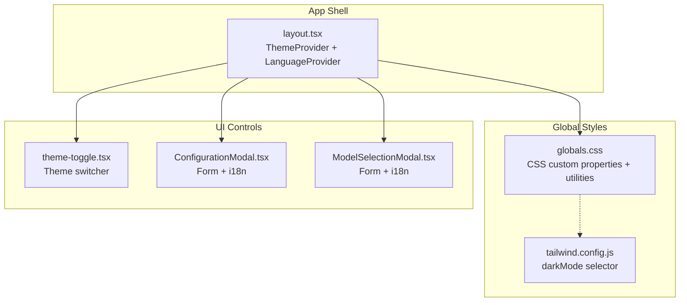
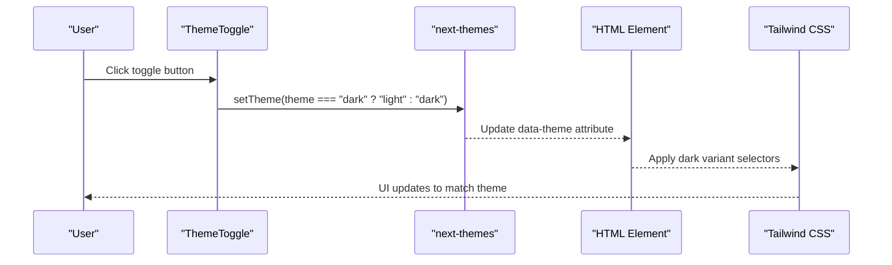
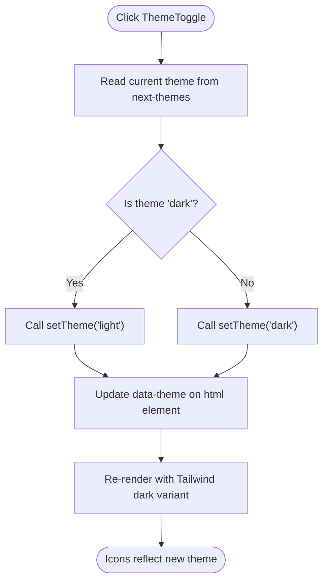
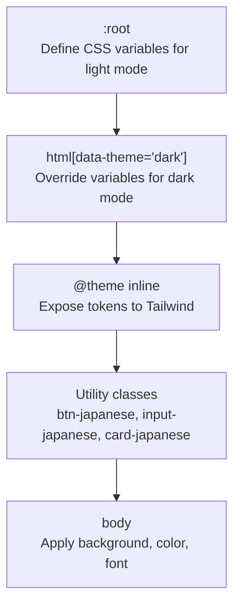
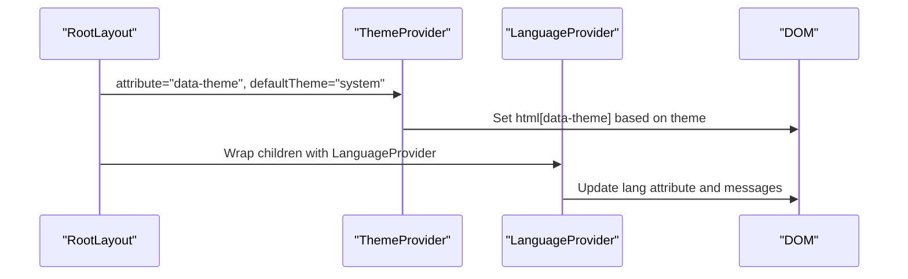
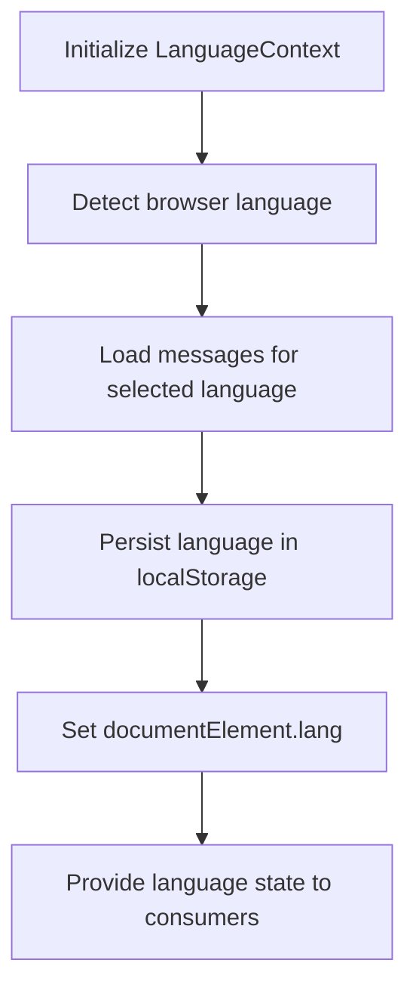
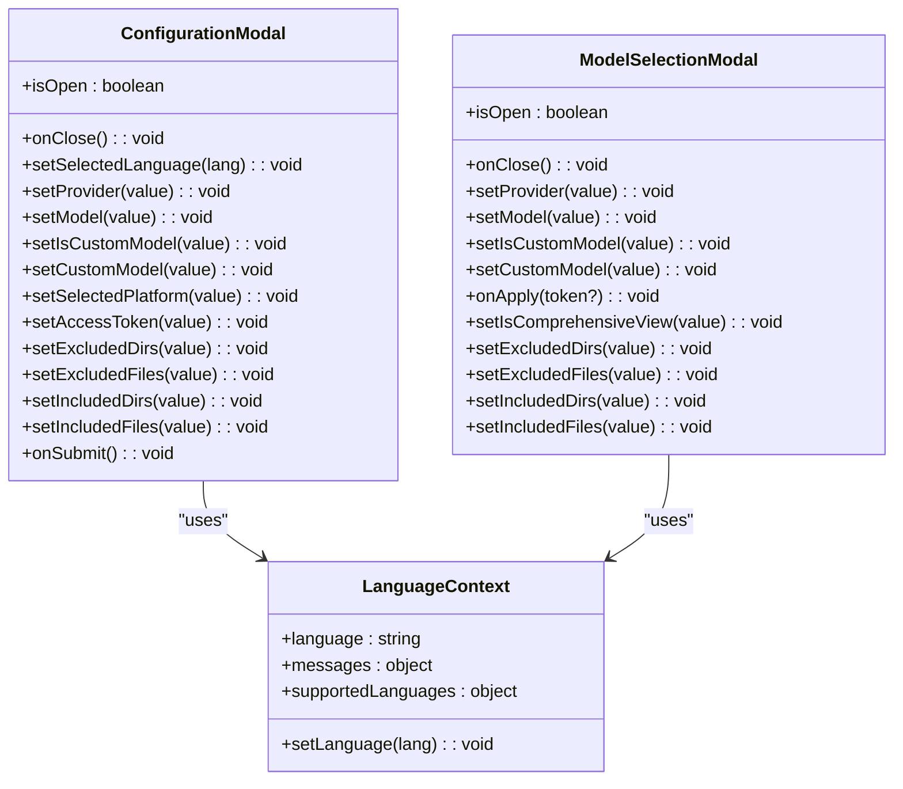
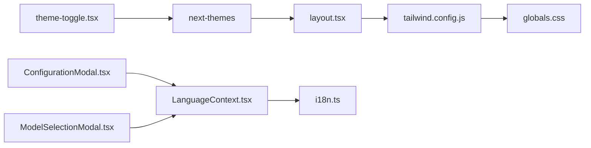

# Theme and UI Control Components

<cite>
**Referenced Files in This Document**
- [theme-toggle.tsx](file://src/components/theme-toggle.tsx)
- [globals.css](file://src/app/globals.css)
- [layout.tsx](file://src/app/layout.tsx)
- [tailwind.config.js](file://tailwind.config.js)
- [next.config.ts](file://next.config.ts)
- [i18n.ts](file://src/i18n.ts)
- [LanguageContext.tsx](file://src/contexts/LanguageContext.tsx)
- [ConfigurationModal.tsx](file://src/components/ConfigurationModal.tsx)
- [ModelSelectionModal.tsx](file://src/components/ModelSelectionModal.tsx)
- [package.json](file://package.json)
</cite>

## Table of Contents
1. [Introduction](#introduction)
2. [Project Structure](#project-structure)
3. [Core Components](#core-components)
4. [Architecture Overview](#architecture-overview)
5. [Detailed Component Analysis](#detailed-component-analysis)
6. [Dependency Analysis](#dependency-analysis)
7. [Performance Considerations](#performance-considerations)
8. [Troubleshooting Guide](#troubleshooting-guide)
9. [Conclusion](#conclusion)
10. [Appendices](#appendices)

## Introduction
This document explains the theme-toggle component and related UI control elements, focusing on:
- Theme switching functionality and dark/light mode implementation
- CSS custom properties system and Tailwind v4 integration
- Internationalization (i18n) integration with Next.js
- Responsive design patterns and accessibility compliance
- Examples of theme customization, component styling patterns, and user preference persistence
- Relationship with global styles, component theming, and cross-browser compatibility

## Project Structure
The theme and UI control system spans three layers:
- Global styles define CSS custom properties and Tailwind utilities
- Layout wraps the app with theme providers
- Components consume theme state and render styled UI

**Diagram sources**
- [layout.tsx](file://src/app/layout.tsx#L13-L31)
- [globals.css](file://src/app/globals.css#L1-L149)
- [tailwind.config.js](file://tailwind.config.js#L1-L8)
- [theme-toggle.tsx](file://src/components/theme-toggle.tsx#L1-L50)
- [ConfigurationModal.tsx](file://src/components/ConfigurationModal.tsx#L1-L200)
- [ModelSelectionModal.tsx](file://src/components/ModelSelectionModal.tsx#L1-L200)

**Section sources**
- [layout.tsx](file://src/app/layout.tsx#L13-L31)
- [globals.css](file://src/app/globals.css#L1-L149)
- [tailwind.config.js](file://tailwind.config.js#L1-L8)

## Core Components
- ThemeToggle: A client component that reads the current theme and toggles between dark and light modes using next-themes. It renders Japanese-inspired sun/moon icons and applies CSS variables for consistent theming.
- Global CSS: Defines CSS custom properties for light/dark modes, Tailwind theme tokens, and reusable Japanese-style utilities (buttons, inputs, cards).
- Layout Provider: Wraps the app with ThemeProvider (next-themes) and LanguageProvider (internationalization), enabling theme and language state across the app.
- Tailwind Config: Enables selector-based dark mode to align with the data-theme attribute used by next-themes.
- Language Context: Manages language detection, persistence, and message loading for i18n.

**Section sources**
- [theme-toggle.tsx](file://src/components/theme-toggle.tsx#L5-L49)
- [globals.css](file://src/app/globals.css#L6-L44)
- [layout.tsx](file://src/app/layout.tsx#L23-L27)
- [tailwind.config.js](file://tailwind.config.js#L1-L8)
- [LanguageContext.tsx](file://src/contexts/LanguageContext.tsx#L17-L194)

## Architecture Overview
The theme system integrates CSS custom properties, a theme provider, and Tailwind utilities. The layout sets the data-theme attribute, which Tailwind uses to apply dark mode variants. Components consume theme state via next-themes and render accordingly.

**Diagram sources**
- [theme-toggle.tsx](file://src/components/theme-toggle.tsx#L9-L15)
- [layout.tsx](file://src/app/layout.tsx#L23-L27)
- [tailwind.config.js](file://tailwind.config.js#L1-L8)

## Detailed Component Analysis

### ThemeToggle Component
- Purpose: Toggle between dark and light themes and render appropriate icons.
- Implementation highlights:
  - Uses next-themes to read and update the current theme.
  - Renders sun/moon SVGs conditionally based on the current theme.
  - Applies CSS variables for borders, foreground, accents, and hover effects.
  - Accessibility: Provides title and aria-label attributes.
- Styling pattern: Uses CSS variables defined globally for consistent theming across components.

**Diagram sources**
- [theme-toggle.tsx](file://src/components/theme-toggle.tsx#L5-L15)
- [layout.tsx](file://src/app/layout.tsx#L23-L27)

**Section sources**
- [theme-toggle.tsx](file://src/components/theme-toggle.tsx#L5-L49)

### Global CSS and CSS Custom Properties
- Defines CSS custom properties for both light and dark modes.
- Establishes Tailwind theme tokens mapped to CSS variables.
- Provides Japanese-style utilities for buttons, inputs, and cards.
- Includes a dark-mode-specific fix for select options in Chromium-based browsers.

**Diagram sources**
- [globals.css](file://src/app/globals.css#L6-L44)
- [globals.css](file://src/app/globals.css#L46-L66)

**Section sources**
- [globals.css](file://src/app/globals.css#L1-L149)

### Layout Provider and Theme Integration
- Wraps the app with ThemeProvider configured to use a data attribute on the html element.
- Enables system preference and persists user choice.
- Ensures hydration safety with suppressHydrationWarning on the html element.

**Diagram sources**
- [layout.tsx](file://src/app/layout.tsx#L13-L31)

**Section sources**
- [layout.tsx](file://src/app/layout.tsx#L13-L31)

### Internationalization and Language Context
- Supported locales are defined centrally and validated against requests.
- LanguageContext detects browser language, loads messages, and persists preferences in localStorage.
- Updates the HTML lang attribute dynamically for accessibility and SEO.

**Diagram sources**
- [i18n.ts](file://src/i18n.ts#L3-L14)
- [LanguageContext.tsx](file://src/contexts/LanguageContext.tsx#L17-L194)

**Section sources**
- [i18n.ts](file://src/i18n.ts#L1-L15)
- [LanguageContext.tsx](file://src/contexts/LanguageContext.tsx#L17-L194)

### UI Control Components Using Theme Variables
- ConfigurationModal and ModelSelectionModal demonstrate consistent theming by:
  - Using CSS variables for backgrounds, borders, and text colors
  - Leveraging Japanese-style utilities for inputs and cards
  - Integrating with LanguageContext for localized labels

**Diagram sources**
- [ConfigurationModal.tsx](file://src/components/ConfigurationModal.tsx#L68-L105)
- [ModelSelectionModal.tsx](file://src/components/ModelSelectionModal.tsx#L48-L78)
- [LanguageContext.tsx](file://src/contexts/LanguageContext.tsx#L8-L13)

**Section sources**
- [ConfigurationModal.tsx](file://src/components/ConfigurationModal.tsx#L1-L200)
- [ModelSelectionModal.tsx](file://src/components/ModelSelectionModal.tsx#L1-L200)
- [LanguageContext.tsx](file://src/contexts/LanguageContext.tsx#L17-L194)

## Dependency Analysis
- Theme system relies on:
  - next-themes for theme state management
  - Tailwind v4 for CSS custom properties and dark mode variants
  - CSS custom properties defined in globals.css
- Internationalization depends on:
  - next-intl for request configuration and message loading
  - LanguageContext for runtime language selection and persistence

**Diagram sources**
- [theme-toggle.tsx](file://src/components/theme-toggle.tsx#L3-L6)
- [layout.tsx](file://src/app/layout.tsx#L23-L27)
- [tailwind.config.js](file://tailwind.config.js#L1-L8)
- [globals.css](file://src/app/globals.css#L39-L44)
- [ConfigurationModal.tsx](file://src/components/ConfigurationModal.tsx#L4-L106)
- [ModelSelectionModal.tsx](file://src/components/ModelSelectionModal.tsx#L3-L79)
- [LanguageContext.tsx](file://src/contexts/LanguageContext.tsx#L5-L22)
- [i18n.ts](file://src/i18n.ts#L1-L14)

**Section sources**
- [package.json](file://package.json#L11-L25)
- [next.config.ts](file://next.config.ts#L1-L71)

## Performance Considerations
- Theme switching is client-side and leverages CSS custom properties, minimizing reflows.
- Tailwind’s dark mode selector avoids generating unused variants, keeping CSS lean.
- next-themes defers heavy computations until the client hydrates, reducing server-side overhead.
- Internationalization messages are loaded asynchronously and cached per session to reduce network usage.

[No sources needed since this section provides general guidance]

## Troubleshooting Guide
- Theme does not persist after reload:
  - Verify ThemeProvider is wrapping the app and defaultTheme is set appropriately.
  - Confirm the html element has the data-theme attribute applied.
- Icons do not reflect theme:
  - Ensure the component reads the theme from next-themes and conditionally renders icons.
  - Check that CSS variables are defined for both light and dark modes.
- Dark mode select dropdown options appear unreadable in Chromium:
  - Confirm the dark-mode fix targeting select option backgrounds is present in global styles.
- Language not updating:
  - Ensure LanguageContext updates documentElement.lang and localStorage.
  - Verify supported languages are fetched and default language fallback is configured.

**Section sources**
- [layout.tsx](file://src/app/layout.tsx#L19-L27)
- [globals.css](file://src/app/globals.css#L34-L37)
- [LanguageContext.tsx](file://src/contexts/LanguageContext.tsx#L101-L176)

## Conclusion
The theme-toggle and related UI controls implement a robust, accessible, and customizable theming system built on CSS custom properties, next-themes, and Tailwind v4. Internationalization is integrated via next-intl and a dedicated LanguageContext, enabling persistent user preferences and localized experiences. The design emphasizes Japanese aesthetics through carefully chosen color palettes and utility classes, while maintaining responsiveness and cross-browser compatibility.

[No sources needed since this section summarizes without analyzing specific files]

## Appendices

### Theme Customization Examples
- Modify CSS variables in :root and html[data-theme='dark'] to adjust color scheme.
- Extend Japanese-style utilities (buttons, inputs, cards) by adding new classes that reference CSS variables.
- Add new theme variants by introducing additional data-theme values and corresponding CSS overrides.

**Section sources**
- [globals.css](file://src/app/globals.css#L6-L44)
- [globals.css](file://src/app/globals.css#L68-L127)

### Component Styling Patterns
- Use CSS variables for consistent theming across components.
- Prefer Tailwind utilities that map to CSS variables for rapid development.
- Leverage Japanese-style utilities for cohesive UI patterns.

**Section sources**
- [ConfigurationModal.tsx](file://src/components/ConfigurationModal.tsx#L114-L131)
- [ModelSelectionModal.tsx](file://src/components/ModelSelectionModal.tsx#L138-L156)
- [globals.css](file://src/app/globals.css#L68-L127)

### Accessibility Compliance Notes
- ThemeToggle includes title and aria-label for screen reader support.
- LanguageContext updates documentElement.lang to improve assistive technology compatibility.
- Ensure interactive elements meet contrast ratios defined by CSS variables in both themes.

**Section sources**
- [theme-toggle.tsx](file://src/components/theme-toggle.tsx#L11-L14)
- [LanguageContext.tsx](file://src/contexts/LanguageContext.tsx#L133-L137)