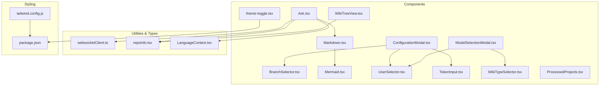
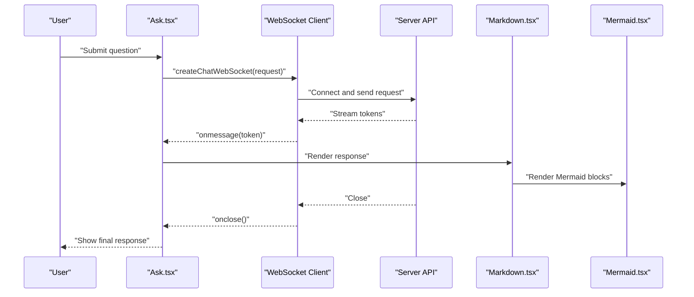
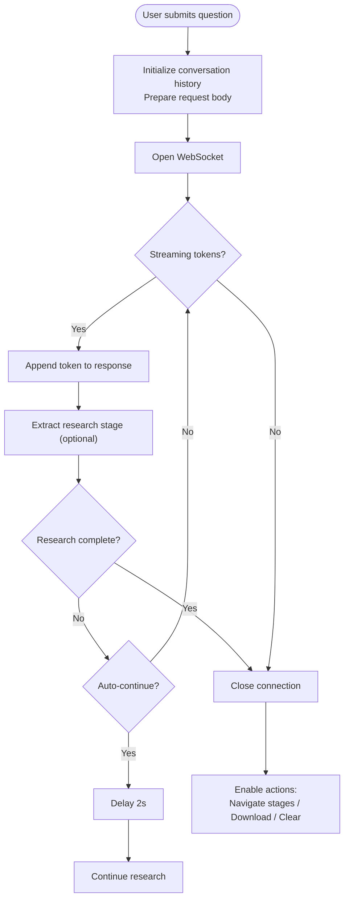
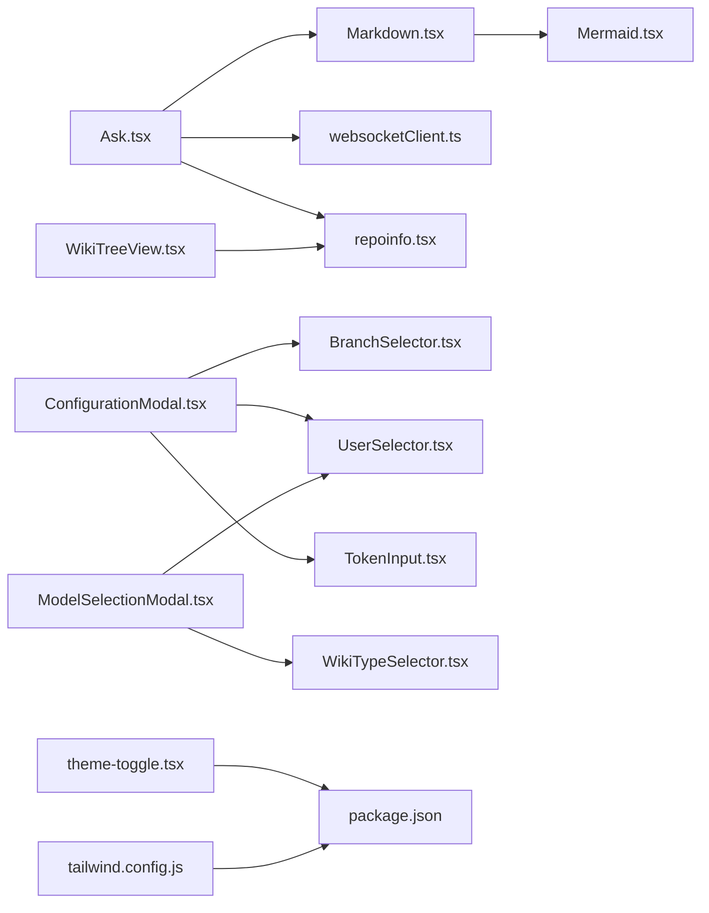

# User Interface Components

<cite>
**Referenced Files in This Document**
- [Ask.tsx](file://src/components/Ask.tsx)
- [BranchSelector.tsx](file://src/components/BranchSelector.tsx)
- [Markdown.tsx](file://src/components/Markdown.tsx)
- [Mermaid.tsx](file://src/components/Mermaid.tsx)
- [ConfigurationModal.tsx](file://src/components/ConfigurationModal.tsx)
- [ModelSelectionModal.tsx](file://src/components/ModelSelectionModal.tsx)
- [UserSelector.tsx](file://src/components/UserSelector.tsx)
- [WikiTreeView.tsx](file://src/components/WikiTreeView.tsx)
- [TokenInput.tsx](file://src/components/TokenInput.tsx)
- [WikiTypeSelector.tsx](file://src/components/WikiTypeSelector.tsx)
- [ProcessedProjects.tsx](file://src/components/ProcessedProjects.tsx)
- [theme-toggle.tsx](file://src/components/theme-toggle.tsx)
- [repoinfo.tsx](file://src/types/repoinfo.tsx)
- [websocketClient.ts](file://src/utils/websocketClient.ts)
- [LanguageContext.tsx](file://src/contexts/LanguageContext.tsx)
- [package.json](file://package.json)
- [tailwind.config.js](file://tailwind.config.js)
</cite>

## Table of Contents
1. [Introduction](#introduction)
2. [Project Structure](#project-structure)
3. [Core Components](#core-components)
4. [Architecture Overview](#architecture-overview)
5. [Detailed Component Analysis](#detailed-component-analysis)
6. [Dependency Analysis](#dependency-analysis)
7. [Performance Considerations](#performance-considerations)
8. [Troubleshooting Guide](#troubleshooting-guide)
9. [Conclusion](#conclusion)
10. [Appendices](#appendices)

## Introduction
This document describes the React component library used by DeepWiki-Open’s frontend. It focuses on the interactive UI components that power RAG-based Q&A, repository branch selection, Markdown rendering, Mermaid diagram display, and configuration modals. The guide explains each component’s visual appearance, behavior, user interaction patterns, props/events/customization, integration points, and accessibility and responsive design considerations. Practical usage guidance and composition patterns are included to help both frontend developers and UI designers integrate and extend the components effectively.

## Project Structure
The UI components live under src/components and are composed with shared utilities, types, and internationalization. The Tailwind CSS configuration enables dark mode via a selector strategy, and the app uses next-themes for theme switching.

**Diagram sources**
- [Ask.tsx](file://src/components/Ask.tsx#L1-L929)
- [BranchSelector.tsx](file://src/components/BranchSelector.tsx#L1-L236)
- [Markdown.tsx](file://src/components/Markdown.tsx#L1-L208)
- [Mermaid.tsx](file://src/components/Mermaid.tsx#L1-L491)
- [ConfigurationModal.tsx](file://src/components/ConfigurationModal.tsx#L1-L364)
- [ModelSelectionModal.tsx](file://src/components/ModelSelectionModal.tsx#L1-L260)
- [UserSelector.tsx](file://src/components/UserSelector.tsx#L1-L540)
- [WikiTreeView.tsx](file://src/components/WikiTreeView.tsx#L1-L184)
- [TokenInput.tsx](file://src/components/TokenInput.tsx#L1-L108)
- [WikiTypeSelector.tsx](file://src/components/WikiTypeSelector.tsx#L1-L79)
- [ProcessedProjects.tsx](file://src/components/ProcessedProjects.tsx#L1-L271)
- [theme-toggle.tsx](file://src/components/theme-toggle.tsx#L1-L50)
- [websocketClient.ts](file://src/utils/websocketClient.ts#L1-L86)
- [repoinfo.tsx](file://src/types/repoinfo.tsx#L1-L11)
- [LanguageContext.tsx](file://src/contexts/LanguageContext.tsx#L1-L203)
- [tailwind.config.js](file://tailwind.config.js#L1-L8)
- [package.json](file://package.json#L1-L40)

**Section sources**
- [tailwind.config.js](file://tailwind.config.js#L1-L8)
- [package.json](file://package.json#L1-L40)

## Core Components
This section summarizes the primary UI components and their roles.

- Ask: RAG chat interface with streaming responses, optional deep-research multi-turn mode, research stage navigation, and model/provider selection.
- BranchSelector: Dropdown to select repository branches across GitHub, GitLab, and Bitbucket with token support and error handling.
- Markdown: Renders markdown with GitHub Flavored Markdown, raw HTML, syntax highlighting, and embedded Mermaid diagrams.
- Mermaid: Renders Mermaid diagrams with Japanese aesthetic theming, pan/zoom, and full-screen modal.
- ConfigurationModal: Central configuration hub for repository, branch, language, wiki type, model/provider, tokens, and filters.
- ModelSelectionModal: Lightweight modal for selecting model/provider and optionally refreshing tokens.
- UserSelector: Dynamic provider/model selector with optional custom model and advanced file inclusion/exclusion filters.
- WikiTreeView: Hierarchical wiki page tree with expand/collapse and importance indicators.
- TokenInput: Platform-aware token input with GitHub/GitLab/Bitbucket options and security note.
- WikiTypeSelector: Toggle between comprehensive and concise wiki generation modes.
- ProcessedProjects: Displays cached wiki projects with search, view modes, and deletion.
- theme-toggle: Theme switcher using next-themes with Japanese-inspired icons.
- repoinfo: Shared repository metadata interface used across components.
- websocketClient: WebSocket client for streaming chat responses with fallback to HTTP streaming.

**Section sources**
- [Ask.tsx](file://src/components/Ask.tsx#L1-L929)
- [BranchSelector.tsx](file://src/components/BranchSelector.tsx#L1-L236)
- [Markdown.tsx](file://src/components/Markdown.tsx#L1-L208)
- [Mermaid.tsx](file://src/components/Mermaid.tsx#L1-L491)
- [ConfigurationModal.tsx](file://src/components/ConfigurationModal.tsx#L1-L364)
- [ModelSelectionModal.tsx](file://src/components/ModelSelectionModal.tsx#L1-L260)
- [UserSelector.tsx](file://src/components/UserSelector.tsx#L1-L540)
- [WikiTreeView.tsx](file://src/components/WikiTreeView.tsx#L1-L184)
- [TokenInput.tsx](file://src/components/TokenInput.tsx#L1-L108)
- [WikiTypeSelector.tsx](file://src/components/WikiTypeSelector.tsx#L1-L79)
- [ProcessedProjects.tsx](file://src/components/ProcessedProjects.tsx#L1-L271)
- [theme-toggle.tsx](file://src/components/theme-toggle.tsx#L1-L50)
- [repoinfo.tsx](file://src/types/repoinfo.tsx#L1-L11)
- [websocketClient.ts](file://src/utils/websocketClient.ts#L1-L86)

## Architecture Overview
The Ask component orchestrates RAG interactions with a WebSocket-based streaming API and falls back to HTTP streaming. Markdown renders content and embeds Mermaid diagrams. Configuration modals delegate to UserSelector and TokenInput for model and token configuration. BranchSelector integrates with external platforms using tokens. Theme and i18n are provided globally via next-themes and LanguageContext.

**Diagram sources**
- [Ask.tsx](file://src/components/Ask.tsx#L532-L627)
- [websocketClient.ts](file://src/utils/websocketClient.ts#L43-L75)
- [Markdown.tsx](file://src/components/Markdown.tsx#L126-L136)
- [Mermaid.tsx](file://src/components/Mermaid.tsx#L369-L383)

## Detailed Component Analysis

### Ask Component (RAG Chat)
- Purpose: Accepts a question, streams model responses, supports optional deep research with multi-stage iterations, and allows downloading responses.
- Key behaviors:
  - Streams tokens via WebSocket with automatic fallback to HTTP streaming on failure.
  - Detects research completion markers and manages research stages.
  - Provides navigation between research stages and a clear conversation action.
  - Integrates with model selection modal and repository info.
- Props:
  - repoInfo: RepoInfo
  - provider?: string
  - model?: string
  - isCustomModel?: boolean
  - customModel?: string
  - language?: string
  - onRef?: (ref: { clearConversation: () => void }) => void
- Events/Callbacks:
  - onRef exposes clearConversation to parent components.
- Interaction patterns:
  - Submit question triggers streaming; loading state disables input.
  - Deep Research toggle enables multi-turn investigation with automatic continuation until completion or iteration cap.
  - Download button saves response as Markdown.
- Accessibility:
  - Proper focus management, disabled states, and ARIA-friendly labels.
- Styling and customization:
  - Uses CSS variables for theme-aware colors and spacing.
  - Responsive input and button sizing with dynamic widths.
- Integration:
  - Consumes LanguageContext for localized messages.
  - Uses websocketClient for streaming.

**Diagram sources**
- [Ask.tsx](file://src/components/Ask.tsx#L532-L627)
- [Ask.tsx](file://src/components/Ask.tsx#L280-L403)
- [Ask.tsx](file://src/components/Ask.tsx#L482-L498)
- [Ask.tsx](file://src/components/Ask.tsx#L500-L530)

**Section sources**
- [Ask.tsx](file://src/components/Ask.tsx#L36-L94)
- [Ask.tsx](file://src/components/Ask.tsx#L115-L149)
- [Ask.tsx](file://src/components/Ask.tsx#L280-L403)
- [Ask.tsx](file://src/components/Ask.tsx#L482-L530)
- [Ask.tsx](file://src/components/Ask.tsx#L532-L627)
- [Ask.tsx](file://src/components/Ask.tsx#L629-L800)
- [websocketClient.ts](file://src/utils/websocketClient.ts#L43-L75)
- [LanguageContext.tsx](file://src/contexts/LanguageContext.tsx#L1-L203)

### BranchSelector Component
- Purpose: Select repository branches across GitHub, GitLab, and Bitbucket with token support.
- Key behaviors:
  - Fetches branches from platform APIs with appropriate headers.
  - Handles rate limits, authentication errors, and missing repos.
  - Normalizes branch data across platforms.
- Props:
  - owner: string
  - repo: string
  - repoType: 'github' | 'gitlab' | 'bitbucket'
  - currentBranch: string
  - onBranchChange: (branch: string) => void
  - token?: string | null
  - className?: string
- Interaction patterns:
  - Opens dropdown; clicking a branch invokes onBranchChange and closes menu.
  - Click outside closes dropdown.
- Accessibility:
  - Disabled state when loading; keyboard-accessible dropdown.
- Styling and customization:
  - Uses CSS variables for theme-aware borders and backgrounds.

**Section sources**
- [BranchSelector.tsx](file://src/components/BranchSelector.tsx#L12-L45)
- [BranchSelector.tsx](file://src/components/BranchSelector.tsx#L47-L151)
- [BranchSelector.tsx](file://src/components/BranchSelector.tsx#L158-L236)

### Markdown Renderer
- Purpose: Render markdown with GFM, raw HTML, syntax highlighting, and embedded Mermaid diagrams.
- Key behaviors:
  - Custom components for headings, lists, tables, links, blockquotes.
  - Inline and block code with copy-to-clipboard and line numbers.
  - Special styling for ReAct-style headings.
  - Embedded Mermaid blocks are rendered via Mermaid component.
- Props:
  - content: string
- Integration:
  - Uses remark-gfm and rehype-raw plugins.
  - Uses react-syntax-highlighter with prism theme.

**Section sources**
- [Markdown.tsx](file://src/components/Markdown.tsx#L9-L193)
- [Markdown.tsx](file://src/components/Markdown.tsx#L126-L136)

### Mermaid Diagram Display
- Purpose: Render Mermaid diagrams with Japanese aesthetic theming, pan/zoom, and full-screen modal.
- Key behaviors:
  - Initializes mermaid with theme and custom CSS.
  - Supports dark mode by adding data-theme="dark".
  - Pan/zoom via svg-pan-zoom when enabled.
  - Full-screen modal with zoom controls and escape key handling.
- Props:
  - chart: string
  - className?: string
  - zoomingEnabled?: boolean
- Accessibility:
  - Hover hint for clickable diagrams; full-screen modal is keyboard navigable.

**Section sources**
- [Mermaid.tsx](file://src/components/Mermaid.tsx#L172-L304)
- [Mermaid.tsx](file://src/components/Mermaid.tsx#L306-L486)

### ConfigurationModal
- Purpose: Central configuration UI for repository, branch, language, wiki type, model/provider, tokens, and filters.
- Key behaviors:
  - Extracts owner/repo from repository input.
  - Integrates BranchSelector, UserSelector, TokenInput, and WikiTypeSelector.
  - Supports authorization code input and toggles token section.
- Props:
  - isOpen, onClose
  - repositoryInput: string
  - selectedBranch?: string, setSelectedBranch?: (branch: string) => void
  - selectedLanguage: string, setSelectedLanguage: (value: string) => void
  - supportedLanguages: Record<string, string>
  - isComprehensiveView: boolean, setIsComprehensiveView: (value: boolean) => void
  - provider, setProvider, model, setModel, isCustomModel, setIsCustomModel, customModel, setCustomModel
  - selectedPlatform: 'github' | 'gitlab' | 'bitbucket', setSelectedPlatform
  - accessToken: string, setAccessToken
  - excludedDirs, setExcludedDirs, excludedFiles, setExcludedFiles, includedDirs, setIncludedDirs, includedFiles, setIncludedFiles
  - onSubmit: () => void, isSubmitting: boolean
  - authRequired?: boolean, authCode?: string, setAuthCode?: (code: string) => void, isAuthLoading?: boolean

**Section sources**
- [ConfigurationModal.tsx](file://src/components/ConfigurationModal.tsx#L9-L105)
- [ConfigurationModal.tsx](file://src/components/ConfigurationModal.tsx#L113-L363)

### ModelSelectionModal
- Purpose: Lightweight modal for selecting model/provider and optionally refreshing tokens and authorization.
- Key behaviors:
  - Maintains local state and applies changes on submit.
  - Integrates WikiTypeSelector and UserSelector.
  - Optional TokenInput for refresh scenarios.
- Props:
  - isOpen, onClose
  - provider, setProvider, model, setModel, isCustomModel, setIsCustomModel, customModel, setCustomModel
  - onApply: (token?: string) => void
  - isComprehensiveView, setIsComprehensiveView
  - showFileFilters?: boolean
  - showWikiType?: boolean
  - showTokenInput?: boolean, repositoryType?: 'github' | 'gitlab' | 'bitbucket'
  - authRequired?: boolean, authCode?: string, setAuthCode?: (code: string) => void, isAuthLoading?: boolean

**Section sources**
- [ModelSelectionModal.tsx](file://src/components/ModelSelectionModal.tsx#L9-L78)
- [ModelSelectionModal.tsx](file://src/components/ModelSelectionModal.tsx#L138-L259)

### UserSelector
- Purpose: Dynamic provider/model selector with optional custom model and advanced file filters.
- Key behaviors:
  - Loads model configuration from /api/models/config.
  - Resets model when provider changes.
  - Supports custom model input when provider allows it.
  - Advanced filters for directories/files with include/exclude modes.
- Props:
  - provider, setProvider, model, setModel, isCustomModel, setIsCustomModel, customModel, setCustomModel
  - showFileFilters?: boolean
  - excludedDirs?, setExcludedDirs?
  - excludedFiles?, setExcludedFiles?
  - includedDirs?, setIncludedDirs?
  - includedFiles?, setIncludedFiles?

**Section sources**
- [UserSelector.tsx](file://src/components/UserSelector.tsx#L24-L66)
- [UserSelector.tsx](file://src/components/UserSelector.tsx#L82-L123)
- [UserSelector.tsx](file://src/components/UserSelector.tsx#L278-L539)

### WikiTreeView
- Purpose: Hierarchical wiki page tree with expand/collapse and importance indicators.
- Key behaviors:
  - Falls back to flat list view if sections are missing.
  - Highlights current page and shows importance via colored dots.
- Props:
  - wikiStructure: WikiStructure
  - currentPageId: string | undefined
  - onPageSelect: (pageId: string) => void
  - messages?: { pages?: string; [key: string]: string | undefined; }

**Section sources**
- [WikiTreeView.tsx](file://src/components/WikiTreeView.tsx#L35-L43)
- [WikiTreeView.tsx](file://src/components/WikiTreeView.tsx#L45-L182)

### TokenInput
- Purpose: Platform-aware token input with GitHub/GitLab/Bitbucket options and security note.
- Props:
  - selectedPlatform: 'github' | 'gitlab' | 'bitbucket'
  - setSelectedPlatform: (value: 'github' | 'gitlab' | 'bitbucket') => void
  - accessToken: string, setAccessToken: (value: string) => void
  - showTokenSection?: boolean
  - onToggleTokenSection?: () => void
  - allowPlatformChange?: boolean

**Section sources**
- [TokenInput.tsx](file://src/components/TokenInput.tsx#L6-L24)
- [TokenInput.tsx](file://src/components/TokenInput.tsx#L29-L107)

### WikiTypeSelector
- Purpose: Toggle between comprehensive and concise wiki generation modes.
- Props:
  - isComprehensiveView: boolean
  - setIsComprehensiveView: (value: boolean) => void

**Section sources**
- [WikiTypeSelector.tsx](file://src/components/WikiTypeSelector.tsx#L7-L16)
- [WikiTypeSelector.tsx](file://src/components/WikiTypeSelector.tsx#L18-L78)

### ProcessedProjects
- Purpose: Displays cached wiki projects with search, view modes, and deletion.
- Key behaviors:
  - Fetches projects from /api/wiki/projects.
  - Supports card and list view modes.
  - Search filters projects by name/owner/repo/type.
  - Delete confirmation and API call to remove entries.
- Props:
  - showHeader?: boolean
  - maxItems?: number
  - className?: string
  - messages?: Record<string, Record<string, string>>

**Section sources**
- [ProcessedProjects.tsx](file://src/components/ProcessedProjects.tsx#L18-L30)
- [ProcessedProjects.tsx](file://src/components/ProcessedProjects.tsx#L56-L81)
- [ProcessedProjects.tsx](file://src/components/ProcessedProjects.tsx#L83-L98)
- [ProcessedProjects.tsx](file://src/components/ProcessedProjects.tsx#L104-L128)
- [ProcessedProjects.tsx](file://src/components/ProcessedProjects.tsx#L130-L271)

### Theme Toggle
- Purpose: Switch between light and dark themes using next-themes.
- Props: None
- Behavior: Toggles theme and renders Japanese-inspired sun/moon icons.

**Section sources**
- [theme-toggle.tsx](file://src/components/theme-toggle.tsx#L5-L49)

### Repository Info Type
- Purpose: Shared interface for repository metadata used across components.
- Props:
  - owner: string
  - repo: string
  - type: string
  - token: string | null
  - localPath: string | null
  - repoUrl: string | null
  - branch?: string

**Section sources**
- [repoinfo.tsx](file://src/types/repoinfo.tsx#L1-L11)

### WebSocket Client
- Purpose: Create and manage WebSocket connections for streaming chat completions.
- Functions:
  - createChatWebSocket(request, onMessage, onError, onClose): Returns WebSocket
  - closeWebSocket(ws): Safely closes connection
- Request shape:
  - repo_url, messages, filePath?, token?, type?, provider?, model?, language?, excluded_dirs?, excluded_files?

**Section sources**
- [websocketClient.ts](file://src/utils/websocketClient.ts#L43-L85)

## Dependency Analysis
- Component coupling:
  - Ask depends on Markdown, LanguageContext, websocketClient, and RepoInfo.
  - Markdown depends on Mermaid for diagram rendering.
  - ConfigurationModal composes BranchSelector, UserSelector, TokenInput, and WikiTypeSelector.
  - ModelSelectionModal composes UserSelector and WikiTypeSelector.
  - WikiTreeView consumes RepoInfo and page selection callbacks.
- External dependencies:
  - mermaid, react-markdown, react-syntax-highlighter, svg-pan-zoom, next-themes, @heroicons/react, react-icons.
- Theming and i18n:
  - Tailwind dark mode via selector; next-themes for theme switching; LanguageContext for messages.

**Diagram sources**
- [Ask.tsx](file://src/components/Ask.tsx#L1-L10)
- [Markdown.tsx](file://src/components/Markdown.tsx#L1-L8)
- [Mermaid.tsx](file://src/components/Mermaid.tsx#L1-L4)
- [ConfigurationModal.tsx](file://src/components/ConfigurationModal.tsx#L1-L8)
- [BranchSelector.tsx](file://src/components/BranchSelector.tsx#L1-L2)
- [UserSelector.tsx](file://src/components/UserSelector.tsx#L1-L4)
- [TokenInput.tsx](file://src/components/TokenInput.tsx#L1-L4)
- [ModelSelectionModal.tsx](file://src/components/ModelSelectionModal.tsx#L1-L7)
- [WikiTypeSelector.tsx](file://src/components/WikiTypeSelector.tsx#L1-L5)
- [WikiTreeView.tsx](file://src/components/WikiTreeView.tsx#L1-L4)
- [theme-toggle.tsx](file://src/components/theme-toggle.tsx#L1-L4)
- [tailwind.config.js](file://tailwind.config.js#L1-L8)
- [package.json](file://package.json#L1-L40)

**Section sources**
- [package.json](file://package.json#L11-L25)
- [tailwind.config.js](file://tailwind.config.js#L1-L8)

## Performance Considerations
- Streaming responses:
  - Prefer WebSocket streaming for real-time updates; fallback to HTTP streaming when needed.
  - Debounce or throttle UI updates when appending tokens to avoid excessive re-renders.
- Diagram rendering:
  - Lazy-load svg-pan-zoom only when pan/zoom is enabled.
  - Limit diagram size and complexity; consider disabling pan/zoom for large diagrams.
- Markdown rendering:
  - Keep code blocks concise; enable line wrapping and copy-to-clipboard sparingly.
- Filtering and search:
  - Memoize filtered results in ProcessedProjects to avoid recomputation on every keystroke.
- Theme and i18n:
  - Avoid frequent theme switches; batch DOM updates when toggling themes.
  - Cache language messages to minimize repeated imports.

[No sources needed since this section provides general guidance]

## Troubleshooting Guide
- Ask component:
  - If WebSocket fails, the component logs an error and falls back to HTTP streaming. Verify server connectivity and request payload.
  - Research completion detection relies on specific markers; ensure prompts include expected conclusion phrases.
- BranchSelector:
  - Authentication failures require tokens; ensure token permissions and platform-specific headers are correct.
  - Rate limits return a specific error; retry after cooldown or add a token.
- Markdown/Mermaid:
  - Invalid Mermaid syntax displays an error panel with the raw chart content for inspection.
- ConfigurationModal:
  - If repository input is malformed, owner/repo extraction may fail; normalize inputs to owner/repo or HTTPS URLs.
- ProcessedProjects:
  - API errors surface as alerts; confirm server availability and cache status.

**Section sources**
- [Ask.tsx](file://src/components/Ask.tsx#L368-L396)
- [Ask.tsx](file://src/components/Ask.tsx#L405-L480)
- [BranchSelector.tsx](file://src/components/BranchSelector.tsx#L87-L103)
- [BranchSelector.tsx](file://src/components/BranchSelector.tsx#L137-L150)
- [Mermaid.tsx](file://src/components/Mermaid.tsx#L384-L400)
- [ConfigurationModal.tsx](file://src/components/ConfigurationModal.tsx#L172-L189)
- [ProcessedProjects.tsx](file://src/components/ProcessedProjects.tsx#L60-L78)
- [ProcessedProjects.tsx](file://src/components/ProcessedProjects.tsx#L108-L128)

## Conclusion
DeepWiki-Open’s component library provides a cohesive, theme-aware, and internationally localized UI for RAG-driven wiki interactions. The Ask component delivers a robust streaming experience with optional deep research, while Markdown and Mermaid enable rich documentation rendering. Configuration modals streamline model, token, and filtering setup across multiple platforms. With thoughtful accessibility, responsive design, and performance-conscious patterns, these components offer a strong foundation for building scalable wiki experiences.

[No sources needed since this section summarizes without analyzing specific files]

## Appendices

### Props Reference Summary
- Ask
  - repoInfo: RepoInfo
  - provider?: string
  - model?: string
  - isCustomModel?: boolean
  - customModel?: string
  - language?: string
  - onRef?: (ref: { clearConversation: () => void }) => void
- BranchSelector
  - owner: string, repo: string, repoType: 'github' | 'gitlab' | 'bitbucket', currentBranch: string, onBranchChange: (branch: string) => void, token?: string | null, className?: string
- Markdown
  - content: string
- Mermaid
  - chart: string, className?: string, zoomingEnabled?: boolean
- ConfigurationModal
  - isOpen: boolean, onClose: () => void, repositoryInput: string, selectedBranch?: string, setSelectedBranch?: (branch: string) => void, selectedLanguage: string, setSelectedLanguage: (value: string) => void, supportedLanguages: Record<string, string>, isComprehensiveView: boolean, setIsComprehensiveView: (value: boolean) => void, provider: string, setProvider: (value: string) => void, model: string, setModel: (value: string) => void, isCustomModel: boolean, setIsCustomModel: (value: boolean) => void, customModel: string, setCustomModel: (value: string) => void, selectedPlatform: 'github' | 'gitlab' | 'bitbucket', setSelectedPlatform: ('github' | 'gitlab' | 'bitbucket') => void, accessToken: string, setAccessToken: (value: string) => void, excludedDirs: string, setExcludedDirs: (value: string) => void, excludedFiles: string, setExcludedFiles: (value: string) => void, includedDirs: string, setIncludedDirs: (value: string) => void, includedFiles: string, setIncludedFiles: (value: string) => void, onSubmit: () => void, isSubmitting: boolean, authRequired?: boolean, authCode?: string, setAuthCode?: (code: string) => void, isAuthLoading?: boolean
- ModelSelectionModal
  - isOpen: boolean, onClose: () => void, provider: string, setProvider: (value: string) => void, model: string, setModel: (value: string) => void, isCustomModel: boolean, setIsCustomModel: (value: boolean) => void, customModel: string, setCustomModel: (value: string) => void, onApply: (token?: string) => void, isComprehensiveView: boolean, setIsComprehensiveView: (value: boolean) => void, excludedDirs?: string, setExcludedDirs?: (value: string) => void, excludedFiles?: string, setExcludedFiles?: (value: string) => void, includedDirs?: string, setIncludedDirs?: (value: string) => void, includedFiles?: string, setIncludedFiles?: (value: string) => void, showFileFilters?: boolean, showWikiType?: boolean, showTokenInput?: boolean, repositoryType?: 'github' | 'gitlab' | 'bitbucket', authRequired?: boolean, authCode?: string, setAuthCode?: (code: string) => void, isAuthLoading?: boolean
- UserSelector
  - provider: string, setProvider: (value: string) => void, model: string, setModel: (value: string) => void, isCustomModel: boolean, setIsCustomModel: (value: boolean) => void, customModel: string, setCustomModel: (value: string) => void, showFileFilters?: boolean, excludedDirs?: string, setExcludedDirs?: (value: string) => void, excludedFiles?: string, setExcludedFiles?: (value: string) => void, includedDirs?: string, setIncludedDirs?: (value: string) => void, includedFiles?: string, setIncludedFiles?: (value: string) => void
- WikiTreeView
  - wikiStructure: WikiStructure, currentPageId: string | undefined, onPageSelect: (pageId: string) => void, messages?: { pages?: string; [key: string]: string | undefined; }
- TokenInput
  - selectedPlatform: 'github' | 'gitlab' | 'bitbucket', setSelectedPlatform: ('github' | 'gitlab' | 'bitbucket') => void, accessToken: string, setAccessToken: (value: string) => void, showTokenSection?: boolean, onToggleTokenSection?: () => void, allowPlatformChange?: boolean
- WikiTypeSelector
  - isComprehensiveView: boolean, setIsComprehensiveView: (value: boolean) => void
- ProcessedProjects
  - showHeader?: boolean, maxItems?: number, className?: string, messages?: Record<string, Record<string, string>>
- theme-toggle
  - None
- websocketClient
  - createChatWebSocket(request, onMessage, onError, onClose): WebSocket
  - closeWebSocket(ws): void

**Section sources**
- [Ask.tsx](file://src/components/Ask.tsx#L36-L54)
- [BranchSelector.tsx](file://src/components/BranchSelector.tsx#L12-L30)
- [Markdown.tsx](file://src/components/Markdown.tsx#L9-L11)
- [Mermaid.tsx](file://src/components/Mermaid.tsx#L172-L176)
- [ConfigurationModal.tsx](file://src/components/ConfigurationModal.tsx#L9-L66)
- [ModelSelectionModal.tsx](file://src/components/ModelSelectionModal.tsx#L9-L46)
- [UserSelector.tsx](file://src/components/UserSelector.tsx#L24-L44)
- [WikiTreeView.tsx](file://src/components/WikiTreeView.tsx#L35-L43)
- [TokenInput.tsx](file://src/components/TokenInput.tsx#L6-L14)
- [WikiTypeSelector.tsx](file://src/components/WikiTypeSelector.tsx#L7-L10)
- [ProcessedProjects.tsx](file://src/components/ProcessedProjects.tsx#L18-L30)
- [websocketClient.ts](file://src/utils/websocketClient.ts#L43-L85)